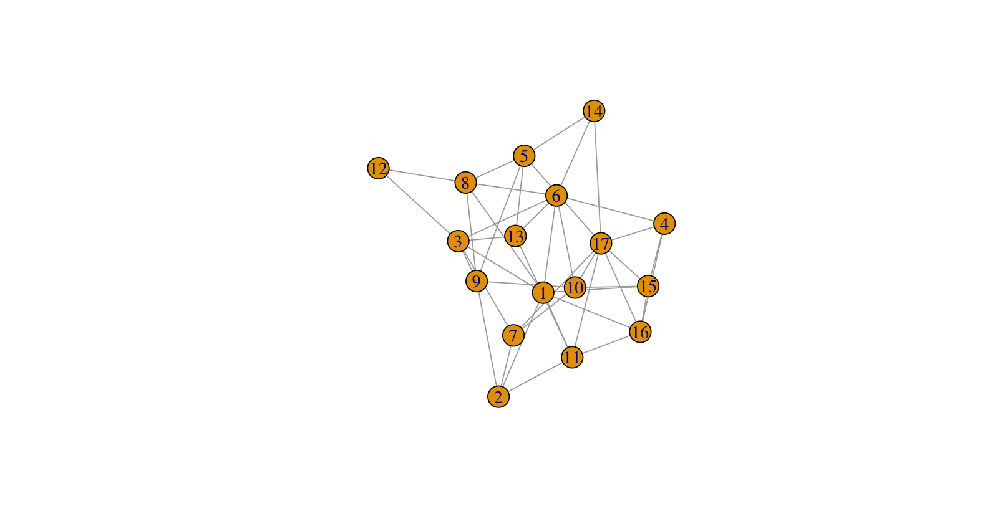

::: {.callout-tip title="Workshop Roadmap"}
**You are here:**  

🧭 Intro — From network psychometrics to Bayesian graphical modeling ✅  
📊 **Session I — Quantifying evidence for network edges** ✅  
🔍 **Session II — Modeling topological structure with priors** 🟩  
🧠 Session III — Comparing groups and testing network invariance  
⚙️ Session IV — MCMC diagnostics and efficiency  
:::


```{r setup, include=FALSE}
knitr::opts_chunk$set(echo = TRUE)
```

# Recap

Before we start the practical work, let’s recall how we got here.

## From Session I — Quantifying edge evidence

- We learned how Bayesian reasoning distinguishes *evidence of absence* from *absence of evidence*.  
- Using Bayes factors, we quantified the strength of evidence for individual edges.  
- We practiced estimating networks, interpreting uncertainty, and running prior-sensitivity checks.

## From Session II (Theory) — Modeling network topology

- A large-scale Bayesian reanalysis showed that most published networks provide **weak or inconclusive** evidence for many edges.  
- This revealed that network estimation alone cannot resolve structural uncertainty.  
- We therefore explored **topological priors**, which, as we shall see in this session, let's us express expectations about the structure itself:
  - **Bernoulli prior** → overall expected density  
  - **Beta–Bernoulli prior** → balanced network complexity and automatic multiplicity correction  
  - **Stochastic Block Model (SBM)** → clustered or modular networks often found in psychology  

::: {.callout-note title="Recap Questions"}
> If we don’t want to fix π by hand, which prior should we use?  

> What can the SBM capture that the other priors cannot?  
:::


## Goals for this session

At the end of this session, you should be able to:

::: {.goals}

- **Describe** how different topological priors (Bernoulli, Beta–Bernoulli, SBM) encode assumptions about network structure.
- **Explain** how the Beta–Bernoulli prior balances network complexity and avoids arbitrary π-choices.
- **Estimate** networks under each prior and compare how prior assumptions affect posterior edge inclusion, network density, and clustering.
- **Interpret** posterior results in light of prior assumptions—when priors favor sparse, complex, or clustered networks.
:::


::: {.note}
**Recommended Reading:**

- Sekulovski, N., Arena, G., Haslbeck, J., Huth, K., Friel, N., & Marsman, M. (2024). A Stochastic Block Prior for Clustering in Graphical Models. Preprint. doi: 10.31234/osf.io/29p3m_v1
- Martarelli, C., Baillifard, A., & Audrin, C. (2023). A Trait-Based Network Perspective on the Validation of the French Short Boredom Proneness Scale. European Journal of Psychological Assessment, 39, 390–399. doi:10.1027/1015-5759/a000718.

**Optional Reading**

- Sekulovski, N., Waaijers, M., & Arena, G., (2025). LLM-Based Prior Elicitation for Bayesian Graphical Modeling. Preprint. doi: 10.31234/osf.io/k2twq_v1

**R Setup Tip:**
Make sure to install and load the following libraries before running the examples:

```r
library(bgms)
library(dplyr) #Used for plotting
library(easybgm)
library(ggplot2) #Used for plotting
library(gridExtra) #Used for plotting
library(patchwork) #Used for plotting
library(pheatmap)
library(qgraph)
library(tidyr) #Used for plotting
```
:::

# 1. The Bernoulli and Beta-Bernoulli Priors for Network Complexity

A first step toward our goals is to develop intuition for what the priors imply.  
By simulating from them, we can **see the assumptions directly** and relate them to the outcomes we expect.

In this part we focus on the two most fundamental cases:  

- **Bernoulli priors**, where each edge is included independently with fixed probability π.  
- **Beta–Bernoulli priors**, which extend the Bernoulli case by treating π itself as random.  

These simulations prepare us to identify their structural assumptions and to explain in what way the Beta–Bernoulli prior generalizes the Bernoulli prior.


::: {.panel-tabset}

### Simulating the Bernoulli Prior

Under a Bernoulli(π) prior, each edge is included independently with fixed probability π.  
Let’s see what that assumption looks like in practice.

**Tasks**

1. **Simulate networks**  
   Generate several random networks from a Bernoulli(π = 0.5) model with *p = 10* nodes.  
   Notice how edge inclusion varies across repetitions.

2. **Check expectations**  
   - Compute the number of possible edges $m = \tfrac{p(p-1)}{2}$.  
   - Calculate the expected number of edges $E[\#\text{edges}] = m \times \pi$.  
   - Verify that the expected density equals $\pi$.  

3. **Compare**  
   Inspect how closely your simulated networks match these expectations.  
   Do the observed edge counts cluster around the theoretical mean?

4. **Reflect**  
   - Do edges appear independent of one another?  
   - Does the expected density change when you vary the number of nodes $p$?  

These steps will give us a concrete sense of what *“independent edges with fixed probability”* means before moving on to more flexible priors.


### Try it

Run the code below to generate four random networks under a Bernoulli(π = 0.5) prior with *p = 10*.  

For each network:  
1. Record the number of edges.  
2. Compute the density (number of edges ÷ possible edges).  

Then compare your results to the theoretical expectations:  
- Number of possible edges: $m = \tfrac{p(p-1)}{2}$.  
- Expected number of edges: $E[\#\text{edges}] = m \times \pi$.  
- Expected density: $E[\text{density}] = \pi$.  

**Questions for reflection**  
- How close are the simulated edge counts to $m \times \pi$ on average?  
- Are the observed densities close to π?  
- Do the networks show any systematic structure (e.g., clusters), or do edges appear randomly scattered?  
- If the number of nodes increased from 10 to 30, what would happen to the expected density? What about the expected number of edges?

```r
library(igraph)

# Draw a single adjacency matrix from Bernoulli prior
sample_network_bernoulli <- function(p, pi) {
  mat <- matrix(0, nrow = p, ncol = p)
  for (i in 1:(p-1)) {
    for (j in (i+1):p) {
      mat[i, j] <- rbinom(1, 1, pi)
      mat[j, i] <- mat[i, j]
    }
  }
  graph_from_adjacency_matrix(mat, mode = "undirected")
}

# 👉 Fill in the blanks below
par(mfrow = c(2,2))
set.seed(1) #<- for reproducibility
for (k in 1:4) {
  g <- sample_network_bernoulli(p =  _____, pi = _____)
  plot(g, main = paste("Draw", k))
}
```


### Solution

```r
# Number of possible edges for p = 10
p <- 10
m <- p * (p - 1) / 2
m
#> 45

# Expected values under Bernoulli(pi = 0.5)
pi <- 0.5
expected_edges <- m * pi
expected_density <- pi

expected_edges     # 22.5
expected_density   # 0.5

# Simulate 4 networks
set.seed(1)
par(mfrow = c(2,2))
for (k in 1:4) {
  g <- sample_network_bernoulli(p = p, pi = pi)
  plot(g, main = paste("Draw", k))
  cat("Network", k, 
      "- edges:", gsize(g), 
      "- density:", edge_density(g), "\n")
}
```

- For *p = 10*, the number of possible edges is $m = 45$.  
- With $\pi = 0.5$:  
  - Expected number of edges = $45 \times 0.5 = 22.5$.  
  - Expected density = $\pi = 0.5$.  

**Simulation results**  
- Across four draws, edge counts ranged from 16 to 24, with densities between ~0.36 and ~0.53.  
- This variation is expected from random draws, but the average aligns with the theoretical expectations.  

**Interpretation**  
- Networks generated under Bernoulli(0.5) appear as random scatterings of edges.  
- No clusters or domains emerge — reflecting the **independence assumption**.  
- The expected density remains fixed at $\pi$, regardless of the number of nodes $p$.  
- The expected *number* of edges, however, grows quickly with network size:  
  - *p = 10*: $m = 45$ → ~22.5 edges expected.  
  - *p = 30*: $m = 435$ → ~217.5 edges expected.  
  - *p = 100*: $m = 4{,}950$ → ~2,475 edges expected.  

:::


---

::: {.callout-tip title="Explore interactively"}
Want to see how different values of α and β shape the Beta distribution?  

👉 Try this interactive Shiny app: [Beta Distribution Explorer](https://amshenao.shinyapps.io/FINAL/)  

Move the sliders (tickers?) for α and β and observe:  
- How the shape of the Beta distribution changes.  
- Think what this will imply about the likely values of π,  
- and how different α,β choices favor sparse vs dense networks.  
:::

---

::: {.panel-tabset}

### Simulating the Beta–Bernoulli Prior

Under a **Beta–Bernoulli(α, β)** prior:
- The inclusion probability π is *random*, drawn from a Beta distribution.  
- Each edge is then included independently with probability π.

Let’s explore how this setup produces networks of varying densities.

**Tasks**

1. **Simulate networks**  
   Generate several random networks with *p = 10* under Beta–Bernoulli(1,1).  
   Notice how making π random yields both sparse and dense networks, rather than clustering near 50% density as in the Bernoulli case.

2. **Check expectations**  
   - Compute the number of possible edges $m = \tfrac{p(p-1)}{2}$.  
   - Calculate the expected edge count $E[\#\text{edges}] = E[π] \times m$.  
   - Verify that the expected density equals $E[π]$.  
   Compare these expectations to your simulated results.

3. **Vary α and β**  
   Experiment with different settings, such as (2, 5), (5, 2), and (10, 10).  
   - How does the distribution of π change?  
   - How do the resulting network densities differ?  
   - Which combinations favor sparser or denser networks?

Through this, you’ll get an intuitive sense of how the Beta–Bernoulli prior generalizes the Bernoulli prior by allowing network densities to vary and by encoding beliefs about sparsity or density.


### Try it

Run the code below to simulate four random networks under a Beta–Bernoulli(1,1) prior with *p = 10*.  

For each network:  
1. Record the number of edges.  
2. Compute the density (number of edges ÷ possible edges).  

Then compare your results to the theoretical expectations:  
- Number of possible edges: $m = \tfrac{p(p-1)}{2}$.  
- Expected value of π: $E[π] = \tfrac{α}{α+β}$.  
- Expected number of edges: $E[\#\text{edges}] = E[π] \times m$.  
- Expected density: $E[\text{density}] = E[π]$.  

**Questions for reflection**  
- Do you observe both sparse and dense networks, not just ones around 50% density?  
- How does making π random instead of fixed change the variety of networks the prior produces?  
- How do different α,β settings shift the prior toward sparser or denser graphs?


```r
# Simulation function
simulate_beta <- function(p = 10, a = 1, b = 1) {
  m <- p * (p - 1) / 2
  pi <- rbeta(1, a, b)        # draw pi from Beta(a,b)
  mat <- matrix(0, nrow = p, ncol = p)
  for (i in 1:(p-1)) {
    for (j in (i+1):p) {
      mat[i, j] <- rbinom(1, 1, pi)
      mat[j, i] <- mat[i, j]
    }
  }
  g <- igraph::graph_from_adjacency_matrix(mat, mode = "undirected")
  return(g)
}

# 👉 Fill in the blanks: simulate and plot 4 networks
par(mfrow = c(2,2))
set.seed(2)
for (k in 1:4) {
  g <- simulate_beta(p = ____, a = ____, b = ____)
  plot(g, main = paste("Draw", k))
  cat("Network", k, "- edges:", gsize(g),
      "- density:", edge_density(g), "\n")
}
```

### Solution

```r
# Expected values for p = 10, a = 1, b = 1
p <- 10
m <- p * (p - 1) / 2
a <- 1; b <- 1
expected_pi <- a / (a + b)
expected_edges <- m * expected_pi
expected_density <- expected_pi

cat("m =", m, "\n")
cat("Expected pi =", expected_pi, "\n")
cat("Expected edges =", expected_edges, "\n")
cat("Expected density =", expected_density, "\n")

# Simulate 4 networks
set.seed(2)
par(mfrow = c(2,2))
for (k in 1:4) {
  g <- simulate_beta(p = p, a = a, b = b)
  plot(g, main = paste("Draw", k))
  cat("Network", k, "- edges:", gsize(g),
      "- density:", edge_density(g), "\n")
}
```

- For $p = 10$, the number of possible edges is $m = 45$.  
- With $α=1$, $β=1$:  
  - $E[π] = 0.5$,  
  - $E[\#\text{edges}] = 22.5$,  
  - $E[\text{density}] = 0.5$.  

**Simulation results**  
- Across four draws, densities vary more widely than under Bernoulli $(0.5)$; some graphs are sparse, others relatively dense.  

**Interpretation**  
- Because $π$ is random, the prior spreads probability across a range of network densities rather than concentrating near a fixed value.  
- Changing $α,β$ shifts the distribution:  
  - $(2,5)$ tends to yield sparser networks ($E[π] \approx 0.29$),  
  - $(5,2)$ tends to yield denser networks ($E[π] \approx 0.71$),  
  - $(10,10)$ centers at $0.5$ with little variation around it. 

:::

```r
library(bgms)
fit = bgm(Wenchuan, 
          update_method = "adaptive-metropolis", 
          iter = 1e4, 
          edge_prior="Beta-Bernoulli")

adj = 1 * (fit$posterior_mean_indicator > .5)
colnames(adj) = rownames(adj) = 1:ncol(Wenchuan)
plot(igraph::graph_from_adjacency_matrix(adj, mode = "undirected"))
```

{fig-align="center" width=50%}


## 1.2. Priors over structures and network complexity

Specifying a prior on edges has two direct consequences:

1. It assigns probabilities to **individual network structures**  
   (each possible graph on $p$ nodes receives some prior weight).  

2. It induces a distribution over **network complexity**  
   (the number of edges $K$ in the graph).

- Under a **Bernoulli(π)** prior, all graphs with $k$ edges are equally likely *within* complexity $k$, but the overall mass across complexities follows a binomial distribution:

  $$
  P(K = k) = {m \choose k} \pi^k (1-\pi)^{m-k}.
  $$

- Under a **Beta–Bernoulli(α,β)** prior, the induced distribution over complexities is beta–binomial:

  $$
  P(K = k) = {m \choose k} \frac{B(k+α,\, m-k+β)}{B(α, β)}.
  $$

  - In the special case $α=1$, $β=1$, this simplifies to a **uniform distribution** over complexities:  
    every possible number of edges (from 0 up to $m$) is equally likely a priori.

To visualize the implications of these priors, we will compare them side by side:

- Left panel: prior probability assigned to **individual network structures**.  
- Right panel: prior probability distribution over **network complexity**.

This comparison highlights that the Beta–Bernoulli prior models not only edge probability, but also the entire distribution of network complexity.


```{r, warning=FALSE, message=FALSE}
library(ggplot2)
library(gridExtra)

# Prior over complexity
pmf_binom <- function(m, pi) {
  k <- 0:m
  prob <- dbinom(k, size = m, prob = pi)
  data.frame(k, prob)
}

pmf_betabinom <- function(m, a, b) {
  k <- 0:m
  prob <- exp(lchoose(m, k) + lbeta(k + a, m - k + b) - lbeta(a, b))
  data.frame(k, prob)
}

plot_prior <- function(p = 6, model = "bernoulli", pi = 0.5, a = 1, b = 1) {
  m <- p * (p - 1) / 2
  k <- 0:m
  
  if (model == "bernoulli") {
    prob_k <- dbinom(k, size = m, prob = pi)
    label <- paste0("Bernoulli(π=", pi, ")")
  } else {
    prob_k <- exp(lchoose(m, k) + lbeta(k + a, m - k + b) - lbeta(a, b))
    label <- paste0("Beta–Bernoulli(", a, ",", b, ")")
  }
  
  # Left: probability per structure = prob_k / choose(m,k)
  df_struct <- data.frame(k, prob = prob_k / choose(m, k))
  
  g1 <- ggplot(df_struct, aes(x = k, y = prob)) +
    geom_line() +
    labs(x = "Number of edges (k)", y = "Prior prob per graph",
         title = "Prior over individual structures") +
    theme_minimal(base_size = 12)
  
  # Right: probability over complexity = prob_k
  df_complexity <- data.frame(k, prob = prob_k)
  
  g2 <- ggplot(df_complexity, aes(x = k, y = prob)) +
    geom_line() +
    labs(x = "Number of edges (k)", y = "Prior prob",
         title = "Prior over network complexity") +
    theme_minimal(base_size = 12)
  
  grid.arrange(g1, g2, ncol = 2, top = label)
}
```

```{r}
# Example: Bernoulli(0.5)
plot_prior(p = 6, model = "bernoulli", pi = 0.5)
```

::: {.callout-note title="Interpretation: Bernoulli(0.5)"}
- **Structures (left):** every graph on $p$ nodes has the same prior probability.  
- **Complexity (right):** the distribution is binomial. Most prior mass lies around 50% density, because there are many more graphs of medium density.  

**Implications:**  
- Edges are independent and equally likely.  
- Expected density is fixed at $\pi$, regardless of network size. But how should one choose $\pi$?  
- For example, under $\pi = 0.5$, sparse and dense networks receive very little prior probability.
:::


```{r}
# Example: Beta–Bernoulli(1,1)
plot_prior(p = 6, model = "beta", a = 1, b = 1)
```

::: {.callout-note title="Interpretation: Beta–Bernoulli(1,1)"}
- **Structures (left):** sparse and dense graphs have higher per-graph probability than mid-density graphs.  
- **Complexity (right):** the distribution is uniform; each possible number of edges $K$ is equally likely.  

**Implications:**  
- Prior mass is spread evenly across all possible network complexities.  
- Sparse, dense, and intermediate graphs are all equally plausible.  
- No need to choose a single fixed value of $\pi$; the model considers a wide range of possible densities.  

:::


```{r}
# Example: Beta–Bernoulli(5,5)
plot_prior(p = 6, model = "beta", a = 2, b = 5)
```


::: {.callout-note title="Interpretation: Beta–Bernoulli(2,5)"}
- **Structures (left):** graphs with fewer edges per structure receive higher prior probability.  
- **Complexity (right):** the distribution places more weight on lower values of $K$, i.e., sparser networks.  

**Implications:**  
- This prior encodes a belief that networks are more likely to be sparse ($E[\pi] \approx 0.29$).  
- The parameters $\alpha$ and $\beta$ determine how strongly sparsity or density is favored.  
:::

---

The simulations highlighted two contrasts:

- Under a Bernoulli(π) prior, the prior mass over complexity is binomial, concentrating around $m \times π$.  
- Under a Beta–Bernoulli(α,β) prior, the mass is redistributed (for $α=β=1$, it is uniform across all $k$).

These differences suggest that the priors treat the odds of including edges in very different ways.  
Since in practice we often evaluate many possible edges, this distinction is important.  
To see how this plays out in real data, we now turn to an applied analysis where you will choose and justify a prior for a psychological network.

## 1.3. Applied analysis: choosing an appropriate prior

The choice of prior reflects your substantive expectations about the network: Is it relatively **sparse** or **dense**?

This exercise asks you to analyze the Wenchuan earthquake PTSD dataset and justify your prior choice, using both your own expectations and evidence from comparable networks.

::: {.panel-tabset}

### Tasks

1. Analyze the **Wenchuan earthquake PTSD dataset** using `bgms`.  
2. Before fitting the model, reflect:  
   - Should the PTSD symptom network be relatively **sparse** or **dense**?  
   - Would a fixed edge probability (Bernoulli prior) be reasonable, or should we allow uncertainty over density (Beta–Bernoulli)?  
3. Explore the [ReBayesed Shiny app](https://uvasobe.shinyapps.io/ReBayesed/) to study other PTSD and clinical networks.  
   - What levels of sparsity or structure are typical?  
   - How might this guide your prior choice?  
4. Based on your expectations, choose a prior (Bernoulli or Beta–Bernoulli) and estimate the Wenchuan network.  
5. Report on:  
   - Posterior network density.  
   - Edge inclusion probabilities.  
   - Whether results align with your prior expectations.

---

### Try it

Use the `bgms` package to estimate the Wenchuan network under different priors.  

Here is a **scaffold** you can start from:  

```r
library(easybgm)
library(bgms)
library(patchwork)
library(ggplot2)


# Example: Bernoulli(π = 0.5)
fit_bern <- bgm(
  x = Wenchuan,
  iter = 1e4,                            #Use more iterations because of Metropolis    
  update_method = "adaptive-metropolis", #Use Metropolis for speed
  edge_prior = "Bernoulli",
  inclusion_probability = 0.5           #π
)

# Example: Beta–Bernoulli(α = 1, β = 1)
fit_beta <- bgm(
  x = Wenchuan,
  iter = 1e4,                            #Use more iterations because of Metropolis
  update_method = "adaptive-metropolis", #Use Metropolis for speed
  edge_prior = "Beta-Bernoulli",
  beta_bernoulli_alpha = 1,              #α
  beta_bernoulli_beta = 1                #β
)

# Compare edge inclusion probabilities visually
plot(x = fit_bern$posterior_summary_indicator$mean,
     y = fit_beta$posterior_summary_indicator$mean,
     xlab = "PiP Bernoulli",
     ylab = "PiP Beta-Bernoulli")
abline(0,1)

# Compare network density
p1 <- easybgm::plot_complexity_probabilities(fit_bern) +  xlim(20, 90)
p2 <- easybgm::plot_complexity_probabilities(fit_beta) +  xlim(20, 90)
p1 / p2

```

---

**Reflection**  

- Did the posterior density under each prior match your expectations?  
- Which prior seemed more defensible, given what you saw in the Shiny app and the literature?  
- If your prior choice and the data told different stories, how would you interpret that?  
- How would you justify your prior choice in a research report?


### Discussion

After completing the analysis, take a few minutes to discuss in pairs or small groups:

- What prior did you choose, and why?  
- Did the posterior network confirm your expectations about sparsity/density?  
- Were there edges or patterns that surprised you?  
- How did the results differ between the Bernoulli and Beta–Bernoulli priors?  
- If you were writing this up for a publication, how would you justify your prior choice?  

As a group, we will collect a few answers and compare them.  
The goal is not to find a single “correct” prior, but to practice **articulating the reasoning** behind prior choice and connecting it to the results.

:::

This exercise showed how prior choice reflects expectations about network sparsity and density.  
Before we move on to clustering priors, we take a short theoretical detour:  
how do priors adjust for the fact that in network analysis we test many possible edges at once?  

## 1.4. [Optional] Multiplicity correction in network priors

Suppose a network has  
- $m = \tfrac{p(p-1)}{2}$ possible edges in total, and  
- $k$ edges are already present.  

We can then ask: *what are the prior odds of including one more edge?*

- **Bernoulli(π) prior:**  
  $$
  \text{Prior odds}(k \to k+1) = \frac{\pi}{1-\pi}.
  $$  
  The odds are constant: they do not depend on how many edges are already present ($k$) or how many edges could possibly exist ($m$).  
  This prior treats every edge as if it were tested in isolation.

- **Beta–Bernoulli(α,β) prior:**  
  $$
  \text{Prior odds}(k \to k+1) = \frac{\alpha + k}{\beta + m - k - 1}.
  $$  
  Here the odds *do* depend on $k$ and $m$:  
  - In a sparse network (few edges present), the odds of switching on another edge are very low.  
  - In a dense network (many edges already present), the odds of switching on another edge are very high.  
  - In larger networks (big $m$), adding edges to a sparse graph becomes even less likely.  

This $m$-dependent adjustment is known as **multiplicity correction**.  
It connects directly to the morning session: when we tested every edge separately with inclusion Bayes factors, we were effectively running a very large number of tests.  
Under a Bernoulli prior, nothing in the prior accounts for this multiplicity.  
By contrast, the Beta–Bernoulli prior automatically adjusts the odds so that the evidence required for edge inclusion scales with the number of possible edges in the network.


---

The prior odds can be expressed both for **including** and **excluding** edges:

- Inclusion odds: the odds of moving from $k$ to $k+1$ edges.  
- Exclusion odds: the odds of moving from $k$ to $k-1$ edges.

This perspective makes the asymmetry clear:  
- In sparse networks, inclusion is strongly penalized while exclusion is easy.  
- In dense networks, inclusion becomes easy while exclusion is penalized.

```{r, message = FALSE, warning = FALSE}
library(ggplot2)
library(dplyr)
library(tidyr)

prior_odds <- function(m, alpha=1, beta=1, pi=0.5) {
  k <- 0:m
  data.frame(
    k = k,
    Bernoulli_incl = rep(pi/(1-pi), length(k)),
    Bernoulli_excl = rep((1-pi)/pi, length(k)),
    BetaBern_incl = (alpha + k) / (beta + m - k),
    BetaBern_excl = (beta + m - k) / (alpha + k),
    m = m
  )
}

df <- rbind(
  prior_odds(m = 5*4/2, alpha = 1, beta = 1, pi = 0.5),   # p = 5, m = 10
  prior_odds(m = 10*9/2, alpha = 1, beta = 1, pi = 0.5)   # p = 10, m = 45
)

df_long <- df %>%
  pivot_longer(
    cols = c("Bernoulli_incl","Bernoulli_excl","BetaBern_incl","BetaBern_excl"),
    names_to = c("Prior","Type"),
    names_sep = "_",
    values_to = "Odds"
  )

ggplot(df_long, aes(x = k, y = Odds, color = Prior, linetype = Type)) +
  geom_line(size = 1) +
  facet_wrap(~ m, scales = "free") +
  labs(x = "Number of included edges (k)",
       y = "Prior odds",
       title = "Inclusion vs. exclusion odds under Bernoulli vs. Beta–Bernoulli(1,1)",
       subtitle = "Line type distinguishes inclusion vs. exclusion odds") +
  theme_minimal(base_size = 12)
```

**Interpretation**  
- Under Bernoulli(π), inclusion and exclusion odds are constant, independent of $k$ and $m$.  
- Under Beta–Bernoulli(1,1), inclusion odds rise with $k$ and exclusion odds fall with $k$.  
- As $m$ grows, the gap between sparse and dense networks widens:  
  the first few edges become increasingly unlikely, while very dense graphs become easy to complete.


### Multiple testing in Bayesian statistics

In frequentist statistics, the *multiple testing problem* arises because if we test many hypotheses at level $\alpha = 0.05$, we expect about 5% false positives by chance. Corrections (e.g., Bonferroni, FDR) raise the threshold for discovery, reducing false positives but inflating false negatives. Importantly, frequentist methods cannot provide support for the null; they can only fail to reject it.

Bayesian inference works differently. Bayes factors can provide evidence for both inclusion and exclusion of an edge. However, if we test each edge **independently**, a similar problem occurs: with many possible edges, we risk overstating support simply because there are so many opportunities to “find evidence.”  

- Under a **Bernoulli(π)** prior, every edge has the same prior odds of inclusion, regardless of how many possible edges $m$ there are. There is no adjustment for multiplicity.  
- Under a **Beta–Bernoulli(α,β)** prior, the prior odds of inclusion depend on both $k$ (the number of edges already present) and $m$ (the total number of possible edges):  

  $$
  \text{Prior odds}(k \to k+1) = \frac{\alpha + k}{\beta + m - k - 1}.
  $$  

This dependence has two consequences:  
- **Sparse regime ($k$ small):** the odds of including an edge are low. This guards against spurious discoveries when many edges are possible but few are supported.  
- **Dense regime ($k$ close to $m$):** the odds of including another edge are high. This reduces false negatives by preventing spurious exclusions when most edges are already supported.  

In other words, Bayesian multiplicity correction is **two-sided**: it automatically adapts to both sparse and dense networks. Rather than applying a penalty after the fact (as in frequentist corrections), the adjustment is built into the prior itself.


## Recap: Priors on network sparsity and multiplicity

In this part we have:  
- Built intuition for how Bernoulli and Beta–Bernoulli priors shape expectations about network density and complexity.  
- Applied these insights to real data, choosing and justifying priors based on substantive expectations and comparisons with existing networks.  
- Seen that priors are not neutral: they actively guide how evidence for or against edges is accumulated.  

This sets the stage for the next step.  
So far we have focused on **sparsity versus density**; whether networks are expected to be mostly empty, mostly full, or something in between.  
But in psychological applications we often expect **structure beyond sparsity**: symptoms cluster into domains, and some symptoms act as bridges between clusters.  

To capture such patterns, we need priors that go beyond edge probability and network complexity.  
We now turn to the **Stochastic Block Model**, which allows us to encode clustering directly into the prior.


# 2. The Stochastic-Block Model

So far, we have focused on modeling **sparsity and density** using network priors:  
- The **Bernoulli prior** fixes an edge probability π.  
- The **Beta–Bernoulli prior** treats π as random, distributing prior mass across different levels of network complexity.  

**Limitation:** Neither prior encodes *organization* among nodes.  
Yet in psychological research, we often expect such organization:  
- Symptoms may cluster into **domains** (e.g., ADHD or Autism).  
- Some symptoms may connect domains, suggesting potential **bridges**.  

The **Stochastic Block Model (SBM)** addresses this by placing a prior directly on **clustering structure**:  
- Nodes are assigned to latent blocks (clusters).  
- The probability of an edge between two nodes depends on the blocks to which they belong.  

**Goals for this section**  
- **Build intuition** for how the SBM prior generates clusters by simulating networks with different block sizes and connection patterns.  
- **Understand the Bayesian workflow** for estimating networks under the SBM prior, including posterior cluster probabilities and Bayes factors.  
- **Apply the SBM** to real psychological data and evaluate competing clustering hypotheses using Bayes factors.  
- **Interpret clustering output** (e.g., Dahl allocations, co-clustering matrices).  
- **Reflect on prior specification**: how to set and justify hyperparameters such as λ (expected number of clusters) and α, β (beliefs about within- vs. between-cluster connectivity).


## 2.1 Building intuition: simulated SBM networks

The Bernoulli and Beta–Bernoulli priors generate networks where edges appear randomly, without visible structure. The SBM instead assumes that nodes belong to clusters (blocks), and that edge probabilities depend on these block memberships.  

To build intuition, we simulate small networks with a fixed number of blocks.  

::: {.panel-tabset}


### Tasks

The **Stochastic Block Model (SBM)** prior assumes that nodes are organized into clusters or domains.  
Edges are more likely within the same block and less likely between blocks.  
Let’s build some intuition for what this structure implies.

**Tasks**

1. **Simulate networks**  
   Generate networks with three blocks of equal size.  
   - Start with smaller blocks, e.g., `block_sizes = c(4, 4, 4)`.  
   - Then try larger ones, e.g., `block_sizes = c(10, 10, 10)`.  
   Compare how cluster size affects how clearly the blocks stand out.

2. **Set connection probabilities**  
   Use a high probability of edges *within* blocks (e.g., 0.6) and a low probability *between* blocks (e.g., 0.1).  
   Observe how different within- vs. between-block probabilities change the overall network pattern.

3. **Visualize**  
   Plot several simulated networks to see how clustering becomes visible.  
   Look for clear domains or bridge nodes connecting clusters.

4. **Compare**  
   Relate these results to the Bernoulli and Beta–Bernoulli networks you simulated earlier.  
   Notice how the SBM introduces structure beyond density alone, capturing domain-like or modular organization.
 

### Try it

Run the code below to simulate networks from an SBM prior.

1. **Set block sizes**  
   - Start with `block_sizes = c(4, 4, 4)`.  
   - Then increase to `block_sizes = c(10, 10, 10)`.  
   Compare how cluster size affects how clearly the clusters appear.

2. **Set edge probabilities**  
   - Use `p_within = 0.6` and `p_between = 0.1` as a starting point.  
   - Experiment with other values to see how stronger or weaker contrasts between within- and between-block connections change the structure.

3. **Simulate multiple networks**  
   - Use the loop to generate and plot several draws.  
   Observe how much variability there is across simulations when the same structural assumptions hold.

4. **Compare with earlier priors**  
   - Recall what the Bernoulli and Beta–Bernoulli networks looked like.  
   Notice how the SBM creates *clustered* structure, while the earlier priors affected only overall density.


```r
library(igraph)

# Simulate an SBM network with fixed block memberships
sample_sbm <- function(block_sizes, p_within, p_between) {
  p <- sum(block_sizes)               # total nodes = sum of block sizes
  blocks <- rep(1:length(block_sizes), times = block_sizes)
  
  mat <- matrix(0, nrow = p, ncol = p)
  for (i in 1:(p-1)) {
    for (j in (i+1):p) {
      prob <- ifelse(blocks[i] == blocks[j], p_within, p_between)
      mat[i, j] <- rbinom(1, 1, prob)
      mat[j, i] <- mat[i, j]
    }
  }
  g <- graph_from_adjacency_matrix(mat, mode = "undirected")
  V(g)$color <- blocks  # color nodes by block
  return(g)
}

# 👉 Fill in the blanks
par(mfrow = c(2,2))
set.seed(123)
for (k in 1:4) {
  g <- sample_sbm(block_sizes = c(____, ____, ____), 
                  p_within = ____, 
                  p_between = ____)
  plot(g, main = paste("Draw", k))
}
```

### Reflection

- **Clusters vs. randomness**  
  Did the SBM simulations show clearer clusters than the Bernoulli or Beta–Bernoulli networks?  
  What does this tell you about how the SBM captures structural organization beyond simple density?

- **Effect of block size**  
  How did smaller blocks (4 nodes) compare to larger ones (10 nodes) in terms of visible clustering?  
  What does this suggest about the number of nodes needed to detect clusters?

- **Within- vs. between-block probabilities**  
  How did changing `p_within` and `p_between` influence how distinct the clusters appeared?  
  Think about how stronger within-block connections correspond to tightly linked symptom domains, while higher between-block connectivity reflects more overlap between domains.

- **Connection to psychology**  
  If these were symptom networks, how would you interpret edges within and between clusters?  
  How might these patterns relate to theoretical expectations about domains or bridging symptoms?


:::

From the simulations we learned:  
- The SBM prior encodes **clustering structure** by assuming higher within-block and lower between-block edge probabilities.  
- Larger blocks make clusters more clearly detectable, highlighting that cluster detection depends on the number of nodes (*p*).  
- The SBM differs from earlier priors by shaping *where* edges appear, not only *how many*.  

With this intuition in hand, we now connect it to the **Bayesian SBM model**: how the prior is specified, how estimation works in practice, and how we can apply it to psychological data.


## 2.2 The Stochastic Block Model as Network Prior

### The generative model

We can now formalize what you already saw in the simulation exercise:  

1. **Block assignments**  
   - Each node is assigned to a latent block (cluster).  
   - This is random: the model places a distribution over assignments.  
   - In our earlier code, this was the line where we sampled the block membership for each node.

2. **Edge probabilities**  
   - For each block pair $(a,b)$, an edge probability $\pi_{ab}$ is drawn from a Beta distribution.  
   - Each within-block and between-block connection set follows a **Beta–Bernoulli model**, just like the priors we studied before.  
   - In our code, this was where we set a high $\pi$ for within-block edges (e.g., 0.6) and a low $\pi$ for between-block edges (e.g., 0.1).

3. **Edges**  
   - Once block memberships and block-to-block probabilities are set, each possible edge is sampled as Bernoulli($\pi_{ab}$).  
   - This is the same Bernoulli mechanism as before — but now $\pi$ depends on which blocks the two nodes belong to.  
   - Put differently: an SBM is a hierarchy of many **local Beta–Bernoulli priors**, one for each block pair.

In the Bayesian SBM, both the number of clusters and the block-to-block edge probabilities are treated as random, learned from the data rather than fixed in advance.  

### Hyperparameters
This introduces new hyperparameters that govern clustering as well as density:

- **λ (lambda):** controls the prior on the number of clusters.  
  *Interpretation:* this plays a role similar to π in the Bernoulli prior — it encodes how complex we expect the network structure to be, but here in terms of clusters rather than edges.  

  In the truncated Poisson prior used here, the expected number of clusters is  

  $$
  \mathbb{E}[\#\text{clusters}] \;=\; \frac{\lambda}{1 - e^{-\lambda}}.
  $$

  Unlike the standard Poisson, λ is not itself the expectation but is closely related.  
  For example:  

  - If $\lambda = 1.59$, the expected number of clusters is about 2.  
  - If $\lambda = 2.82$, the expected number of clusters is about 3.  
  - If $\lambda = 3.92$, the expected number of clusters is about 4.  

  In other words, λ does not equal the expected number of clusters directly (as in a standard Poisson), but it tracks it closely: larger λ implies more clusters on average.

- **α, β (beta_bernoulli_alpha, beta_bernoulli_beta):** shape the Beta–Bernoulli priors on block-to-block connections.  
  *Interpretation:* just as before, these parameters determine whether we expect connections to be sparse or dense.  
  In principle, each block pair $(a,b)$ could have its own Beta–Bernoulli distribution.  
  In practice, in the software we use here, a single pair $(\alpha,\beta)$ is applied to all block pairs, so the same prior governs both within- and between-block connections.


- **Dirichlet parameter (dirichlet_alpha):** governs the distribution of nodes across clusters.  
  *Interpretation:* this parameter controls how balanced we expect cluster sizes to be.  

  - With larger values, the prior favors clusters of similar size (nodes are spread more evenly across blocks).  
  - With smaller values, the prior allows some clusters to be large and others very small, making uneven splits more plausible.  

  In practice, we almost always leave this parameter at its default value of 1.  
  That choice corresponds to a neutral prior: all partitions of nodes are equally likely, without preferring equal or unequal clusters.


## 2.3 Bayesian workflow for SBM analysis

So far, we have built intuition for what the SBM prior does.  
Now we turn to the **workflow** for analyzing clustering in real psychological networks.
The central goal of SBM analysis is to evaluate evidence for clustering.  
In practice, this is done through **clustering Bayes factors**.  
Here is the workflow:

### Step 1: Fit SBM model
- Use the `bgms::bgm()` function with `edge_prior = "Stochastic-Block"`.   
- Since this analysis is fairly new, SBM functionality is not yet fully wrapped in simplified interfaces such as `easybgm` and `JASP`, so we work directly with `bgm()`.  
- A typical call looks like:

```r
library(bgms)

fit_sbm <- bgm(
  x = data,                           
  update_method = "adaptive-metropolis",  # use metropolis for speed
  iter = 1e4,                             # increase iterations for metropolis
  edge_prior = "Stochastic-Block",        # stochastic block model prior
  lambda = 1.5936,                        # expected 2 clusters
  beta_bernoulli_alpha = 1,               # same α, β for all block pairs
  beta_bernoulli_beta = 1,
  dirichlet_alpha = 1                     # usually fixed
)
```

### Step 2: Posterior distribution of the number of clusters
The object `fit_sbm$posterior_num_blocks` contains posterior probabilities for each possible number of clusters.  

```r
fit_sbm$posterior_num_blocks
```

> Which numbers of clusters (e.g., 1, 2, 3) are most supported by the data?  

### Step 3: Compute posterior odds
From `posterior_num_blocks`, compute the posterior odds of one clustering hypothesis vs. another:  

$$
\text{Posterior odds} = \frac{P(B = b_1 \mid \text{data})}{P(B = b_2 \mid \text{data})}
$$

For example, you can extract posterior probabilities from `fit_sbm$posterior_num_blocks`:  

- **$H_0$ (one cluster):**  
  ```r
  p1 <- fit_sbm$posterior_num_blocks[1, 1]
  ```

- **$H_1$ (two clusters):**  
  ```r
  p2 <- fit_sbm$posterior_num_blocks[2, 1]
  ```

- **$H_2$ (two or more clusters):**  
  ```r
  p_ge2 <- sum(fit_sbm$posterior_num_blocks[-1, 1])
  ```


### Step 4: Compute prior odds

The prior on the number of clusters $B$ follows a **truncated Poisson** distribution with rate parameter λ:  

$$
P(B = b) = \frac{e^{-\lambda}\, \lambda^b}{b!}\, \frac{1}{1 - e^{-\lambda}}, \quad b = 1, 2, \ldots
$$

From this, the prior odds are:  

$$
\text{Prior odds} = \frac{P(B = b_1)}{P(B = b_2)}.
$$

#### Case 1: Point hypotheses
For example, comparing 2 vs 1 cluster:  

```r
lambda <- 2

# Prior probability of 1 cluster
prior1 <- dpois(1, lambda) / (1 - exp(-lambda))

# Prior probability of 2 clusters
prior2 <- dpois(2, lambda) / (1 - exp(-lambda))

# Prior odds: 2 vs 1 cluster
prior_odds_2v1 <- prior2 / prior1
```

---

#### Case 2: Range hypotheses
For example, comparing “two or more clusters” vs “one cluster”:  

$$
P(B \geq 2) = 1 - P(B=1) = 1 - \frac{\lambda}{e^{\lambda}-1}.
$$

```r
# Prior probability of 1 cluster
prior1 <- lambda / (exp(lambda) - 1)

# Prior probability of 2 or more clusters
prior_ge2 <- 1 - prior1

# Prior odds: (>=2 clusters) vs (1 cluster)
prior_odds_ge2v1 <- prior_ge2 / prior1
```

### Step 5: Clustering Bayes factors

Bayes factors compare posterior odds with prior odds:  

$$
BF_{b_1,b_2} \;=\; \frac{\text{Posterior odds}}{\text{Prior odds}}.
$$

---

#### Example 1: Clustering vs. no clustering
Compare “two or more clusters” vs “one cluster.”  

```r
# Posterior probabilities (from Step 3)
p1    <- fit_sbm$posterior_num_blocks[1, 1]           # P(B=1 | data)
p_ge2 <- sum(fit_sbm$posterior_num_blocks[-1, 1])     # P(B>=2 | data)

post_odds_ge2v1 <- p_ge2 / p1

# Prior probabilities (from Step 4)
lambda <- 2
prior1 <- lambda / (exp(lambda) - 1)                  # P(B=1)
prior_ge2 <- 1 - prior1                               # P(B>=2)

prior_odds_ge2v1 <- prior_ge2 / prior1

# Bayes factor
BF_ge2v1 <- post_odds_ge2v1 / prior_odds_ge2v1
BF_ge2v1
```

---

#### Example 2: Comparing specific cluster numbers
Compare 2 clusters vs 3 clusters.  

```r
# Posterior probabilities
p2 <- fit_sbm$posterior_num_blocks[2, 1]              # P(B=2 | data)
p3 <- fit_sbm$posterior_num_blocks[3, 1]              # P(B=3 | data)

post_odds_3v2 <- p3 / p2

# Prior probabilities
prior2 <- dpois(2, lambda) / (1 - exp(-lambda))       # P(B=2)
prior3 <- dpois(3, lambda) / (1 - exp(-lambda))       # P(B=3)

prior_odds_3v2 <- prior3 / prior2

# Bayes factor
BF_3v2 <- post_odds_3v2 / prior_odds_3v2
BF_3v2
```

---

**Interpretation**  
- If BF ≫ 1: strong evidence in favor of the numerator hypothesis (e.g., clustering over no clustering, or 3 clusters over 2).  
- If BF ≈ 1: little evidence to prefer one clustering hypothesis over the other.  


## 2.4 Empirical Example: Boredom, Curiosity, and Exploration

We now turn to an empirical example from [Martarelli, Ballifard, and Audrin (2023)](https://github.com/Bayesian-Graphical-Modelling-Lab/BGM_Workshops/blob/5thFSoIM/workshop%20material/Session%20II/Martarelli%20Ballifard%20Audrin%202023.pdf).  
The authors aimed to:  

1. Validate the French translation of the **Short Boredom Proneness Scale (SBPS)**.  
2. Investigate how boredom proneness relates to **curiosity** and **exploration** at the trait level using network psychometrics.  

**Hypotheses**  
- Expected: **three latent clusters** → boredom (SBPS), curiosity (CEI curiosity subscale), and exploration (CEI exploration subscale).  
- Observed with Walktrap: **two clusters** → boredom items, and curiosity + exploration items together.  

**Data**  
- 18 Likert items (8 SBPS + 10 CEI), $N=490$ French-speaking individuals.  
- cleaned dataset:
```r
data_boredom = read.csv2("https://raw.githubusercontent.com/Bayesian-Graphical-Modelling-Lab/BGM_Workshops/refs/heads/5thFSoIM/data/data_boredom.csv")[,-1]
```

---

::: {.panel-tabset}

### Tasks

Now test the clustering hypotheses from Martarelli, Ballifard, and Audrin (2023) using the Bayesian SBM.

1. **Specify prior expectations**  
   - Choose λ to reflect the expected number of clusters (the authors anticipated 3).  
   - Keep the Beta–Bernoulli parameters at their defaults, α = β = 1, representing neutral beliefs about overall density.  
   - Leave the Dirichlet parameter at 1 for balanced cluster sizes.  
   This step translates the substantive hypothesis—three underlying domains—into prior parameters.

2. **Fit the SBM model**  
   Estimate the model on the cleaned dataset using `bgm()`.  
   This will apply the SBM prior to empirical data and allow the number of clusters to vary according to the posterior.

3. **Compute posterior probabilities**  
   Extract `posterior_num_blocks` to obtain the posterior distribution over the number of clusters.  
   Examine whether the data favor one, two, or three clusters.

4. **Compute clustering Bayes factors**  
   Begin by testing whether the data support any clustering at all:  

   - $H_0$: one cluster (no clustering)  
   - $H_1$: two or more clusters (evidence for clustering)  

   Then compare specific hypotheses of interest:  

   - $H_1$: two clusters  
   - $H_2$: three clusters (the authors’ expectation)  

   Evaluate whether the posterior evidence supports the expected three-domain structure or favors fewer domains.

---

### Try it

Follow these steps in R:

```r
library(easybgm)
library(bgms)

# Step 1: Fit SBM model
fit_sbm_boredom <- bgm(
  x = data_boredom,                       # cleaned dataset
  update_method = "adaptive-metropolis",  # Metropolis for speed
  iter = 1e4,                             # more iterations needed
  edge_prior = "Stochastic-Block",        # stochastic block prior
  lambda = _____,                         # expected ~3 clusters
  beta_bernoulli_alpha = _____,           
  beta_bernoulli_beta = _____,
  dirichlet_alpha = _____                 
)

# Step 2: Posterior distribution of the number of clusters
fit_sbm_boredom$posterior_num_blocks

# 👉 Tasks:
# - Extract p1, p2, p3, and p_ge2 (posterior probabilities for 1, 2, 3, ≥2 clusters).
# - Compute prior1, prior2, prior3, and prior_ge2 from truncated Poisson(λ = 2.821439).
# - Calculate Bayes factors:
#     BF(≥2 vs 1), BF(2 vs 1), BF(3 vs 2).
```

---

**Reflection questions**  
- Is there evidence for clustering at all (≥2 vs 1)?  
- If clustering is present, which hypothesis (2 vs 3 clusters) receives strongest support?  
- Do the Bayesian results reproduce or challenge the Walktrap findings?  
- How sensitive are your conclusions to the choice of λ?

---

### Solution

```r
# Step 1: Fit SBM model with λ ≈ 3 (2.82 gives E[#clusters] ≈ 3)
fit_sbm_boredom <- bgm(
  x = data_boredom,
  update_method = "adaptive-metropolis",
  iter = 1e4,
  edge_prior = "Stochastic-Block",
  lambda = 2.821439,          # expectation ≈ 3 clusters
  beta_bernoulli_alpha = 1,           
  beta_bernoulli_beta = 1,
  dirichlet_alpha = 1
)

# Step 2: Posterior probabilities
p1    <- fit_sbm_boredom$posterior_num_blocks[1,1]       # P(B=1 | data)
p2    <- fit_sbm_boredom$posterior_num_blocks[2,1]       # P(B=2 | data)
p3    <- fit_sbm_boredom$posterior_num_blocks[3,1]       # P(B=3 | data)
p_ge2 <- sum(fit_sbm_boredom$posterior_num_blocks[-1,1]) # P(B≥2 | data)

# Step 3: Prior probabilities from truncated Poisson(λ)
lambda <- 2.821439
prior1    <- dpois(1, lambda) / (1 - exp(-lambda))
prior2    <- dpois(2, lambda) / (1 - exp(-lambda))
prior3    <- dpois(3, lambda) / (1 - exp(-lambda))
prior_ge2 <- 1 - prior1

# Step 4: Bayes factors
BF_ge2v1 <- (p_ge2/p1) / (prior_ge2/prior1)   # clustering vs no clustering
BF_2v1   <- (p2/p1)   / (prior2/prior1)       # 2 vs 1 cluster
BF_3v2   <- (p3/p2)   / (prior3/prior2)       # 3 vs 2 clusters

BF_ge2v1; BF_2v1; BF_3v2
```

**Interpretation**  
- $BF_{\geq 2,1}$: Evidence for clustering vs. no clustering at all.  
- $BF_{2,1}$: Evidence for 2 clusters over 1.  
- $BF_{3,2}$: Evidence for 3 separate domains (authors’ hypothesis) vs. 2 domains (Walktrap result).  

:::

## 2.5 [Optional] Inspecting node-level clustering

If time permits, we can go one step further:  
looking not only at the number of clusters, but also at **how nodes are assigned to them**.

### Dahl clustering and visualization
- Use Dahl’s method (`posterior_mean_allocations`) to obtain a representative cluster assignment.  
- Color nodes by cluster in a network plot.

```r
library(qgraph)

# Step 1: Extract Dahl clustering (posterior mean allocations)
clusters <- fit_sbm_boredom$posterior_mean_allocations

# Step 2: Get posterior mean partial associations
assoc_matrix <- fit_sbm_boredom$posterior_mean_pairwise

# Step 3: Plot with qgraph, coloring nodes by cluster
qgraph(assoc_matrix,
       layout = "spring",
       groups = as.factor(clusters),
       color = rainbow(length(unique(clusters))),
       legend = TRUE,
       legend.cex = 0.4,
       title = "Dahl clustering of boredom–curiosity–exploration data")
```

{width=80%}
{width=80%}

### Co-clustering matrix
- Inspect `posterior_coclustering_matrix` to see how often pairs of nodes appear in the same cluster.  
- Nodes with unstable assignments may be candidates for **bridge symptoms**, but this requires careful interpretation.  

```r
install.packages("pheatmap") # if not already installed
library(pheatmap)

pheatmap(fit_sbm_boredom$posterior_mean_coclustering_matrix, 
         cluster_rows = TRUE, 
         cluster_cols = TRUE, 
         display_numbers = FALSE
         )
```
{width=80%}


**Reflection questions**  
- Do Dahl clusters align with the substantive scales (SBPS vs CEI subscales)?  
- Which nodes are uncertain in their cluster assignment?  
- Could this uncertainty relate to bridge-like behavior across domains?  

---

# Bonus: Using LLMs for Prior Specification

Up to now, we have specified priors either by hand (choosing π, α, β, λ) or by using defaults.  
But what if we could **automate prior elicitation** by using existing scientific knowledge?  

A recent proposal by **Sekulovski, Waaijers, & Arena (2025)** ([preprint](https://osf.io/preprints/psyarxiv/k2twq_v1)) introduces **LLM-based prior elicitation**.  

### The idea
- A **large language model (LLM)** is prompted with context and variable names.  
- For each pair of variables, it estimates whether an edge should be present or absent.  
- Repeated prompts with different permutations stabilize the estimates.  
- The resulting inclusion probabilities can be:
  - used directly as **edge priors** in a Bernoulli model,  
  - converted into **α, β** parameters for a Beta–Bernoulli prior, or  
  - summarized into an **expected number of clusters (λ)** for an SBM prior.  

This approach is implemented in the R package **[`bgmElicit`](https://github.com/sekulovskin/bgmElicit)** and via a Shiny app: [bgmElicit App](https://uvasobe.shinyapps.io/bgmElicit/).  

### Why it matters
- **Prior elicitation is hard**: theory may be vague, and defaults don’t always reflect substantive expectations.  
- LLMs can help by distilling broad domain knowledge into structured prior information.  
- These machine-generated priors can then be combined with expert judgment and tested with **sensitivity analyses**.  

### Example workflow in R
```r
library(bgmElicit)

# Step 1: Elicit edge probabilities
llm_out <- elicitEdgeProb(
  context = "PTSD symptoms according to DSM-V",
  variable_list = c("Intrusive thoughts","Nightmares","Flashbacks"),
  LLM_model = "gpt-5",
  n_perm = 5,
  seed = 123
)

# Step 2: Inspect elicited edge priors
llm_out$inclusion_probability_matrix

# Step 3: Convert to hyperparameters
betaBernParameters(llm_out, method = "mle")     # for Beta–Bernoulli priors
sbmClusters(llm_out, algorithm = "louvain")     # for SBM priors
```

---

::: {.callout-tip title="Explore further"}
Try the interactive [bgmElicit Shiny app](https://uvasobe.shinyapps.io/bgmElicit/).  
Upload your variable list, specify context, and obtain priors ready to use in `easybgm` or `bgms`.  

⚠️ Note: The **R package currently requires an OpenAI API key** to connect to GPT models.  
This makes it a proof-of-concept tool for now, but it illustrates how priors can be informed not only by hand-tuning, but also by **AI-assisted elicitation**.
:::


## Recap and Outlook

**In this session (Session II – Practical), we have:**  
- Simulated networks under three topological priors — Bernoulli, Beta–Bernoulli, and SBM.  
- Explored how each prior encodes different structural assumptions about density, complexity, and clustering.  
- Computed Bayes factors for both edge inclusion and network clustering.  
- Applied the SBM workflow to empirical data on boredom, curiosity, and exploration.  
- Reflected on how prior choices translate substantive psychological theory into statistical form.

**How this connects to the rest of the workshop:**  
- In **Session I**, we learned to quantify evidence for individual edges.  
- Here in **Session II**, we extended that reasoning to the structure of the entire network — modeling uncertainty and theoretical expectations directly in the prior.  
- In **Session III**, we will build on this foundation to compare networks across groups, testing hypotheses about invariance and difference at both the edge and network levels.  

**Optional extensions (if time allows):**   
- Visualizing node-level clustering and co-clustering matrices.  
- Examining whether unstable cluster assignments indicate possible bridge symptoms or overlapping domains.  

**Looking ahead:**  
- Recent work by **Sekulovski, Waaijers, & Arena (2025)**  
  ([preprint](https://osf.io/preprints/psyarxiv/k2twq_v1)) uses **large language models (LLMs)** to elicit **hyperpriors** for network analysis.  
- This approach is implemented in the R package [**bgmElicit**](https://github.com/sekulovskin/bgmElicit) and the [**bgmElicit App**](https://uvasobe.shinyapps.io/bgmElicit/).  
- ⚠️ Note: using the R package currently requires an **OpenAI API key**.  
- Together, these developments show that prior specification remains an active research frontier — evolving from simple Bernoulli assumptions, through Beta–Bernoulli and SBM priors, toward interactive and AI-assisted elicitation.
