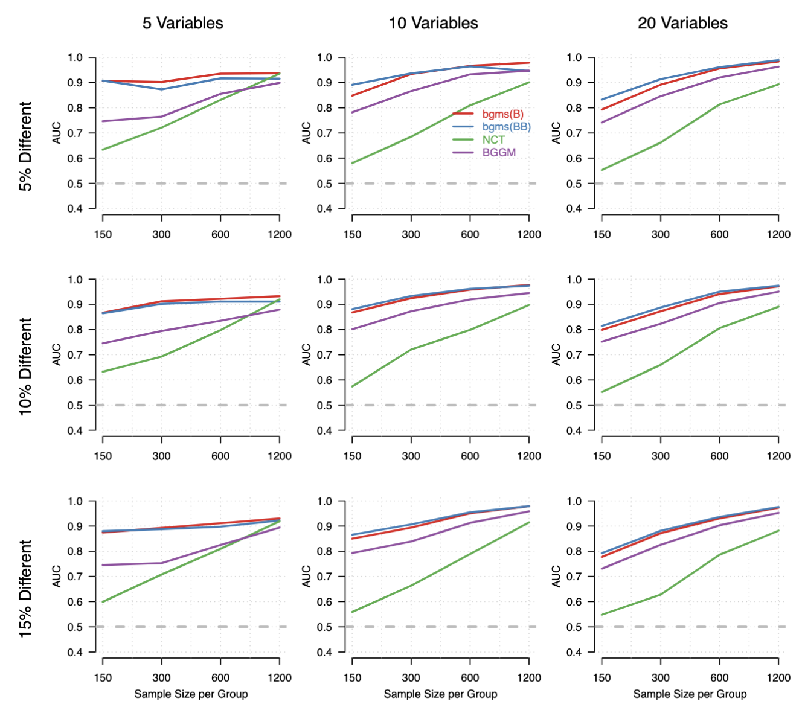
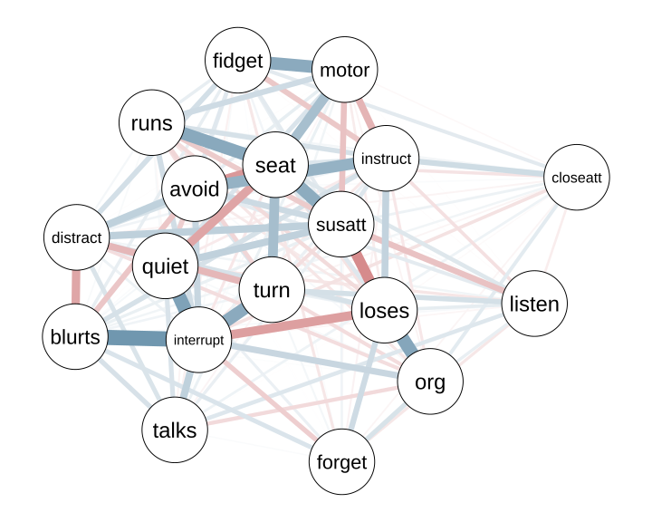
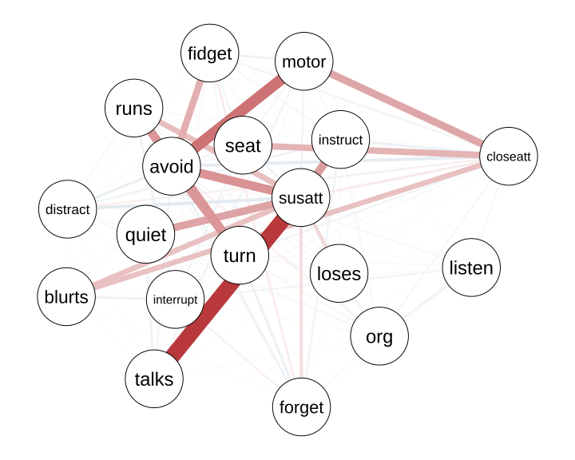
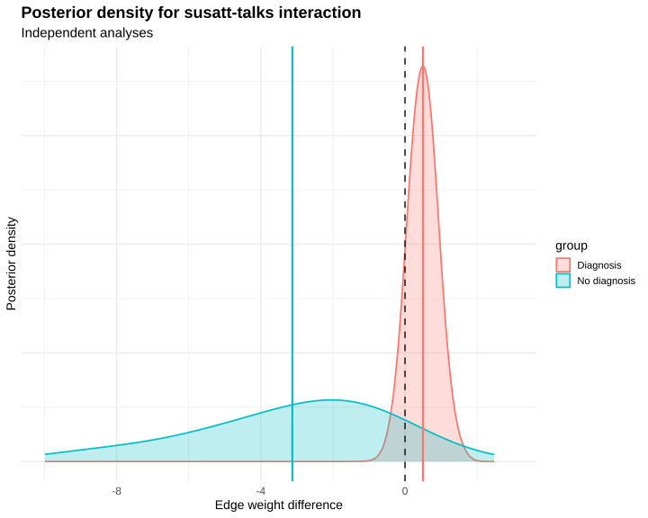
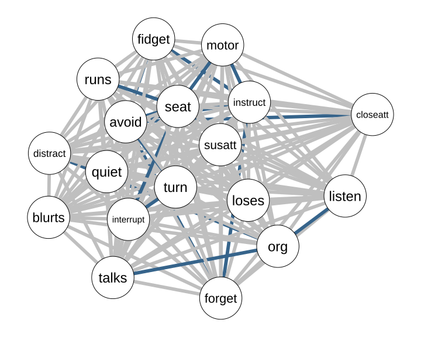
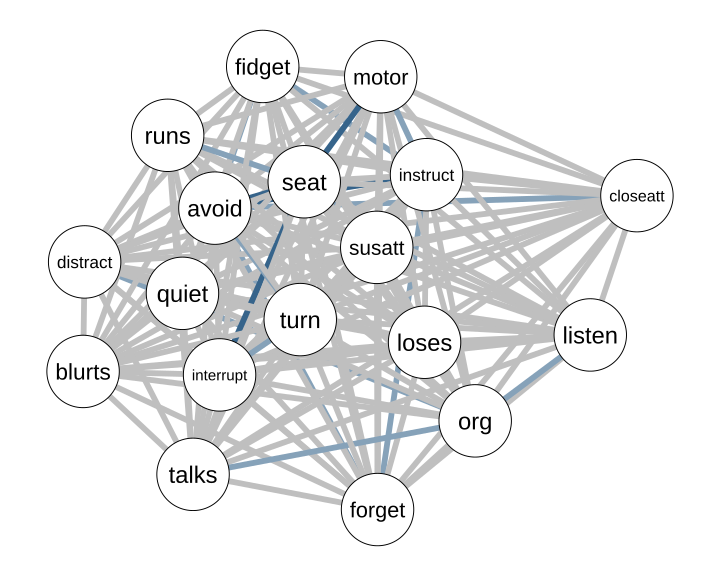
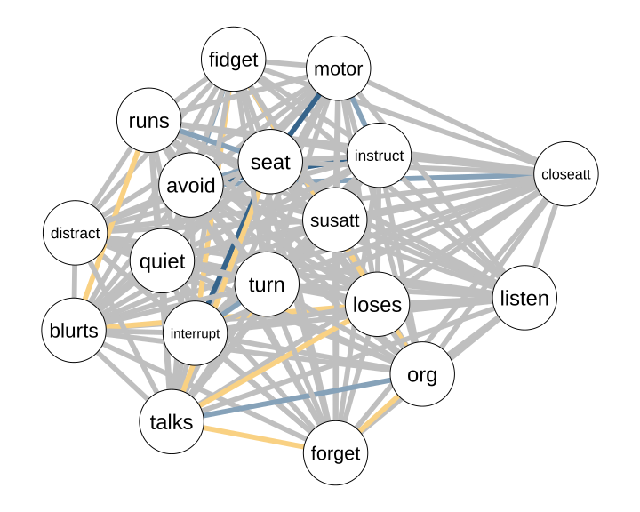

```{r setup, include=FALSE}
knitr::opts_chunk$set(echo = TRUE)
library(easybgm)
library(bgms)
library(knitr)
library(qgraph)
```

## Recap

This morning, you learned how to:

- **estimate** Bayesian graphical models within a single group  
  - using methods implemented in `bgms`, `BGGM`, and `BDgraph` (and wrapped in `easybgm`)  
  - interpreting posterior edge inclusion, parameter uncertainty, and network structure  

- **interpret** Bayesian network results in terms of  
  - evidence for and against including individual edges  
  - precision and uncertainty of parameter estimates  

---


## 🎯 Learning Outcomes

We now extend these ideas to the case of **two (or more) groups**. By the end of this session, you will be able to:

::: {.goals}
- Fit network models for two- or more groups using `easybgm`  
- Use **Bayes factors** to test group differences in network parameters and interpret their strength  
- Visualize evidence for group differences and relate it to estimated network structure  
- Assess the sensitivity of group comparison results to **prior settings** 
:::

In this tutorial you will largely mirror the analyses from the preceding lecture.

---

## 📘 This Session

::: {.note}
**Optional Reading:**

- Marsman, M., Waldorp, L., Sekulovski, N., & Haslbeck, J. (2025). Bayes factor tests for group differences in ordinal and binary graphical models. **Psychometrika**, **90**, 1809-1842. doi: 10.1017/psy.2025.10060

**R Setup Tip:**
Make sure to install and load the following libraries before running the examples:

```r
library(easybgm)
library(bgms)
library(qgraph)
```
:::

---

Before we continue with the hands-on part, let’s briefly revisit what we covered
in Part I of this session and why it matters for what we are about to do.

---
  
## 🔍 From single networks to group comparisons
  
In the morning session, we focused on estimating and testing **a single network**.
In the afternoon session, we extend this logic to **comparing networks across groups**.

Conceptually, the questions shift as follows:
  
&nbsp;1️⃣ **Is there a difference?** (edge variance vs. invariance)  
&nbsp;2️⃣ **If so, how large is that difference?** (difference in edge weight)

> Rather than asking whether an edge should be included or excluded,
> we now ask whether an **edge difference** should be included or excluded.

---
  
  
## 🧭 Why Bayesian group comparison?
    
In the theory session, we argued that classical group comparison approaches can reject hypotheses of invariance, but cannot support them.
Bayesian group comparison, in contrast, can accumulate evidence **for differences** and **for invariance**.
  
Simulation results illustrate how these methods can detect group differences across a range of scenarios.
Bayesian methods show reliable detection of group differences, particularly when samples are modest or effects are small.
  
{fig-align="center" width=80%}
  
  
### 🧠 Quick check-in
  
Before we move on, try to answer the following questions:
  
  1. What does a Bayes factor compare in a group comparison setting?  
  2. What does a value of $\text{BF}_{10} = 10$ mean?  
  *(Same interpretation as in the morning session.)*  
  3. Why might we vary prior settings when comparing networks?  

---
  
## What We Do in This Tutorial

This tutorial is organized as follows:

1. use `easybgm` (`bgms`) to fit a joint model that allows for edge differences,
2. evaluate evidence for edge invariance versus differences using Bayes factors,
3. examine how these conclusions change under alternative prior specifications, and
4. visualize and interpret the results.

You will work through each step using the same examples discussed in the lecture.

---

# Analysis

## Data

We use the `ADHD` dataset from:

> Silk, T.J., Malpas, C.B., Beare, R., Efron, D., Anderson, V., Hazell, P., Jongeling, B., Nicholson, J.M., & Sciberras, E. (2019). A network analysis approach to ADHD symptoms: More than the sum of its parts. **PLOS ONE**, **14**(1), e0211053. doi:10.1371/journal.pone.0211053.

The data consist of binary symptom variables (absent / present) and a grouping variable distinguishing two groups.

The dataset is made available in the `bgms` package,

```r
library(bgms)
?ADHD
```

::: {.panel-tabset}

### Tasks

Answer the following questions:

- Which variable defines group membership? 
- How many participants are in each group? 
- What are the symptom prevalences in each group? 

To answer these questions, extract: 

- a grouping variable indicating group membership, and  
- a data matrix containing only the symptom variables.  

### Solution

```r
library(bgms)

# Inspect the dataset
?ADHD

# Extract group indicator and symptom data
group_indicator = ADHD[, 1]
data = ADHD[, -1]

# Check group sizes
table(group_indicator)

# Inspect symptom prevalences by group
prevalence_group0 = colMeans(data[group_indicator == 0, , drop = FALSE])
prevalence_group1 = colMeans(data[group_indicator == 1, , drop = FALSE])

prevalence_group0
prevalence_group1
```
:::


```{r, echo = FALSE}
group_indicator = ADHD[, 1]
data = ADHD[, -1]

group_indicator_labeled = factor(
  group_indicator,
  levels = c(0, 1),
  labels = c("Not diagnosed", "Diagnosed")
)
```


```{r, echo = FALSE}
group_sizes = as.data.frame(table(group_indicator_labeled))
colnames(group_sizes) = c("Group", "N")

kable(group_sizes, caption = "Number of participants per group")
```

```{r, echo = FALSE}
prevalence_table = data.frame(
  Symptom = colnames(data),
  `Not diagnosed` = colMeans(data[group_indicator == 0, , drop = FALSE]),
  Diagnosed = colMeans(data[group_indicator == 1, , drop = FALSE]),
  row.names = NULL
)

# Round numeric columns only
prevalence_table[ , -1] = round(prevalence_table[ , -1], 2)

kable(
  prevalence_table,
  caption = "Symptom prevalences by group"
)
```

--- 

## Inspecting Group-Specific Networks

You can first inspect the networks for each group separately by estimating them
with `bgms` **without edge selection**. This provides a descriptive overview of
the group-specific network structures and their overall organization.

For reference, the code below illustrates how these networks can be estimated.
The analyses have already been run, and the results are shown further below.

```{r, eval = FALSE}
library(bgms)
library(qgraph)

fit_diag = bgm(
  x = data[group_indicator == 1, ],
  iter = 2000, # Number of MCMC iterations
  edge_selection = FALSE, #No edge selection
  seed = 1234)

fit_no_diag = bgm(
  x = data[group_indicator == 0, ],
  iter = 2000, # Number of MCMC iterations
  edge_selection = FALSE, #No edge selection
  seed = 1234)

layout = qgraph::qgraph(
  input = fit_diag$posterior_mean_pairwise,
  DoNotPlot = TRUE,
  layout = "spring"
)$layout

global_max <- max(
  (fit_diag$posterior_mean_pairwise),
  (fit_nodiag$posterior_mean_pairwise)
)

qgraph::qgraph(
  fit_diag$posterior_mean_pairwise,
  layout = layout,
  labels = colnames(ADHD[,-1]),
  theme = "TeamFortress",
  vsize = 10,
  esize = 20,
  legend = FALSE,
  maximum = global_max
)

qgraph::qgraph(
  fit_nodiag$posterior_mean_pairwise,
  layout = layout,
  labels = colnames(ADHD[,-1]),
  theme = "TeamFortress",
  vsize = 10,
  esize = 20,
  legend = FALSE,
  maximum = global_max
)
```

::: {.columns}
::: {.column width="50%"}
  
*(a) Diagnosis*
:::

::: {.column width="50%"}
  
*(b) No diagnosis*
:::
:::

*Estimated group-specific networks for the ADHD dataset.*


---

The estimated networks appear quite different, but apparent differences may be
due to sampling variation. To illustrate this, we inspect the posterior
distributions for the edge that shows the largest difference between groups:
**susatt** (difficulty sustaining attention) and **talks** (difficulty awaiting turn).

{width=80%}

The posterior distributions overlap substantially, indicating that the
difference in posterior means alone is not very informative about a population-level
difference. In particular, the no-diagnosis group shows a wide range of plausible
values for this edge.

To determine whether this and other apparent differences reflect more than
sampling variation, we need to formally quantify the evidence for or against
edge differences between groups.

---

## The `easybgm_compare` function

We now move to a joint group comparison model using `easybgm_compare`.

::: {.panel-tabset}

### Tasks

1. Inspect the help page of `easybgm_compare` to understand:
   - which inputs the function requires, and
   - which modeling options must be specified explicitly.

2. Using this information, fit a group comparison model with `easybgm_compare` for the ADHD data:
   - use the prepared `data` matrix and `group_indicator`,
   - use the `bgms` package (argument),
   - treat the data as ordinal,
   - set the number of iterations to 2000,
   - set a seed for reproducibility.

3. Inspect the fitted group comparison model by calling its summary method:
   - which part of the output reports the evidence for edge differences (or invariance),  
   - where is the information about group-specific edge estimates shown, and  
   - where are the overall conclusions about the number of differing or invariant edges summarized?


### Try-It

```r
easy_fit = easybgm_compare(
  data = data,
  group_indicator = group_indicator,
  iter = 2000,
  package = "bgms",
  type = "ordinal",
  seed = 1234
)
```

### Solution

```r
> summary(easy_fit)

 BAYESIAN NETWORK COMPARISON 
 Model type: ordinal 
 Number of nodes: 18 
 Fitting Package: bgms 
--- 
 EDGE SPECIFIC OVERVIEW 
           Relation Across-group Estimate Average Difference Difference BF     Category Convergence
     avoid-closeatt                 1.079             -1.511         4.810 inconclusive       1.001
     avoid-distract                 1.918             -0.171         0.605 inconclusive       1.000
  closeatt-distract                -0.535              0.335         0.804 inconclusive       1.000
       avoid-forget                 0.692             -1.112         3.403 inconclusive       1.000
    closeatt-forget                -0.003             -0.186         0.618 inconclusive       1.000
    distract-forget                 0.271             -0.081         0.487 inconclusive       1.000
     avoid-instruct                 1.073              2.335        20.108    different       1.000
                ...                   ...                ...           ...         ...          ...
```

:::


---

### Output

#### Model

As we saw with the `easybgm` output, the opening lines of `easybgm_compare` output report basic information about the fitted model:

  - the type of data that was analyzed,
  - the number of nodes in the network, and
  - the package used for estimation.

This is mainly used for sanity checking.

```r
 BAYESIAN NETWORK COMPARISON 
 Model type: ordinal 
 Number of nodes: 18 
 Fitting Package: bgms 
```

---

#### Edge Specific Overview

The edge specific overview lists results for each possible edge:  

  - an estimate of the average interaction effect across groups $\phi_{ij}$,  
  - an estimate of the difference between groups $\delta_{ij}$, 
  - a Bayes factor quantifying evidence for a group difference, 
  - a categorical classification based on this evidence, and
  - the $\hat{R}$ convergence diagnostic.

```r
 EDGE SPECIFIC OVERVIEW 
           Relation Across-group Estimate Average Difference Difference BF     Category Convergence
     avoid-closeatt                 1.079             -1.511         4.810 inconclusive       1.001
     avoid-distract                 1.918             -0.171         0.605 inconclusive       1.000
  closeatt-distract                -0.535              0.335         0.804 inconclusive       1.000
       avoid-forget                 0.692             -1.112         3.403 inconclusive       1.000
    closeatt-forget                -0.003             -0.186         0.618 inconclusive       1.000
    distract-forget                 0.271             -0.081         0.487 inconclusive       1.000
     avoid-instruct                 1.073              2.335        20.108    different       1.000
  closeatt-instruct                 1.535             -0.307         0.791 inconclusive       1.111
  distract-instruct                 1.313             -0.293         0.763 inconclusive       1.000
    forget-instruct                 0.676             -1.164         4.587 inconclusive       1.011
       avoid-listen                -0.142              1.127         2.492 inconclusive       1.000
    closeatt-listen                -0.521              0.204         0.671 inconclusive       1.012
    distract-listen                 0.440              0.007         0.474 inconclusive       1.000
      forget-listen                 0.057             -0.268         0.732 inconclusive       1.000
    instruct-listen                -0.047             -0.007         0.487 inconclusive       1.000
        avoid-loses                 0.246             -0.271         0.739 inconclusive       1.000
     closeatt-loses                 0.061             -0.073         0.518 inconclusive       1.027
     distract-loses                 0.482              0.555         1.387 inconclusive       1.001
       forget-loses                 1.046              0.116         0.483 inconclusive       1.000
     instruct-loses                 1.145              0.176         0.600 inconclusive       1.000
       listen-loses                 0.372              0.149         0.564 inconclusive       1.000
          avoid-org                -0.523              0.858         2.043 inconclusive       1.001
       closeatt-org                 0.879             -0.192         0.628 inconclusive       1.000
       distract-org                 0.542             -0.982         3.376 inconclusive       1.011
         forget-org                 1.068             -0.035         0.404 inconclusive       1.006
       instruct-org                 0.574             -0.619         1.500 inconclusive       1.001
         listen-org                 1.496             -0.994         3.932 inconclusive       1.000
          loses-org                 2.261              0.630         1.931 inconclusive       1.028
       avoid-susatt                 0.425              1.219         1.366 inconclusive       1.000
    closeatt-susatt                 0.382              0.221         0.764 inconclusive       1.000
    distract-susatt                 1.966             -0.364         0.785 inconclusive       1.024
      forget-susatt                 0.061              0.547         0.863 inconclusive       1.001
    instruct-susatt                 0.091              1.387         1.582 inconclusive       1.000
      listen-susatt                -0.611             -0.332         0.817 inconclusive       1.000
       loses-susatt                -2.016              0.149         0.773 inconclusive       1.000
         org-susatt                 0.432              0.111         0.630 inconclusive       1.000
       avoid-blurts                -0.758             -0.177         0.674 inconclusive       1.000
    closeatt-blurts                -0.604              1.608         2.456 inconclusive       1.000
    distract-blurts                -1.186             -0.277         0.765 inconclusive       1.000
      forget-blurts                 0.487              0.545         1.258 inconclusive       1.001
    instruct-blurts                 0.741              0.212         0.641 inconclusive       1.000
      listen-blurts                -0.216              0.197         0.631 inconclusive       1.000
       loses-blurts                -0.057              0.044         0.443 inconclusive       1.001
         org-blurts                 0.025              0.071         0.429 inconclusive       1.000
      susatt-blurts                 0.181              0.641         0.932 inconclusive       1.000
       avoid-fidget                -0.888              3.066         5.957 inconclusive       1.000
    closeatt-fidget                 0.964             -0.188         0.625 inconclusive       1.000
    distract-fidget                 0.401              0.543         1.373 inconclusive       1.000
      forget-fidget                -0.787              0.528         1.151 inconclusive       1.000
    instruct-fidget                 0.154             -1.318         5.093 inconclusive       1.000
      listen-fidget                -0.064              0.090         0.485 inconclusive       1.000
       loses-fidget                 0.265              0.292         0.771 inconclusive       1.001
         org-fidget                 0.218             -0.022         0.412 inconclusive       1.023
      susatt-fidget                 0.783             -0.025         0.598 inconclusive       1.001
      blurts-fidget                 0.313              0.105         0.475 inconclusive       1.000
    avoid-interrupt                 0.781              0.332         0.828 inconclusive       1.000
 closeatt-interrupt                -0.010             -0.435         1.051 inconclusive       1.001
 distract-interrupt                 0.511             -0.075         0.488 inconclusive       1.000
   forget-interrupt                -1.109              0.123         0.522 inconclusive       1.001
 instruct-interrupt                -0.222             -0.010         0.477 inconclusive       1.000
   listen-interrupt                 0.930             -0.935         2.970 inconclusive       1.000
    loses-interrupt                -0.777             -0.377         0.940 inconclusive       1.000
      org-interrupt                 0.206              0.884         2.820 inconclusive       1.000
   susatt-interrupt                -0.177              0.161         0.649 inconclusive       1.000
   blurts-interrupt                 2.699              0.155         0.554 inconclusive       1.000
   fidget-interrupt                 0.300             -0.006         0.398 inconclusive       1.107
        avoid-motor                -0.610              1.791         2.530 inconclusive       1.000
     closeatt-motor                -1.188              1.887         2.758 inconclusive       1.000
     distract-motor                 0.712             -0.131         0.527 inconclusive       1.000
       forget-motor                -0.126             -0.015         0.468 inconclusive       1.000
     instruct-motor                -0.360             -1.587         7.325 inconclusive       1.000
       listen-motor                -0.012              0.012         0.414 inconclusive       1.001
        loses-motor                -0.208             -0.130         0.537 inconclusive       1.000
          org-motor                -0.060             -0.112         0.504 inconclusive       1.000
       susatt-motor                -0.353             -1.311         2.380 inconclusive       1.000
       blurts-motor                 0.332             -0.334         0.928 inconclusive       1.000
       fidget-motor                 2.521              0.115         0.508 inconclusive       1.000
    interrupt-motor                -0.099             -0.080         0.464 inconclusive       1.000
        avoid-quiet                -0.392             -0.495         1.120 inconclusive       1.000
     closeatt-quiet                -0.053              0.047         0.551 inconclusive       1.000
     distract-quiet                 1.023             -0.117         0.534 inconclusive       1.000
       forget-quiet                 0.443              0.079         0.483 inconclusive       1.000
     instruct-quiet                -0.488              0.052         0.502 inconclusive       1.000
       listen-quiet                -0.312             -0.093         0.478 inconclusive       1.000
        loses-quiet                 0.240              0.218         0.630 inconclusive       1.000
          org-quiet                 0.469             -0.140         0.534 inconclusive       1.000
       susatt-quiet                 0.388              1.829         2.049 inconclusive       1.001
       blurts-quiet                 0.120              0.127         0.498 inconclusive       1.000
       fidget-quiet                 0.674              0.122         0.532 inconclusive       1.007
    interrupt-quiet                 2.340              0.379         0.934 inconclusive       1.000
        motor-quiet                 0.620              0.082         0.460 inconclusive       1.000
         avoid-runs                -0.644              0.075         0.543 inconclusive       1.000
      closeatt-runs                 0.465             -0.031         0.539 inconclusive       1.000
      distract-runs                 1.127             -0.098         0.534 inconclusive       1.000
        forget-runs                 0.381             -0.285         0.781 inconclusive       1.000
      instruct-runs                 0.734              0.409         0.989 inconclusive       1.000
        listen-runs                 0.284              0.054         0.451 inconclusive       1.000
         loses-runs                -0.776              0.051         0.480 inconclusive       1.000
           org-runs                 0.147             -0.527         1.406 inconclusive       1.000
        susatt-runs                -1.310              0.490         0.878 inconclusive       1.000
        blurts-runs                 0.208              0.008         0.394 inconclusive       1.000
        fidget-runs                 0.406              0.127         0.496 inconclusive       1.001
     interrupt-runs                 1.613             -0.253         0.700 inconclusive       1.000
         motor-runs                 1.009              0.153         0.556 inconclusive       1.000
         quiet-runs                -0.038             -0.098         0.505 inconclusive       1.000
         avoid-seat                -0.258             -2.269        13.679    different       1.000
      closeatt-seat                -1.428              1.579         1.779 inconclusive       1.000
      distract-seat                 0.368              0.156         0.585 inconclusive       1.000
        forget-seat                 0.087             -0.011         0.451 inconclusive       1.022
      instruct-seat                 0.284              0.512         1.156 inconclusive       1.000
        listen-seat                 0.542              0.133         0.526 inconclusive       1.000
         loses-seat                 0.964             -0.055         0.459 inconclusive       1.001
           org-seat                 0.046             -0.681         1.882 inconclusive       1.005
        susatt-seat                 2.478              0.114         0.615 inconclusive       1.006
        blurts-seat                 0.017              0.072         0.427 inconclusive       1.000
        fidget-seat                 0.858             -0.365         0.942 inconclusive       1.029
     interrupt-seat                 0.603             -2.104        48.689    different       1.109
         motor-seat                 0.370              2.876       284.714    different       1.001
         quiet-seat                -1.348             -0.305         0.831 inconclusive       1.000
          runs-seat                 2.067              1.381         8.379 inconclusive       1.000
        avoid-talks                 0.520             -0.815         2.252 inconclusive       1.000
     closeatt-talks                 0.423             -0.019         0.460 inconclusive       1.000
     distract-talks                 0.287              0.266         0.754 inconclusive       1.000
       forget-talks                 0.110             -0.004         0.383 inconclusive       1.000
     instruct-talks                -0.309              0.125         0.507 inconclusive       1.000
       listen-talks                 0.426              0.124         0.488 inconclusive       1.001
        loses-talks                 0.004             -0.055         0.417 inconclusive       1.000
          org-talks                -0.010             -0.908         4.556 inconclusive       1.000
       susatt-talks                -0.230              1.306         1.501 inconclusive       1.000
       blurts-talks                 0.752              0.178         0.598 inconclusive       1.000
       fidget-talks                -0.476              0.147         0.552 inconclusive       1.000
    interrupt-talks                 0.679              0.467         1.319 inconclusive       1.000
        motor-talks                 0.975             -0.721         2.636 inconclusive       1.000
        quiet-talks                 1.448             -0.662         2.195 inconclusive       1.000
         runs-talks                 0.009              0.196         0.625 inconclusive       1.000
         seat-talks                 0.216              0.010         0.407 inconclusive       1.000
         avoid-turn                -0.242              2.148         3.113 inconclusive       1.000
      closeatt-turn                 0.153             -0.563         1.177 inconclusive       1.000
      distract-turn                -1.222              0.008         0.548 inconclusive       1.000
        forget-turn                 0.875             -0.799         1.834 inconclusive       1.000
      instruct-turn                 0.582              0.142         0.614 inconclusive       1.000
        listen-turn                 0.525              0.839         1.660 inconclusive       1.000
         loses-turn                 0.521             -0.139         0.586 inconclusive       1.000
           org-turn                -0.640              0.034         0.524 inconclusive       1.000
        susatt-turn                -0.601              0.184         0.791 inconclusive       1.000
        blurts-turn                 0.262              0.182         0.621 inconclusive       1.000
        fidget-turn                 0.353             -0.205         0.662 inconclusive       1.000
     interrupt-turn                 1.809              1.387         5.135 inconclusive       1.000
         motor-turn                 0.610             -0.199         0.667 inconclusive       1.001
         quiet-turn                 0.462              0.176         0.596 inconclusive       1.009
          runs-turn                -1.255              0.855         1.196 inconclusive       1.001
          seat-turn                 1.590              0.594         1.192 inconclusive       1.001
         talks-turn                 0.274             -0.482         1.173 inconclusive       1.000
```

That's a long list!

The summary output reports several defaults used to classify edges.

```r
Bayes Factors larger than 10 were considered sufficient evidence for the classification. 
Bayes factors were obtained using Bayesian model-averaging. 
 
Convergence indicates the R-hat (Gelman-Rubin) statistic measuring how well MCMC chains have converged to 
the same target distribution, and values greater than about 1.01-1.05 are considered concerning,  
indicating potential lack of convergence.  
```

---

#### Group-specific edge estimates

```r
 GROUP SPECIFIC EDGE ESTIMATES 
                          group1       group2
avoid-closeatt      1.834468328  0.323837693
avoid-distract      2.003354511  1.832744826
avoid-forget        1.248336291  0.136003953
avoid-instruct     -0.094181982  2.240839461
avoid-listen       -0.705469909  0.421438235
avoid-loses         0.381885956  0.110869864
avoid-org          -0.952607167 -0.094330851
avoid-susatt       -0.184253587  1.034983862
avoid-blurts       -0.669275535 -0.845807516
...                 ...          ...
```

Reports the estimated edge weights within each group, shown side by side.

Conceptually, the group-specific estimates can be written as
$$
\sigma = \phi \pm \frac{\delta}{2},
$$
where $\phi$ denotes the edge effect averaged across groups and $\delta$ the estimated group difference.

Each row corresponds to a single edge, and the two columns report:

- the estimated edge weight in group 1, and
- the estimated edge weight in group 2.

On their own, these estimates are not that interesting.
The group-specific estimates are primarily useful for visualizing group-specific networks and for contextualizing detected differences.

---

#### Aggregated edge overview

```r
 AGGREGATED EDGE OVERVIEW 
 Number of edges with sufficient evidence for group differences: 4 
 Number of edges with insufficient evidence: 149 
 Number of edges with sufficient evidence for group similarity: 0 
 Number of possible edges: 153 
```

Summarizes the evidence for group differences across all edges in the network.

- *Number of edges with sufficient evidence for group differences*  
  Counts edges for which the Bayes factor for a group difference exceeds the predefined threshold.

- *Number of edges with sufficient evidence for group similarity*  
  Counts edges for which there is sufficient evidence in favor of no group difference.

- *Number of edges with insufficient evidence*  
  Counts edges for which the data do not provide strong evidence either for a difference or for similarity.

- *Number of possible edges*  
  The total number of pairwise associations in the network.

In this analysis, only a small number of edges show strong evidence for group differences, while the majority of edges remain inconclusive. 

Of course, the absence of evidence for differences across most edges should not be interpreted as evidence for similarity.

---

#### Structure overview

```r
 STRUCTURE OVERVIEW 
 Number of visited structures: 8000 
 Number of possible structures: 1.141798e+46 
 Posterior probability of most likely structure: 0.000125 
```

Reports information about the configurations visited during model estimation.

- *Number of visited structures*  
  The number of distinct configurations visited by the sampler. In this context, each configuration corresponds to a specific pattern of presence and absence of group differences across edges.

- *Number of possible structures*  
  The total number of theoretically possible configurations of edge differences for the given number of nodes.

- *Posterior probability of the most likely structure*  
  The relative frequency of the most frequently visited configuration across all MCMC iterations.

In this analysis, the number of visited structures equals the total number of MCMC iterations (2,000 iterations in each of 4 chains). Consequently, the estimated posterior probability of the most frequently visited configuration is $1 / 8000$.

This indicates substantial uncertainty about the overall pattern of edge differences between the two groups, consistent with the results reported in the aggregated edge overview.

---

## Vizualization of Group Comparison Results

As in the morning session, we visualize the results of the group comparison analysis using `easybgm`.
The edge evidence plot summarizes, for each edge, how strongly the data support a group difference, group similarity, or neither.

::: {.panel-tabset}

### Tasks

1. Inspect the edge evidence plot for the group comparison results.
2. Change the evidence threshold to 3 and to 10.
3. Describe what changes across plots.

---

### Try it

Use `plot_edgeevidence()` and vary the `evidence_thresh` argument.

---

### Solution

```r
plot_edgeevidence(easy_fit, evidence_thresh = 3)
plot_edgeevidence(easy_fit, evidence_thresh = 10)
```
:::

---

::: {.columns}
::: {.column width="50%"}
  
*(a) `evidence_thresh = 3`*
:::

::: {.column width="50%"}
  
*(b) `evidence_thresh = 10`*
:::
:::

*Edge evidence plots for the group comparison analysis.*


---

## Understanding Priors

This morning we argued that priors encode assumptions about the model that were made *before* seeing the data. In group comparisons, these assumptions concern:

- **Difference structure**: Which edges we expect to be different
- **Difference parameters**: How weak or strong we expect group differences to be

The `bgms` and `easybgm` software makes these assumptions explicit through two sets of priors, which we briefly inspect and vary to see how conclusions about group differences
change.

### Priors on difference structure

As in network estimation, a structural prior specifies which effects are expected to be present before seeing the data. 
In group comparisons, this concerns how many edges are expected to differ between groups.

The `bgms` software offers two commonly used options for this purpose.

- **Bernoulli($\pi$)**  
  The default choice, with $\pi = 0.5$, treats each edge difference as equally likely to be present or absent. As a consequence, about half of the differences are expected to be present, **a priori**.

- **Beta–Bernoulli($\alpha, \beta$)**  
  A hierarchical alternative in which the inclusion probability itself is learned from the data. This allows the analysis to adapt to sparse solutions where few differences are present as well as dense solutions where many differences are present. 


::: {.panel-tabset}

### Tasks

1. Inspect the underlying group comparison function `bgmCompare` in `bgms` and identify the argument that controls the prior on **difference structures** (i.e., whether edges differ between groups).
   
2. Refit the group comparison model using a **Beta–Bernoulli(1,1)** prior for the difference configuration.

3. Compare the aggregated edge overview to the results obtained under the default Bernoulli(0.5) prior.

### Try it

```r
easy_fit_beta_bern = easybgm_compare(
  data = data,
  group_indicator = group_indicator,
  iter = 2000,
  package = "bgms",
  type = "ordinal",
  seed = 1234,
  difference_prior = "Beta-Bernoulli",
  beta_bernoulli_alpha = 1,
  beta_bernoulli_beta = 1
)
```

### Solution

With Bernoulli($0.5$):
```r
 AGGREGATED EDGE OVERVIEW 
 Number of edges with sufficient evidence for group differences: 4 
 Number of edges with insufficient evidence: 149 
 Number of edges with sufficient evidence for group similarity: 0 
 Number of possible edges: 153 
```

With Beta-Bernoulli($1,1$):
```r
 AGGREGATED EDGE OVERVIEW 
 Number of edges with sufficient evidence for group differences: 3 
 Number of edges with insufficient evidence: 150 
 Number of edges with sufficient evidence for group similarity: 0 
 Number of possible edges: 153 
```

:::


::: {.columns}
::: {.column width="50%"}
  
*(a) Bernoulli ($0.5$)*
:::

::: {.column width="50%"}
  
*(b) Beta-Bernoulli($1,1$)*
:::
:::

*Edge evidence plots for the group comparison analysis with different structure priors.*

### Priors on the (size of) difference parameters

In addition to specifying whether edges differ between groups, `bgms` places a prior on the **size** of these differences.

Group differences are assigned a Cauchy prior centered at zero. The scale of this prior determines how large differences are considered plausible a priori and can be adjusted by the user.


::: {.panel-tabset}

### Tasks

1. Inspect the help page of `bgmCompare` and identify the argument that controls the **scale** of the prior on group differences.

2. Refit the model using a different prior scale for group differences:

   - once with the scale doubled,
   - once with the scale halved.

3. Compare the aggregated edge overview across the fitted models.


### Try it

```r
easy_fit_scale = easybgm_compare(
    data = data,
    group_indicator = group_indicator,
    iter = 2000,
    package = "bgms",
    type = "ordinal",
    seed = 1234,
    difference_scale = 2
)
```

### Solution

Scale is 0.5:
```r
 AGGREGATED EDGE OVERVIEW 
 Number of edges with sufficient evidence for group differences: 3 
 Number of edges with insufficient evidence: 150 
 Number of edges with sufficient evidence for group similarity: 0 
 Number of possible edges: 153 
```

Scale is 1:
```r
 AGGREGATED EDGE OVERVIEW 
 Number of edges with sufficient evidence for group differences: 4 
 Number of edges with insufficient evidence: 149 
 Number of edges with sufficient evidence for group similarity: 0 
 Number of possible edges: 153 
```

Scale is 2:
```r
 AGGREGATED EDGE OVERVIEW 
 Number of edges with sufficient evidence for group differences: 4 
 Number of edges with insufficient evidence: 149 
 Number of edges with sufficient evidence for group similarity: 0 
 Number of possible edges: 153 
```

:::


```{r, echo = FALSE}
easy_fit_scale2 = easybgm_compare(
  data = data,
  group_indicator = group_indicator,
  iter = 2000,
  package = "bgms",
  type = "ordinal",
  seed = 1234,
  difference_scale = 2, 
  progress = FALSE
)

easy_fit_scale_5 = easybgm_compare(
  data = data,
  group_indicator = group_indicator,
  iter = 2000,
  package = "bgms",
  type = "ordinal",
  seed = 1234,
  difference_scale = 0.5, 
  progress = FALSE
)

# x and y are your log-BF vectors
x <- log(easy_fit_scale2$inc_BF[lower.tri(easy_fit_scale2$inc_BF)])
y <- log(easy_fit_scale_5$inc_BF[lower.tri(easy_fit_scale_5$inc_BF)])

# Choose how much negative space you want to keep
lower <- min(x, y) - .1  

# Compute a shared upper limit after cropping (keeps x/y comparable)
upper <- max(c(x, y)[c(x, y) > lower], na.rm = TRUE) + .1

# Shared limits for both axes (not symmetric around zero)
lims <- c(lower, upper)

par(mar = c(6, 6, 1, 1))

plot(
  x, y,
  xlim = lims,
  ylim = lims,
  xlab = "",
  ylab = "",
  pch = 21,
  bg = "white",
  cex = 1.1,
  axes = FALSE,
  asp = 1
)

axis(1, cex.axis = 1.4)
axis(2, las = 1, cex.axis = 1.4)

mtext("Log Bayes Factors (scale = 2)", side = 1, line = 3, cex = 1.7)
mtext("Log Bayes Factors (scale = 0.5)", side = 2, line = 3, cex = 1.7)

# zero lines (only draw if zero is inside the plotting window)
if (lims[1] < 0 && lims[2] > 0) abline(v = 0, h = 0, col = "gray70", lty = 3)

# identity line (clipped)
library(plotrix)
ablineclip(0, 1,
  x1 = lims[1], x2 = lims[2],
  y1 = lims[1], y2 = lims[2],
  lty = 2, col = "gray40"
)

# H0 under both priors (bottom-left)
rect(
  lims[1], lims[1],
  min(0, lims[2]), min(0, lims[2]),
  col = rgb(0.6, 0.6, 0.6, 0.12),
  border = NA
)

# H1 under both priors (top-right)
rect(
  max(0, lims[1]), max(0, lims[1]),
  lims[2], lims[2],
  col = rgb(0.2, 0.6, 0.2, 0.12),
  border = NA
)
```

In this example, using a larger prior scale (scale = 2) leads to larger Bayes factors than using a smaller prior scale (scale = 0.5) for edges showing positive evidence for group differences. Across edges, the Bayes factors under the two scales are approximately linearly related.

The resulting edge classifications are very similar across scales: three edges show sufficient evidence for group differences when the scale is set to 0.5, and four edges when the scale is set to 1 or 2. All remaining edges are classified as inconclusive under all examined scales.

Thus, changing the prior scale affected the magnitude of the Bayes factors, but not the substantive conclusions.

### What should you do in practice?

To emphasize the same ideas as in the morning session:

  - Start with defaults unless you have specific expectations.  
  - If theory or data suggest otherwise, adapt the prior accordingly. 
  - Run at least one sensitivity check. 
  - Report your choices transparently.  


# Recap of Part II

In this session, we extended the Bayesian network framework to the case of
**group comparisons**, focusing on what this approach adds beyond estimating
networks separately for each group.

In particular, you have seen the practical benefits of Bayesian group comparison:

- *You can obtain evidence for both **group differences** and **group similarity***  
- *You can distinguish inconclusive results from genuine evidence for invariance*  
- *You can relate evidence for differences to the estimated network structure*  

To put this into practice, we walked through the full group comparison workflow:

✅ Inspecting group-specific networks  
✅ Quantifying evidence for edge differences using Bayes factors  
✅ Visualizing results with edge evidence and network plots  
✅ Examining the sensitivity of conclusions to prior settings  

Taken together, these tools allow you to move beyond informal visual comparisons
and make principled statements about **which network differences are supported by
the data, which are not, and which remain uncertain**.

