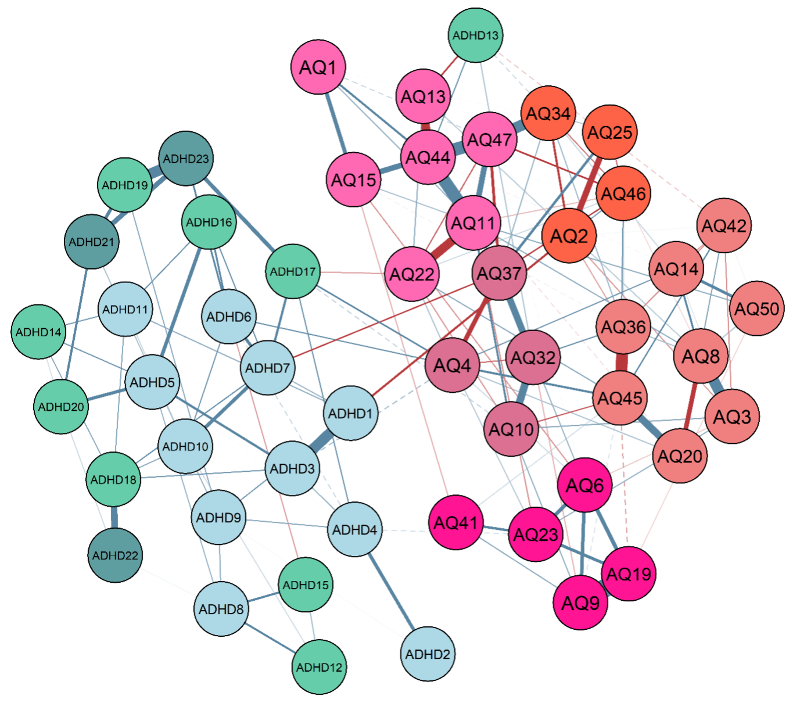
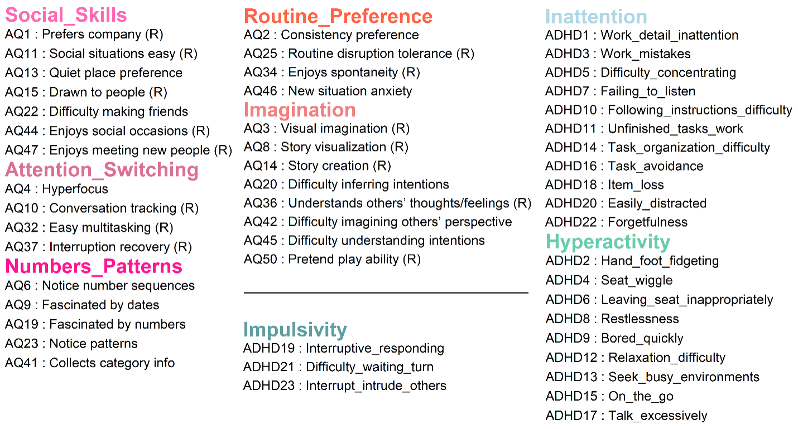
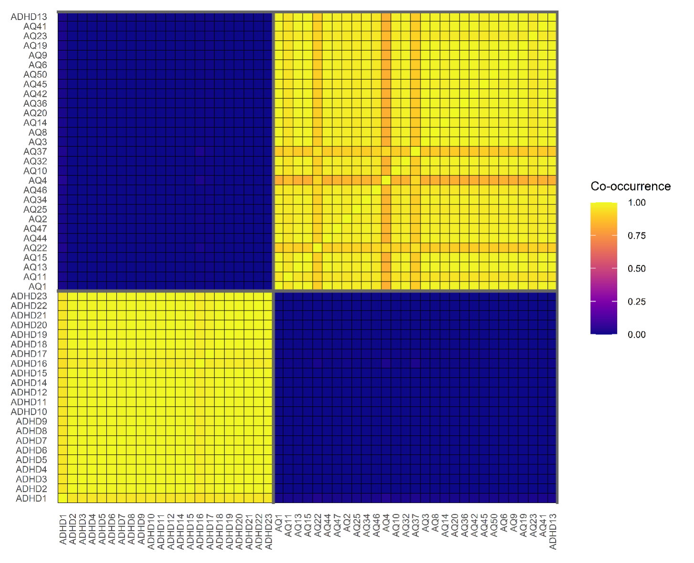

```{r setup, include=FALSE}
knitr::opts_chunk$set(echo = TRUE)
```

# TODO:

- add the plots 
- add the code examples
- add more text on why clustering is important
- render the html 

# Recap

- We learned how Bayesian reasoning distinguishes *evidence of absence* from *absence of evidence*.
- Using Bayes factors, we quantified the strength of evidence for individual edges.  
- We practiced estimating networks, interpreting uncertainty, and running prior-sensitivity checks.
- We briefly touched upon the structure priors.


## Goals for this session

At the end of this session, you should be able to:

::: {.goals}

- **Describe** how the different structure priors (Bernoulli, Beta–Bernoulli, Stochastic Block Model) encode assumptions about network structure.
- **Explain** the difference between the three priors
- **Estimate** networks under each prior, test for clustering and estimate the cluster membership of the nodes.
- **Interpret** results for clustering. 
:::


::: {.note}
**Recommended Reading:**

- Sekulovski, N., Arena, G., Haslbeck, J., Huth, K., Friel, N., & Marsman, M. (2024). A Stochastic Block Prior for Clustering in Graphical Models. Preprint. doi: 10.31234/osf.io/29p3m_v1
- Sekulovski, N., Keetelaar, S., Haslbeck, J., & Marsman, M. (2024). Sensitivity analysis of prior distributions in Bayesian graphical modeling: Guiding informed prior choices for conditional independence testing. advances.in/psychology, 2 , e92355. doi: 10.56296/aip00016

**Optional Reading**

- Sekulovski, N., Waaijers, M., & Arena, G., (2025). LLM-Based Prior Elicitation for Bayesian Graphical Modeling. Preprint. doi: 10.31234/osf.io/k2twq_v1

**R Setup Tip:**
Make sure to install and load the following libraries before running the examples:

```r
library(bgms)
library(dplyr) #Used for plotting
library(easybgm)
library(ggplot2) #Used for plotting
library(gridExtra) #Used for plotting
library(patchwork) #Used for plotting
library(pheatmap)
library(qgraph)
library(tidyr) #Used for plotting
```
::
:::


# Network Structure Priors

Network structure priors are used to incorporate the researcher's beliefs (or uncertainty) about the underlying structure of the network before observing the data. This is one of the main distinguishing characteristics of Bayesian graphical modeling framework.

These priors allow us to:

- Control which edges are more or less likely to be included. 
- Model the network density. 
- Incorporate a clustering assumption as well as test for the presence of clusters in the network and estimate the cluster membership of the nodes.

In this session we will explore the three structure priors in detail and showcase how to use them in practice with the `easybgm` R package.

# 1. The Bernoulli Prior

This is the prior which you already saw during the morning session. In its simplest form, this prior sets a Bernoulli(π) distribution, where the inclusion probability π is fixed to $0.5$ and equal for all edges. This is equivalent to saying that we expect about half of the relations to be present in the network.

[figure]. 

What do you notice in this figure? Which network structures are most likely?

Alternatively, based on substantive or thoretical reaspons, we might believe that some edges are more likely than others. The Bernoulli structure prior allows us to incporporate such assumptions by setting a seperate inclusion probability π for each edge.  This will make the corresponding network structures where the associated edge is present more or less likely, depending on the value of π.

## 1.2 Workflow in easybgm 

[example code: How to do it in R, with the default example and also with how to do it seperately for each edge (note for BBDgraph is different than for bgms, I thinl)]


# 2. The Beta–Bernoulli Prior

The second prior is the **Beta–Bernoulli prior**. This prior generalizes the Bernoulli prior by treating the global inclusion probability π as a random variable drawn from a Beta(α, β) distribution. This extra layer of uncertainty allows the Beta–Bernoulli prior to model a wider range of network densities. By adjusting the parameters α and β, we can encode beliefs about whether the network is likely to be sparse, dense, or somewhere in between. Note that this prior assumes that the prior inclusion probability π is constant across the edges. 
t case ,m] bithoth shape paparameters of the Beta distribution are set to 1, resulting in a uniform distribution over π. This means that all network densities are equally likely a priori.

[figure]

What do you notice in the figure? How does this compae to the Bernoulli prior? 

## 2.2 Workflow in easybgm

[Code, this can only be done with the OMRF]

# 3. The Stochastic-Block Model

So far, we have focused on modeling **sparsity and density** using network priors:  
- The **Bernoulli prior** fixes an edge probability π.  
- The **Beta–Bernoulli prior** treats π as random, distributing prior mass across different levels of network complexity.  

**Limitation:** Neither prior encodes *organization* among nodes.  
Yet in psychological research, we often expect such organization:  
- Symptoms may cluster into **domains** (e.g., ADHD or Autism).  
- Some symptoms may connect domains, suggesting potential **bridges**.  

The **Stochastic Block Model (SBM)** addresses this by placing a prior directly on **clustering structure**:  
- Nodes are assigned to latent blocks (clusters), which are learned from the data.
- The probability of an edge between two nodes depends on the blocks to which they belong.  

The **Stochastic Block Model (SBM)** prior assumes that nodes are organized into clusters or domains.  
Edges are more likely within the same block and less likely between blocks.  
Let’s build some intuition for what this structure implies.

### Why do we need such a model?

If these were symptom networks, how would you interpret edges within and between clusters?  
  How might these patterns relate to theoretical expectations about domains or bridging symptoms?
[expand on this]

## 3.2 The Stochastic Block Model as Network Prior

### The generative model

1. **Block assignments**  
   - Each node is assigned to a latent block based on the data.  
   - This is random: the model places a distribution over assignments.  
   - In our earlier code, this was the line where we sampled the block membership for each node.

2. **Edge probabilities**  
   - For each block pair $(a,b)$, an edge probability $\pi_{ab}$ is drawn from a Beta distribution.  
   - Each within-block and between-block connection set follows a **Beta–Bernoulli model**, just like the Beta-Bernoulli prior 
   
3. **Edges**  
   - Once block memberships and block-to-block probabilities are set, each possible edge is sampled as Bernoulli($\pi_{ab}$).  
   - This is the same Bernoulli mechanism as before — but now $\pi$ depends on which blocks the two nodes belong to.  
   - Put differently: an SBM is a hierarchy of many **local Beta–Bernoulli priors**, one for each block pair.

In the Bayesian SBM, both the number of clusters and the block-to-block edge probabilities are treated as random, learned from the data rather than fixed in advance.  

### Hyperparameters

- **λ (lambda):** controls the prior on the number of clusters (it is the rate parameter of a truncated Poisson distribution).  
  *Interpretation:* this plays a role similar to π in the Bernoulli prior — it encodes how complex we expect the network structure to be, but here in terms of clusters rather than edges.  

Unlike the standard Poisson, λ is not itself the expectation but is closely related.  
  For example:  

  - If $\lambda = 1.59$, the expected number of clusters is about 2.  
  - If $\lambda = 2.82$, the expected number of clusters is about 3.  
  - If $\lambda = 3.92$, the expected number of clusters is about 4.  

  In other words, λ does not equal the expected number of clusters directly (as in a standard Poisson), but it tracks it closely: larger λ implies more clusters on average.

- **α, β** shape the Beta–Bernoulli priors on block-to-block connections for the edges within clusters and between clusters.  
  *Interpretation:* just as before, these parameters determine whether we expect connections to be sparse or dense, hiowever, now we have two pairs of parameters: one for within-block connections (beta_bernoulli_alpha and beta_bernoulli_beta) and one for between-block connections (beta_bernoulli_alpha_between and  beta_bernoulli_beta_between).

- **Dirichlet parameter (dirichlet_alpha):** governs the distribution of the allocation of the nodes across clusters.  
  *Interpretation:* this parameter controls how balanced we expect cluster sizes to be.  

  - With larger values, the prior favors clusters of similar size (nodes are spread more evenly across blocks).  
  - With smaller values, the prior allows some clusters to be large and others very small, making uneven splits more plausible.  

  In practice, we almost always leave this parameter at its default value of 1.  
  That choice corresponds to a neutral prior: all partitions of nodes are equally likely, without preferring equal or unequal clusters.


## 3.3 Workflow in easybgm

So far, we have built intuition for what the SBM prior does.  
Now we turn to the **workflow** for analyzing clustering in real psychological networks.
The central goal of SBM analysis is to evaluate evidence for clustering.  
In practice, this is done through **clustering Bayes factors**.  
Here is the workflow:

### Step 1: Fit SBM model

```r
library(bgms)

fit_sbm <- easybgm(
  data = data,
  type = "ordinal" # or "binary"
  update_method = "adaptive-metropolis",  # use metropolis for speed
  edge_prior = "Stochastic-Block",        # stochastic block model prior
  lambda = 1.5936,                        # expected 2 clusters
  beta_bernoulli_alpha = 1,               # α, β for the within block probability
  beta_bernoulli_beta = 1,
  beta_bernoulli_alpha_between = 1,       # α, β for the between block probability
  beta_bernoulli_beta_between = 1,
  dirichlet_alpha = 1                     # usually fixed
)
```

### Step 2: Posterior distribution of the number of clusters
The object `fit_sbm$posterior_num_blocks` contains posterior probabilities for each possible number of clusters.  

```r
fit_sbm$posterior_num_blocks
```

> Which numbers of clusters (e.g., 1, 2, 3) are most supported by the data?  

### Step 3: Compute posterior odds
From `posterior_num_blocks`, compute the posterior odds of one clustering hypothesis vs. another:  

$$
\text{Posterior odds} = \frac{P(B = b_1 \mid \text{data})}{P(B = b_2 \mid \text{data})}
$$

For example, you can extract posterior probabilities from `fit_sbm$posterior_num_blocks`:  

- **$H_0$ (one cluster):**  
  ```r
  p1 <- fit_sbm$posterior_num_blocks[1, 1]
  ```

- **$H_1$ (two clusters):**  
  ```r
  p2 <- fit_sbm$posterior_num_blocks[2, 1]
  ```

- **$H_2$ (two or more clusters):**  
  ```r
  p_ge2 <- sum(fit_sbm$posterior_num_blocks[-1, 1])
  ```


### Step 4: Compute prior odds

The prior on the number of clusters $B$ follows a **truncated Poisson** distribution with rate parameter λ:  

$$
P(B = b) = \frac{e^{-\lambda}\, \lambda^b}{b!}\, \frac{1}{1 - e^{-\lambda}}, \quad b = 1, 2, \ldots
$$

From this, the prior odds are:  

$$
\text{Prior odds} = \frac{P(B = b_1)}{P(B = b_2)}.
$$

#### Case 1: Point hypotheses
For example, comparing 2 vs 1 cluster:  

```r
lambda <- 2

# Prior probability of 1 cluster
prior1 <- dpois(1, lambda) / (1 - exp(-lambda))

# Prior probability of 2 clusters
prior2 <- dpois(2, lambda) / (1 - exp(-lambda))

# Prior odds: 2 vs 1 cluster
prior_odds_2v1 <- prior2 / prior1
```

---

#### Case 2: Range hypotheses
For example, comparing “two or more clusters” vs “one cluster”:  

$$
P(B \geq 2) = 1 - P(B=1) = 1 - \frac{\lambda}{e^{\lambda}-1}.
$$

```r
# Prior probability of 1 cluster
prior1 <- lambda / (exp(lambda) - 1)

# Prior probability of 2 or more clusters
prior_ge2 <- 1 - prior1

# Prior odds: (>=2 clusters) vs (1 cluster)
prior_odds_ge2v1 <- prior_ge2 / prior1
```

### Step 5: Clustering Bayes factors

Bayes factors compare posterior odds with prior odds:  

$$
BF_{b_1,b_2} \;=\; \frac{\text{Posterior odds}}{\text{Prior odds}}.
$$

---

#### Example 1: Clustering vs. no clustering
Compare “two or more clusters” vs “one cluster.”  

```r
# Posterior probabilities (from Step 3)
p1    <- fit_sbm$posterior_num_blocks[1, 1]           # P(B=1 | data)
p_ge2 <- sum(fit_sbm$posterior_num_blocks[-1, 1])     # P(B>=2 | data)

post_odds_ge2v1 <- p_ge2 / p1

# Prior probabilities (from Step 4)
lambda <- 2
prior1 <- lambda / (exp(lambda) - 1)                  # P(B=1)
prior_ge2 <- 1 - prior1                               # P(B>=2)

prior_odds_ge2v1 <- prior_ge2 / prior1

# Bayes factor
BF_ge2v1 <- post_odds_ge2v1 / prior_odds_ge2v1
BF_ge2v1
```

---

#### Example 2: Comparing specific cluster numbers
Compare 2 clusters vs 3 clusters.  

```r
# Posterior probabilities
p2 <- fit_sbm$posterior_num_blocks[2, 1]              # P(B=2 | data)
p3 <- fit_sbm$posterior_num_blocks[3, 1]              # P(B=3 | data)

post_odds_3v2 <- p3 / p2

# Prior probabilities
prior2 <- dpois(2, lambda) / (1 - exp(-lambda))       # P(B=2)
prior3 <- dpois(3, lambda) / (1 - exp(-lambda))       # P(B=3)

prior_odds_3v2 <- prior3 / prior2

# Bayes factor
BF_3v2 <- post_odds_3v2 / prior_odds_3v2
BF_3v2
```

---

**Interpretation**  
- If BF ≫ 1: strong evidence in favor of the numerator hypothesis (e.g., clustering over no clustering, or 3 clusters over 2).  
- If BF ≈ 1: little evidence to prefer one clustering hypothesis over the other.  


::: {.panel-tabset}

### Tasks

Now test the clustering hypotheses from Martarelli, Ballifard, and Audrin (2023) using the Bayesian SBM.

1. **Specify prior expectations**  
   - Choose λ to reflect the expected number of clusters (the authors anticipated 3).  
   - Keep the Beta–Bernoulli parameters at their defaults, α = β = 1, representing neutral beliefs about overall density.  
   - Leave the Dirichlet parameter at 1 for balanced cluster sizes.  
   This step translates the substantive hypothesis—three underlying domains—into prior parameters.

2. **Fit the SBM model**  
   Estimate the model on the cleaned dataset using `bgm()`.  
   This will apply the SBM prior to empirical data and allow the number of clusters to vary according to the posterior.

3. **Compute posterior probabilities**  
   Extract `posterior_num_blocks` to obtain the posterior distribution over the number of clusters.  
   Examine whether the data favor one, two, or three clusters.

4. **Compute clustering Bayes factors**  
   Begin by testing whether the data support any clustering at all:  

   - $H_0$: one cluster (no clustering)  
   - $H_1$: two or more clusters (evidence for clustering)  

   Then compare specific hypotheses of interest:  

   - $H_1$: two clusters  
   - $H_2$: three clusters (the authors’ expectation)  

   Evaluate whether the posterior evidence supports the expected three-domain structure or favors fewer domains.

---

### Try it

Follow these steps in R:

```r
library(easybgm)
library(bgms)

# Step 1: Fit SBM model
fit_sbm_boredom <- bgm(
  x = data_boredom,                       # cleaned dataset
  update_method = "adaptive-metropolis",  # Metropolis for speed
  iter = 1e4,                             # more iterations needed
  edge_prior = "Stochastic-Block",        # stochastic block prior
  lambda = _____,                         # expected ~3 clusters
  beta_bernoulli_alpha = _____,           
  beta_bernoulli_beta = _____,
  dirichlet_alpha = _____                 
)

# Step 2: Posterior distribution of the number of clusters
fit_sbm_boredom$posterior_num_blocks

# 👉 Tasks:
# - Extract p1, p2, p3, and p_ge2 (posterior probabilities for 1, 2, 3, ≥2 clusters).
# - Compute prior1, prior2, prior3, and prior_ge2 from truncated Poisson(λ = 2.821439).
# - Calculate Bayes factors:
#     BF(≥2 vs 1), BF(2 vs 1), BF(3 vs 2).
```

---

**Reflection questions**  
- Is there evidence for clustering at all (≥2 vs 1)?  
- If clustering is present, which hypothesis (2 vs 3 clusters) receives strongest support?  
- Do the Bayesian results reproduce or challenge the Walktrap findings?  
- How sensitive are your conclusions to the choice of λ?

---

### Solution

```r
# Step 1: Fit SBM model with λ ≈ 3 (2.82 gives E[#clusters] ≈ 3)
fit_sbm_boredom <- bgm(
  x = data_boredom,
  update_method = "adaptive-metropolis",
  iter = 1e4,
  edge_prior = "Stochastic-Block",
  lambda = 2.821439,          # expectation ≈ 3 clusters
  beta_bernoulli_alpha = 1,           
  beta_bernoulli_beta = 1,
  dirichlet_alpha = 1
)

# Step 2: Posterior probabilities
p1    <- fit_sbm_boredom$posterior_num_blocks[1,1]       # P(B=1 | data)
p2    <- fit_sbm_boredom$posterior_num_blocks[2,1]       # P(B=2 | data)
p3    <- fit_sbm_boredom$posterior_num_blocks[3,1]       # P(B=3 | data)
p_ge2 <- sum(fit_sbm_boredom$posterior_num_blocks[-1,1]) # P(B≥2 | data)

# Step 3: Prior probabilities from truncated Poisson(λ)
lambda <- 2.821439
prior1    <- dpois(1, lambda) / (1 - exp(-lambda))
prior2    <- dpois(2, lambda) / (1 - exp(-lambda))
prior3    <- dpois(3, lambda) / (1 - exp(-lambda))
prior_ge2 <- 1 - prior1

# Step 4: Bayes factors
BF_ge2v1 <- (p_ge2/p1) / (prior_ge2/prior1)   # clustering vs no clustering
BF_2v1   <- (p2/p1)   / (prior2/prior1)       # 2 vs 1 cluster
BF_3v2   <- (p3/p2)   / (prior3/prior2)       # 3 vs 2 clusters

BF_ge2v1; BF_2v1; BF_3v2
```

**Interpretation**  
- $BF_{\geq 2,1}$: Evidence for clustering vs. no clustering at all.  
- $BF_{2,1}$: Evidence for 2 clusters over 1.  
- $BF_{3,2}$: Evidence for 3 separate domains (authors’ hypothesis) vs. 2 domains (Walktrap result).  

:::

## 2.5 [Optional] Inspecting node-level clustering

If time permits, we can go one step further:  
looking not only at the number of clusters, but also at **how nodes are assigned to them**.

### Dahl clustering and visualization
- Use Dahl’s method (`posterior_mean_allocations`) to obtain a representative cluster assignment.  
- Color nodes by cluster in a network plot.

```r
library(qgraph)

# Step 1: Extract Dahl clustering (posterior mean allocations)
clusters <- fit_sbm_boredom$posterior_mean_allocations

# Step 2: Get posterior mean partial associations
assoc_matrix <- fit_sbm_boredom$posterior_mean_pairwise

# Step 3: Plot with qgraph, coloring nodes by cluster
qgraph(assoc_matrix,
       layout = "spring",
       groups = as.factor(clusters),
       color = rainbow(length(unique(clusters))),
       legend = TRUE,
       legend.cex = 0.4,
       title = "Dahl clustering of boredom–curiosity–exploration data")
```

{width=80%}
{width=80%}

### Co-clustering matrix
- Inspect `posterior_coclustering_matrix` to see how often pairs of nodes appear in the same cluster.  
- Nodes with unstable assignments may be candidates for **bridge symptoms**, but this requires careful interpretation.  

```r
install.packages("pheatmap") # if not already installed
library(pheatmap)

pheatmap(fit_sbm_boredom$posterior_mean_coclustering_matrix, 
         cluster_rows = TRUE, 
         cluster_cols = TRUE, 
         display_numbers = FALSE
         )
```
{width=80%}


**Reflection questions**  
- Do Dahl clusters align with the substantive scales (SBPS vs CEI subscales)?  
- Which nodes are uncertain in their cluster assignment?  
- Could this uncertainty relate to bridge-like behavior across domains?  

---

# Bonus: Using LLMs for Prior Specification

Up to now, we have specified priors either by hand (choosing π, α, β, λ) or by using defaults.  
But what if we could **automate prior elicitation** by using existing scientific knowledge?  

A recent proposal by **Sekulovski, Waaijers, & Arena (2025)** ([preprint](https://osf.io/preprints/psyarxiv/k2twq_v1)) introduces **LLM-based prior elicitation**.  

### The idea
- A **large language model (LLM)** is prompted with context and variable names.  
- For each pair of variables, it estimates whether an edge should be present or absent.  
- Repeated prompts with different permutations stabilize the estimates.  
- The resulting inclusion probabilities can be:
  - used directly as **edge priors** in a Bernoulli model,  
  - converted into **α, β** parameters for a Beta–Bernoulli prior, or  
  - summarized into an **expected number of clusters (λ)** for an SBM prior.  

This approach is implemented in the R package **[`bgmElicit`](https://github.com/sekulovskin/bgmElicit)** and via a Shiny app: [bgmElicit App](https://uvasobe.shinyapps.io/bgmElicit/).  

### Why it matters
- **Prior elicitation is hard**: theory may be vague, and defaults don’t always reflect substantive expectations.  
- LLMs can help by distilling broad domain knowledge into structured prior information.  
- These machine-generated priors can then be combined with expert judgment and tested with **sensitivity analyses**.  

### Example workflow in R
```r
library(bgmElicit)

# Step 1: Elicit edge probabilities
llm_out <- elicitEdgeProb(
  context = "PTSD symptoms according to DSM-V",
  variable_list = c("Intrusive thoughts","Nightmares","Flashbacks"),
  LLM_model = "gpt-5",
  n_perm = 5,
  seed = 123
)

# Step 2: Inspect elicited edge priors
llm_out$inclusion_probability_matrix

# Step 3: Convert to hyperparameters
betaBernParameters(llm_out, method = "mle")     # for Beta–Bernoulli priors
sbmClusters(llm_out, algorithm = "louvain")     # for SBM priors
```

---

::: {.callout-tip title="Explore further"}
Try the interactive [bgmElicit Shiny app](https://uvasobe.shinyapps.io/bgmElicit/).  
Upload your variable list, specify context, and obtain priors ready to use in `easybgm` or `bgms`.  

⚠️ Note: The **R package requires an OpenAI API key** to connect to GPT models.  
This makes it a proof-of-concept tool for now, but it illustrates how priors can be informed not only by hand-tuning, but also by **AI-assisted elicitation**.
:::


## Recap and Outlook

**In this session (Session II – Practical), we have:**  
- Simulated networks under three topological priors — Bernoulli, Beta–Bernoulli, and SBM.  
- Explored how each prior encodes different structural assumptions about density, complexity, and clustering.  
- Computed Bayes factors for both edge inclusion and network clustering.  
- Applied the SBM workflow to empirical data on boredom, curiosity, and exploration.  
- Reflected on how prior choices translate substantive psychological theory into statistical form.

**Looking ahead:**  
- Recent work by **Sekulovski, Waaijers, & Arena (2025)**  
  ([preprint](https://osf.io/preprints/psyarxiv/k2twq_v1)) uses **large language models (LLMs)** to elicit **hyperpriors** for network analysis.  
- This approach is implemented in the R package [**bgmElicit**](https://github.com/sekulovskin/bgmElicit) and the [**bgmElicit App**](https://uvasobe.shinyapps.io/bgmElicit/).  
- ⚠️ Note: using the R package currently requires an **OpenAI API key**.  
- Together, these developments show that prior specification remains an active research frontier — evolving from simple Bernoulli assumptions, through Beta–Bernoulli and SBM priors, toward interactive and AI-assisted elicitation.
