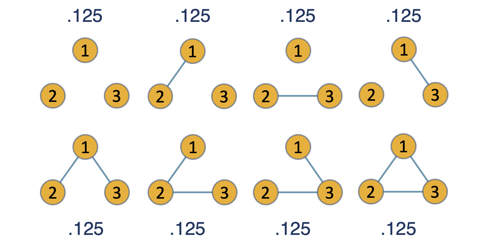
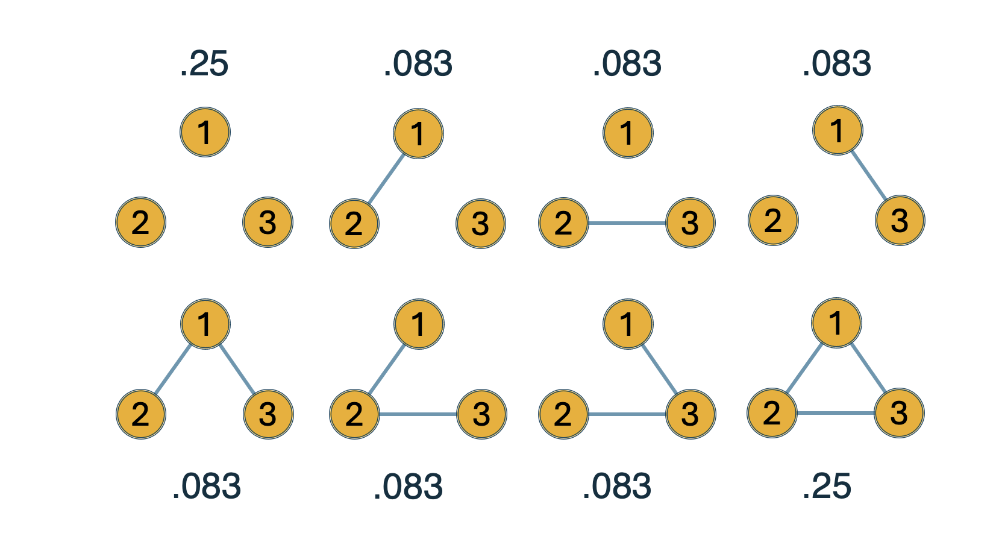

```{r setup, include=FALSE}
knitr::opts_chunk$set(echo = TRUE)
```

# Recap

In the morning session, we covered the fundamentals of Bayesian graphical modeling.

-   We learned how Bayesian reasoning distinguishes *evidence of absence* from *absence of evidence* using the inclusion Bayes factor.
-   We practiced estimating networks, interpreting the structure-averaged parameter estimates and their uncertainty.
-   We briefly touched upon the priors on the network structure.

## Goals for this session

By the end of this session, you will be able to:

::: goals
-   **Describe** how the different priors (Bernoulli, Beta–Bernoulli, Stochastic Block Model) encode assumptions about the network structure.
-   **Explain** the difference between the three priors.
-   **Estimate** networks under each prior, test for clustering and estimate the cluster membership of the nodes.
:::

::: note
**Recommended Reading:**

-   Sekulovski, N., Arena, G., Haslbeck, J., Huth, K., Friel, N., & Marsman, M. (2024). A Stochastic Block Prior for Clustering in Graphical Models. Preprint. doi: 10.31234/osf.io/29p3m_v1
-   Sekulovski, N., Keetelaar, S., Haslbeck, J., & Marsman, M. (2024). Sensitivity analysis of prior distributions in Bayesian graphical modeling: Guiding informed prior choices for conditional independence testing. advances.in/psychology, 2 , e92355. doi: 10.56296/aip00016

**Optional Reading**

-   Sekulovski, N., Waaijers, M., & Arena, G., (2025). LLM-Based Prior Elicitation for Bayesian Graphical Modeling. Preprint. doi: 10.31234/osf.io/k2twq_v1

**R Setup Tip:** Make sure to install and load the following libraries before running the examples:
:::

# Network Structure Priors

Priors on the network structure are used to incorporate researcher's beliefs (or uncertainty) about the underlying combination of present and absent edges before observing the data.

This is one of the main distinguishing characteristics of the Bayesian graphical modeling framework.

These priors allow us to:

-   Control which edges are more or less likely to be included.
-   Model the network density.
-   Incorporate the assumption of clustering.
-   Test for the presence of clusters in the network and estimate the cluster membership of the nodes.

In this session we will explore the three structure priors in detail and showcase how to use them in practice with the `easybgm` package.

# 1. The Bernoulli Prior

In its simplest form, this prior sets a Bernoulli(π) distribution, where the inclusion probability π is fixed to $0.5$ for all edges.
This is the prior that was implicitly assumed during the morning lecture.

Let's visualize the implications of this prior for a small network with $p = 6$ nodes (i.e., $m = 15$ possible edges and $2^m$ possible network structures).

-   Left panel: prior probability assigned to **individual network structures**.
-   Right panel: prior probability distribution over the **network density**.

```{r, warning=FALSE, message=FALSE}
library(ggplot2)
library(gridExtra)

# Prior over density
pmf_binom <- function(m, pi) {
  k <- 0:m
  prob <- dbinom(k, size = m, prob = pi)
  data.frame(k, prob)
}

pmf_betabinom <- function(m, a, b) {
  k <- 0:m
  prob <- exp(lchoose(m, k) + lbeta(k + a, m - k + b) - lbeta(a, b))
  data.frame(k, prob)
}

plot_prior <- function(p = 6, model = "bernoulli", pi = 0.5, a = 1, b = 1) {
  m <- p * (p - 1) / 2
  k <- 0:m
  
  if (model == "bernoulli") {
    prob_k <- dbinom(k, size = m, prob = pi)
    label <- paste0("Bernoulli(π=", pi, ")")
  } else {
    prob_k <- exp(lchoose(m, k) + lbeta(k + a, m - k + b) - lbeta(a, b))
    label <- paste0("Beta–Bernoulli(", a, ",", b, ")")
  }
  
  # Left: probability per structure = prob_k / choose(m,k)
  df_struct <- data.frame(k, prob = prob_k / choose(m, k))
  
  g1 <- ggplot(df_struct, aes(x = k, y = prob)) +
    geom_line() +
    labs(x = "Network Structures", y = "Prior prob per graph",
         title = "Prior for the individual structures") +
    theme_minimal(base_size = 12)
  
  # Right: probability over density = prob_k
  df_complexity <- data.frame(k, prob = prob_k)
  
  g2 <- ggplot(df_complexity, aes(x = k, y = prob)) +
    geom_line() +
    labs(x = "Number of edges (k)", y = "Prior prob",
         title = "Prior over the network density") +
    theme_minimal(base_size = 12)
  
  grid.arrange(g1, g2, ncol = 2, top = label)
}
```

```{r}
# Example: Bernoulli(0.5)
plot_prior(p = 6, model = "bernoulli", pi = 0.5)
```

::: {.callout-note title="Interpretation: Bernoulli(0.5)"}
-   **Structures (left):** every graph of $p$ nodes has the same prior probability.\
-   **Density (right):** the distribution is binomial. Most prior mass lies around 50% density, because there are many more graphs of medium density.

**Implications:**

-   Edges are independent and equally likely.
-   Expected density is fixed at $\pi$, regardless of network size. But how should one choose $\pi$?\
-   For example, under $\pi = 0.5$, extremely sparse and dense networks receive very little prior probability.
:::

{width="80%"}

Alternatively, based on substantive or theoretical considerations, we might believe that some edges are more likely than others.
The Bernoulli structure prior allows us to incorporate such assumptions by setting a separate inclusion probability π for each edge.

## 1.2 Workflow in easybgm

This prior is available both for estimating networks based on ordinal/binary data as well as for estimating GGMs and models for mixed data types.

For binary and ordinal data, the Bernoulli prior is specified by setting `edge_prior = "Bernoulli"` in the `easybgm()` function.
By default, the inclusion probability π is set to $0.5$ for all edges, using the `inclusion_prob` argument.
Here is an example:

``` r
library(bgms)
library(easybgm)

fit <- easybgm(
  data = ADHD[, c(2:6)],
  type = "ordinal", # 
  update_method = "adaptive-metropolis",  # use metropolis for speed
  edge_prior = "Bernoulli",  # specify the prior 
  inclusion_prob = 0.5    # set inclusion probability (default is 0.5)
)
```

If we wish to set different inclusion probabilities for different edges, we can do so by providing a matrix of inclusion probabilities to the `inclusion_prob` argument.
Here is an example:

``` r
library(bgms)
library(easybgm)
# Create a custom inclusion probability matrix
inclusion_matrix <- matrix(0.5, nrow = 5, ncol =
 5)
diag(inclusion_matrix) <- 0    # No self-loops
inclusion_matrix[1, 2] <- 0.8  # Higher probability forinclusion between nodes 1 and 2
inclusion_matrix[2, 1] <- 0.8  # Symmetric matrix
# Fit the model with custom inclusion probabilities
fit_custom <- easybgm(
  data = ADHD[, c(2:6)],
  type = "ordinal",
  update_method = "adaptive-metropolis",
  edge_prior = "Bernoulli",
  inclusion_prob = inclusion_matrix
)
```

For GGMs and GMs for mixed data, the Bernoulli prior is the only choice and is automatically set.
By default, the inclusion probability π is set to $0.5$ for all edges, using the `inclusion_prob` argument.
Here is an example:

``` r
library(bgms)
library(easybgm)

fit <- easybgm(
  data = ADHD[, c(2:6)],
  type = "continuous", # or mixed  
  inclusion_prob = 0.5    # set inclusion probability (default is 0.5)
)
```

We can set different inclusion probabilities for different edges by providing a matrix of inclusion probabilities to the `inclusion_prob` argument, similar to the previous example.

# 2. The Beta–Bernoulli Prior

The second prior is the **Beta–Bernoulli prior**.
This prior generalizes the Bernoulli prior by treating the global inclusion probability π as a random variable drawn from a Beta(α, β) distribution.
This extra layer of uncertainty allows the Beta–Bernoulli prior to model a wider range of network densities.
By adjusting the parameters α and β, we can encode beliefs about whether the network is likely to be sparse, dense, or somewhere in between.
Note that this prior assumes that the prior inclusion probability π is constant across the edges.
In the default case, both shape parameters of the Beta distribution are set to 1, resulting in a uniform distribution over π.
This means that all network densities are equally likely a priori.

```{r}
# Example: Beta–Bernoulli(5,5)
plot_prior(p = 6, model = "beta", a = 1, b = 1)
```

::: {.callout-note title="Interpretation: Beta–Bernoulli(1,1)"}
-   **Structures (left):** sparse and dense graphs have higher per-graph probability than mid-density graphs.\
-   **Density (right):** the distribution is uniform; each possible number of edges $k$ is equally likely.

**Implications:**\
- Prior mass is spread evenly across all possible network densities.\
- Sparse, dense, and intermediate graphs are all equally plausible.\
- No need to choose a single fixed value of $\pi$; the model considers a wide range of possible densities.
:::

{width="80%"}

```{r}
# Example: Beta–Bernoulli(5,5)
plot_prior(p = 6, model = "beta", a = 2, b = 5)
```

::: {.callout-note title="Interpretation: Beta–Bernoulli(2,5)"}
-   **Structures (left):** graphs with fewer edges per structure receive higher prior probability.\
-   **Density (right):** the distribution places more weight on lower values of $k$, i.e., sparser networks.

**Implications:**\
- This prior encodes a belief that networks are more likely to be sparse ($E[\pi] = \frac{\alpha}{\alpha + \beta} \approx 0.29$).\
- The parameters $\alpha$ and $\beta$ determine how strongly sparsity or density is favored.
:::

## 2.2 Workflow in easybgm

This prior is only available for networks based on ordinal/binary data (i.e., for the ordinal Markov random field model).
The prior is specified by setting `edge_prior = "Beta-Bernoulli"` in the `easybgm()` function.
By default, the parameters $\alpha$ and $\beta$ are set to $1$, representing a uniform prior over inclusion probability.
Here is an example:

``` r
library(bgms)
library(easybgm)

fit <- easybgm(
  data = ADHD[, c(2:6)],
  type = "ordinal", 
  update_method = "adaptive-metropolis",
  edge_prior = "Beta-Bernoulli", 
  beta_bernoulli_alpha = 1,
  beta_bernoulli_beta = 1   
)
```

As a guide on deciding how to set the $\alpha$ and $\beta$ parameters, you can use [this](https://amshenao.shinyapps.io/FINAL/) Shiny app, which can help you to visualize the distribution.
The app also provides the measures of central tendency and dispersion of the distribution, given the specified parameters.

# Prior Odds Under the Bernoulli and Beta-Bernoulli Priors 

# 3. The Stochastic-Block Model

So far, we have focused on modeling **sparsity and density** using network priors:\
- The **Bernoulli prior** fixes an edge probability π.\
- The **Beta–Bernoulli prior** treats π as random, distributing prior mass across different levels of the network density.

**Limitation:** Neither prior encodes the *organization* among nodes.

To capture such patterns, we need priors that go beyond edge probability and network density.

## 3.1 Clustering in Psychological networks

In many psychological network theories, we expect nodes of the network to cluster into **domains** or **communities**.

-   Items measuring abilities (such as intelligence) are assumed to cluster together.
-   Symptoms of psychological disorders may cluster into domains (e.g., ADHD or Autism, Depression or Anxiety).
-   Some symptoms may connect domains, suggesting potential **bridges**, which some authors have argued are important in the study of comorbidity of mental disorders (e.g., Cramer et al., 2010; Borsboom & Cramer, 2013).

{width="80%"}

So far, there have only been post-hoc methods to detect such clusters in estimated networks (e.g., using Exploratory Graph Analysis).

However, these methods do not allow us to incorporate prior beliefs about clustering into the estimation process itself and to test for the presence of clusters (i.e., test a theory).

We need a prior (i.e., a model on the network structure) that directly incorporates the clustering assumption into the network model.

## 3.2 The Stochastic Block Model as a Prior on the Network Structure of the OMRF

The **Stochastic Block Model (SBM)** addresses this by placing a prior directly on **clustering structure**:

-   Nodes are assigned to latent blocks (clusters), which are learned from the data.
-   Then, the probability of an edge between two nodes depends on the blocks to which they belong.
-   We can set edges to be more likely within the same block and less likely between blocks.

### The Model

1.  **Block assignments**
    -   Each node is assigned to a latent block based on the data.
2.  **Edge probabilities**
    -   For each pair of nodes, an edge probability $\pi_{aa}$ is drawn from a Beta($\alpha_{within}, \beta_{within}$), for edges belonging to the same cluster and edge probability $\pi_{ab}$ is drawn from a Beta($\alpha_{between}, \beta_{between}$), for edges belonging to different clusters.
3.  **Edges**
    -   Once block memberships and block-to-block probabilities are set, each possible edge is sampled as a Bernoulli($\pi_{ab}$) variable.
    -   This is the same Beta-Bernoulli mechanism as before — but now $\pi$ depends on which blocks the two nodes belong to.
    -   Put differently: an SBM is a hierarchy of many **local Beta–Bernoulli priors**, one for each block pair.

In the Bayesian SBM, both the number of clusters and the block-to-block edge probabilities are treated as random, learned from the data rather than fixed in advance.

### Hyperparameters

-   **λ:** controls the prior on the number of clusters (it is the rate parameter of a truncated Poisson distribution).\
    *Interpretation:* this plays a role similar to π in the Bernoulli prior — it encodes how complex we expect the network structure to be, but here in terms of clusters rather than edges.

Unlike the standard Poisson, λ is not itself the expectation but is closely related.\
For example:

-   If $\lambda = 1.59$, the expected number of clusters is about 2.\
-   If $\lambda = 2.82$, the expected number of clusters is about 3.\
-   If $\lambda = 3.92$, the expected number of clusters is about 4.

In other words, λ does not equal the expected number of clusters directly (as in a standard Poisson), but it tracks it closely: larger λ implies more clusters on average.

-   **α, β** shape the Beta–Bernoulli priors on block-to-block connections for the edges within clusters and between clusters.\
    *Interpretation:* just as before, these parameters determine whether we expect connections to be sparse or dense, however, now we have two pairs of parameters: one for within-block connections ($\alpha_{within}, \beta_{within}$) and one for between-block connections ($\alpha_{between}, \beta_{between}$).

-   **Dirichlet concentration parameter:** governs the distribution of the allocation of the nodes across clusters.\
    *Interpretation:* this parameter controls how balanced we expect cluster sizes to be.

    -   With larger values, the prior favors clusters of similar size (nodes are spread more evenly across blocks).\
    -   With smaller values, the prior allows some clusters to be large and others very small, making uneven splits more plausible.

    In practice, we almost always leave this parameter at its default value of 1.\
    That choice corresponds to a neutral prior: all partitions of nodes are equally likely, without preferring equal or unequal clusters.

## 3.3 Workflow in easybgm

The central practical goal, of a network analysis using the SBM prior, is to test for clustering and to estimate the cluster membership of the nodes.
In practice, this is done through **clustering Bayes factors**.
You can also find a tutorial that explains how to perform a clustering analysis using both `easybgm` and `bgms` packages [here](https://www.nikolasekulovski.com/blog/post2/).

In this example, we will be using a simulated data set with 12 ordinal variables, where we know that the true number of clusters is 2.
We will leave all the prior parameter settings at their default values (i.e., we set the expected number of clusters to 1, all Beta distribution shape parameters to 1, and the Dirichlet concentration parameter to 1.).

Here is the workflow:

```{r}
#| cache: true
library(easybgm)
library(bgms)
data <- readRDS("data_sbm.rds")
fit_sbm <- easybgm(
  data = data,
  type = "ordinal", # or "binary"
  update_method = "adaptive-metropolis", # use metropolis for speed
  edge_prior = "Stochastic-Block",       # stochastic block model prior
  lambda = 1,                            # expected 1 clusters
  beta_bernoulli_alpha = 1,              # α, β for the within block probability
  beta_bernoulli_beta = 1,
  beta_bernoulli_alpha_between = 1,      # α, β for the between block probability
  beta_bernoulli_beta_between = 1,
  dirichlet_alpha = 1,                    
  seed = 1234,
  progress = FALSE
)

# summarize the rresults 
summary(fit_sbm)
```

```{r}
#| message: false
#| warning: false
library(easybgm)
clusterBayesfactor(fit_sbm, type = "point", b1 = 2, b2 = 1)
```

```{r}
library(pheatmap)
pheatmap(fit_sbm$sbm$posterior_mean_coclustering_matrix, 
         cluster_rows = FALSE, 
         cluster_cols = FALSE,
         color = colorRampPalette(c("#B8860B", "#009E73"))(100))
```

# Bonus: Using LLMs for Prior Specification

Up to now, we have specified priors either by hand (choosing π, α, β, λ) or by using defaults.\
But what if we could **automate prior elicitation** by using existing scientific knowledge?

A recent proposal by **Sekulovski, Waaijers, & Arena (2025)** ([preprint](https://osf.io/preprints/psyarxiv/k2twq_v1)) introduces **LLM-based prior elicitation**.

### The idea

-   A **large language model (LLM)** is prompted with context and variable names.\
-   For each pair of variables, it estimates whether an edge should be present or absent.\
-   Repeated prompts with different permutations stabilize the estimates.\
-   The resulting inclusion probabilities can be:
    -   used directly as **edge priors** in a Bernoulli model,\
    -   converted into **α, β** parameters for a Beta–Bernoulli prior, or\
    -   summarized into an **expected number of clusters (λ)** for an SBM prior.

This approach is implemented in the R package [**`bgmElicit`**](https://github.com/sekulovskin/bgmElicit) and via a Shiny app: [bgmElicit App](https://uvasobe.shinyapps.io/bgmElicit/).

### Why it matters

-   **Prior elicitation is hard**: theory may be vague, and defaults don’t always reflect substantive expectations.\
-   LLMs can help by distilling broad domain knowledge into structured prior information.\
-   These machine-generated priors can then be combined with expert judgment and tested with **sensitivity analyses**.

### Example workflow in R

``` r
library(bgmElicit)

# Step 1: Elicit edge probabilities
llm_out <- elicitEdgeProb(
  context = "PTSD symptoms according to DSM-V",
  variable_list = c("Intrusive thoughts","Nightmares","Flashbacks"),
  LLM_model = "gpt-5",
  n_perm = 5,
  seed = 123
)

# Step 2: Inspect elicited edge priors
llm_out$inclusion_probability_matrix

# Step 3: Convert to hyperparameters
betaBernParameters(llm_out, method = "mle")     # for Beta–Bernoulli priors
sbmClusters(llm_out, algorithm = "louvain")     # for SBM priors
```

------------------------------------------------------------------------

::: {.callout-tip title="Explore further"}
Try the interactive [bgmElicit Shiny app](https://uvasobe.shinyapps.io/bgmElicit/).\
Upload your variable list, specify context, and obtain priors ready to use in `easybgm` or `bgms`.

⚠️ Note: The **R package requires an OpenAI API key** to connect to GPT models.\
This makes it a proof-of-concept tool for now, but it illustrates how priors can be informed not only by hand-tuning, but also by **AI-assisted elicitation**.
It should be also noted that LLMs are not infallible and may produce inaccurate or biased outputs.\
Therefore, it is crucial to critically evaluate and validate the elicited priors before using them in any analysis.
And always perform a prior sensitivity analysis to assess the robustness of your results to different prior specifications.
:::

# Recap

**In this session, we have:**\
-  Explored three priors on network structure: **Bernoulli**, **Beta–Bernoulli**, and **Stochastic Block Model (SBM)**.\
-  Discussed how each prior encodes different assumptions about edge inclusion, network density, and clustering.\
-  Practiced estimating networks under each prior using the `easybgm` package.\
-  Learned how to test for clustering and estimate cluster membership with the SBM prior.\
-  Now you are equipped to choose and implement structure priors that align with your research questions and theoretical expectations in Bayesian graphical modeling!
