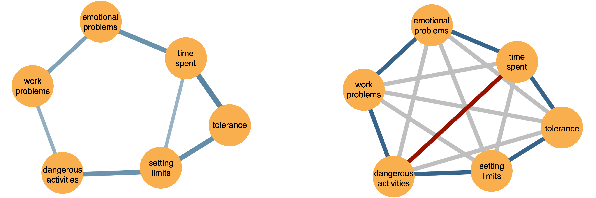
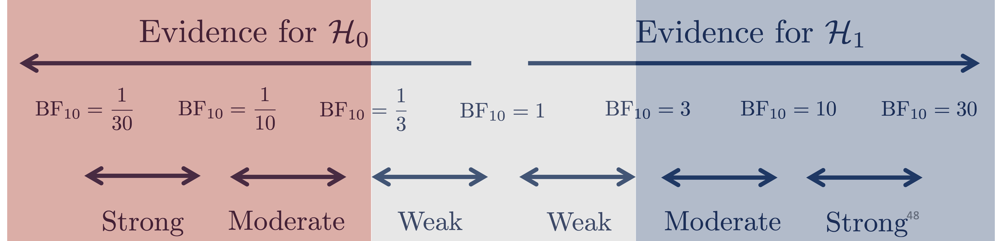
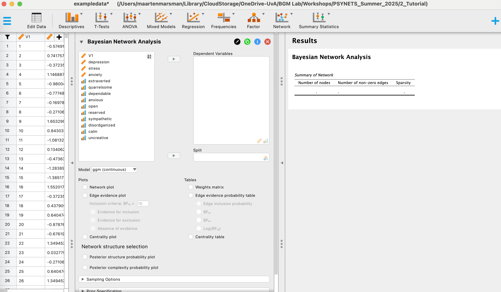
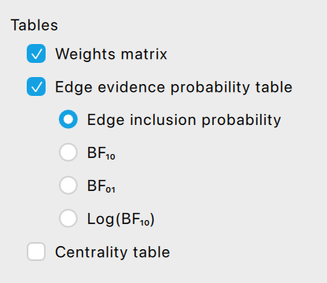
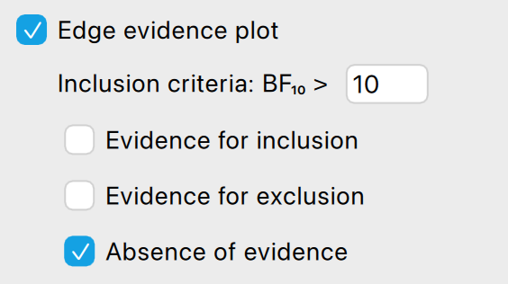
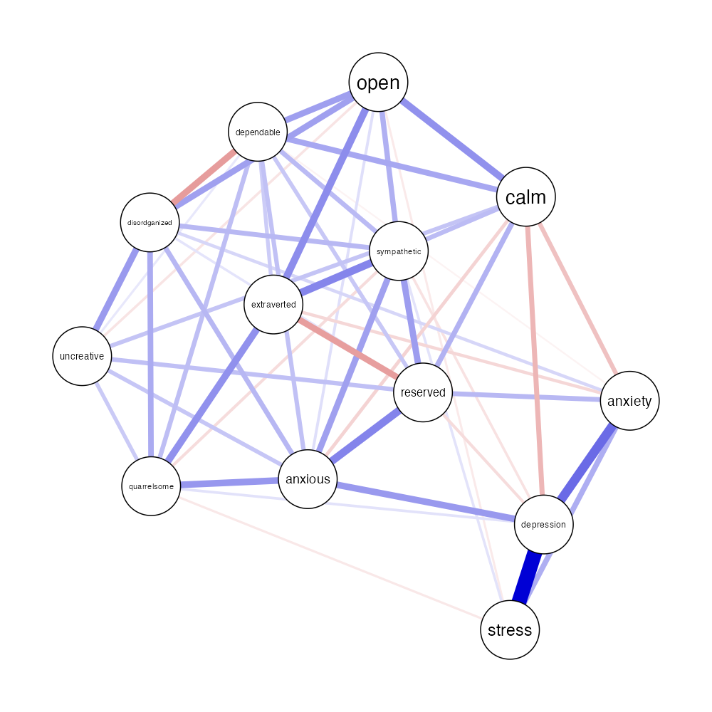
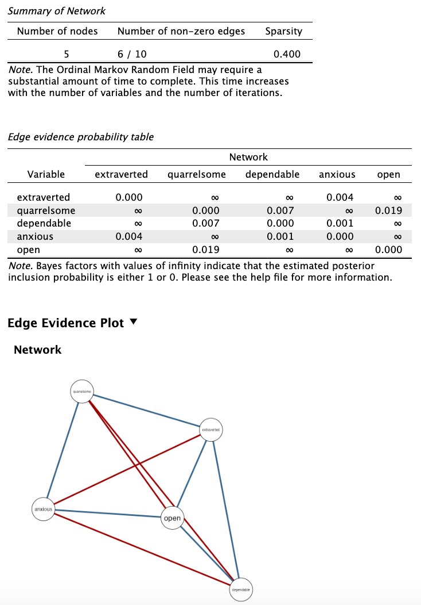

::: {.callout-tip title="Workshop Roadmap"}
**You are here:** 

📜 Part I — History ✅  
📘 Part II — Theory ✅  
🔧 **Part III — Tutorial (this lecture)**
:::

```{r setup, include=FALSE}
knitr::opts_chunk$set(echo = TRUE)
library(easybgm)
#install.packages("bgms")
library(bgms)
library(BDgraph)
compile_iter = 1e4
```

In Part I, we looked back at why network modeling became a thing, what it essentially is, and how it is done.

In Part II, we explored how Bayesian reasoning helps us understand whether network relations are present or not.

Now in Part III, we’ll put that into practice.

You’ll learn how to run Bayesian network analyses using `easybgm` and JASP, interpret the output, and understand how priors and uncertainty shape your conclusions.

By the end of this session, you’ll be able to:

::: {.goals}
- Fit a network model using Bayesian methods in R or JASP  
- Use Bayes factors to test edges, and interpret effect sizes  
- Visualize and report results clearly  
- Explore the role of prior assumptions in Bayesian models  
:::

Before we dive into the hands-on part, let’s take a moment to remind ourselves what we covered in Part II and why it matters for what we’re about to do.

# Recap of Part II

## Two fundamental questions
In Part II, we discussed the **two fundamental questions** in network analysis.  

<div style="text-align: center;">
  
</div>

The focus in Part II was on testing for an effect (i.e., Question 1), but in Part III we also consider estimating the size and sign of an effect (i.e., Question 2). 

## Distinguishing absence of evidence from evidence of absence

We discussed that network estimation cannot tell us why some effects are absent. But  
the Bayesian approach helps distinguish **absence of evidence** from **evidence of absence**.

<div style="text-align: center;">
  
</div>

> Why is this important? Think about when you’ve seen null effects in published network models. Were they truly absent? Or just underpowered?

## From prior weights to posterior probabilities

We use **prior probabilities** to reflect uncertainty in structure **before we see the data**, and update them with data using Bayes’ Rule.

<div style="text-align: center;">
  
</div>

> What is a posterior probability? It indicates the relative plausibility that a model or structure generated the observed data.

## What are Bayes factors?

Bayes factors compare how well two competing hypotheses could predict the observed data:
$$
\text{BF}_{10} = \frac{P(\text{data} \mid \mathcal{H}_1)}{P(\text{data} \mid \mathcal{H}_0)}.
$$

- If $\text{BF}_{10} > 1$, the data favor $\mathcal{H}_1$ (e.g., edge is present)
- If $\text{BF}_{10} < 1$, the data favor $\mathcal{H}_0$ (e.g., edge is absent)

## How do we use Bayes Factors in practice?

A Bayes factor is a continuous measure of evidence not just a binary decision. While Bayes factors are continuous, we often use interpretive categories to summarize them:

<div style="text-align: center;">
  
</div>


# Bayesian Graphical Modeling Software

Bayesian network models are powerful, but historically they’ve been out of reach for researchers without a background in programming or statistical computing.

The [Bayesian Graphical Modeling Lab](https://bayesiangraphicalmodeling.com/) contributes to an ecosystem of **open tools** that make these methods more accessible. Our goal is to help researchers explore network structures using **principled Bayesian inference** — without having to write complex MCMC code.

We work to make Bayesian graphical modeling both **transparent** and **approachable**, whether you use R or point-and-click interfaces like JASP.

---
  
## Core Inference Engines
  
There are three main computational packages used in Bayesian network modeling. Each makes different assumptions and offers different features. Here’s a comparison:
  
| Package           | Data Types                    | Structure Learning | Estimation | Priors                                  | Inference       | Highlights                                       |
|-------------------|-------------------------------|--------------------|------------|------------------------------------------|-----------------|--------------------------------------------------|
| **BDgraph**</br>| Continuous, Binary, Ordinal, Count† | ✅ Yes         | ❌ No     | Bernoulli                                | Model-averaged  | Structure learning for mixed data                 |
| **BGGM**</br>| Continuous, Binary, Ordinal†        | ❌ No          | ✅ Yes    | None                                     | Single model    | Edge estimation and network comparison |
| **bgms** </br>| Binary, Ordinal *(Continuous in dev)* | ✅ Yes         | ✅ Yes    | Bernoulli, Beta-Bernoulli, Stochastic Block | Model-averaged  | Structure learning + estimation, network comparison, clustering, missing data imputation   |

† BDgraph and BGGM use probit models for ordinal/binary data, not Markov random field models.

---
  
## Why We Use `easybgm` and JASP
  
Rather than asking you to choose and learn each package separately, we use [`easybgm`](https://github.com/KarolineHuth/easybgm) — a unified interface that wraps around the best parts of these engines.

- Handles preprocessing, fitting, and plotting  
- Standardizes output across packages  
- Allows prior customization  
- Integrated into **JASP** for non-coders

Depending on your data and choices, `easybgm` automatically uses the appropriate back-end:  
  `BDgraph`, `bgms`, or (in some cases) `BGGM`.

---

# Testing the Structure of the Network

We set up our analysis by loading a dataset containing responses from a sample of 2,000 individuals on 13 psychological indicators. The data includes three scale scores, and ten ordinal items.

```{r, include=FALSE}
library(easybgm)
data = read.csv("https://raw.githubusercontent.com/Bayesian-Graphical-Modelling-Lab/BGM_Workshops/refs/heads/What-is-psychometrics/Part%20III/exampledata.csv")[, -1]
```

::: {.panel-tabset}
### Setup (R)


```r
# install.packages("easybgm")
library(easybgm)
data = read.csv("https://raw.githubusercontent.com/Bayesian-Graphical-Modelling-Lab/BGM_Workshops/refs/heads/What-is-psychometrics/Part%20III/exampledata.csv")[, -1]
```
```{r}
head(data)
```

### Setup (JASP)

#### Step 1: Open JASP

Launch JASP and locate the main toolbar.

#### Step 2: Open the Data File

1. Click the **three horizontal bars** in the top-left corner (☰).
2. Select **"Open" → "Computer" → "Browse…"**
3. Navigate to your `.csv` file and click **Open**.

After importing, you should see your dataset listed in the main workspace.

#### Step 3: Open the Bayesian Network Analysis Module

1. Click the **blue plus sign** (`+`) at the top-right of the JASP window to open the modules menu.
2. Scroll down to find the **Network** category.
3. Under **Network**, click **Bayesian** to load the module.

Once loaded, you’ll see a new menu item: **"Bayesian Network"** under the *Network* tab in the top menu bar.

<div style="text-align: center;">
  
</div>

:::


## Fit the Model

Before we fit the model, it's useful to explore the function we'll use:
```r
?easybgm
```

Here’s the full function signature to get oriented:

```r
easybgm(
  data,
  type,
  package = NULL,
  not_cont = NULL,
  iter = 10000,
  save = FALSE,
  centrality = FALSE,
  progress = TRUE,
  posterior_method = "model-averaged",
  ...
)
```
The `type` argument tells easybgm what kind of data you’re working with — for example, `"continuous"`, `"binary"`, `"ordinal"`, or `"mixed"`. The package argument chooses the estimation engine.

To keep things fast and simple for this example, we’ll treat the data as if it were continuous (yes, even though it isn’t fully), and use `BDgraph` to fit the model.

```{r, include = FALSE}
set.seed(1)
fit = easybgm(
  data = data,
  type = "continuous",
  package = "BDgraph",
  iter = 1e5,
  burnin = 1e4,
  save = TRUE,
  centrality = TRUE,
  progress = FALSE)
```

Now let’s fit the model and summarize the results.

::: {.panel-tabset}

### Exercise
Fill in the blanks below to use the `easybgm()` function on the workshop dataset and inspect the `summary(fit)` output. 

```r
set.seed(1)
fit = easybgm(data = data,
               type = ____________,
               package = ____________,
               iter = 1e5,
               burnin = 1e4,
               save = TRUE,
               centrality = TRUE,
               progress = TRUE)
summary(fit)               
```

✅ What is the total number of edges?  
✅ Which edge(s) are excluded with high certainty?

### Solution (R)

```r
set.seed(1)
fit = easybgm(data = data,
               type = "continuous",
               package = "BDgraph",
               iter = 1e5,
               burnin = 1e4,
               save = TRUE,
               centrality = TRUE,
               progress = TRUE)
summary(fit)               
```

```r
 BAYESIAN ANALYSIS OF NETWORKS 
 Model type: ggm 
 Number of nodes: 13 
 Fitting Package: bdgraph 
--- 
 EDGE SPECIFIC OVERVIEW 
                  Relation Estimate Posterior Incl. Prob. Inclusion BF     Category
         depression-stress    0.598                  1.00          Inf     included
        depression-anxiety    0.349                  1.00          Inf     included
            stress-anxiety    0.191                  1.00          Inf     included
    depression-extraverted    0.000                  0.02        0.020     excluded
        stress-extraverted    0.002                  0.05        0.053     excluded
               ...             ...                    ...         ...         ...  
            
 Bayes Factors larger than 10 were considered sufficient evidence for the classification 
 Bayes factors were obtained using Bayesian model-averaging. 
 --- 
 AGGREGATED EDGE OVERVIEW 
 Number of edges with sufficient evidence for inclusion: 47 
 Number of edges with insufficient evidence: 11 
 Number of edges with sufficient evidence for exclusion: 20 
 Number of possible edges: 78 
 
 --- 
 STRUCTURE OVERVIEW 
 Number of visited structures: 194 
 Number of possible structures: 3.022315e+23 
 Posterior probability of most likely structure: 0.07481111 
---
```

### Solution (JASP)

<div class="screenshot-block">

  
  
  
  
  

</div>

:::


### Evidence Thresholds
By default, `easybgm` uses an evidence threshold (Bayes factor) of 10:

- **BF > 10** → evidence for inclusion
- **BF < 1/10** → evidence for exclusion
- **In between** → inconclusive

You can adjust this threshold to make the evidence criterion more or less strict.

::: {.panel-tabset}

### Exercise

Change the evidence threshold in `summary(fit, evidence_thresh = ___)` and see how the number of included and excluded edges changes.

✅ Which edges change their classification?  
✅ What happens when you use a very lenient threshold (e.g., 1.5)?

This gives you practice for adjusting evidence sensitivity in Part III.

### Solution (R)

```r
summary(fit, evidence_thresh = 3)
```

```r
 BAYESIAN ANALYSIS OF NETWORKS
 Model type: ggm
 Number of nodes: 13
 Fitting Package: bdgraph
---
 EDGE SPECIFIC OVERVIEW
                  Relation Estimate Posterior Incl. Prob. Inclusion BF     Category
         depression-stress    0.598                  1.00          Inf     included
        depression-anxiety    0.349                  1.00          Inf     included
            stress-anxiety    0.191                  1.00          Inf     included
    depression-extraverted    0.000                  0.02        0.020     excluded
        stress-extraverted    0.002                  0.05        0.053     excluded
               ...             ...                    ...         ...         ...

 Bayes Factors larger than 3 were considered sufficient evidence for the classification 
 Bayes factors were obtained using Bayesian model-averaging. 
 --- 
 AGGREGATED EDGE OVERVIEW 
 Number of edges with sufficient evidence for inclusion: 50 
 Number of edges with insufficient evidence: 7 
 Number of edges with sufficient evidence for exclusion: 21 
 Number of possible edges: 78 
 
 --- 
 STRUCTURE OVERVIEW 
 Number of visited structures: 194 
 Number of possible structures: 3.022315e+23 
 Posterior probability of most likely structure: 0.07481111
---
```

### Solution (JASP)

In JASP, there is **no automatic classification table** showing which edges are included, excluded, or inconclusive.

But don’t worry, you can **determine this yourself** by inspecting the inclusion Bayes factors in the output table. 💪  
(And we believe in you!)

✅ A visual summary is available: the **edge evidence plot**, which we’ll explore in the next section.

:::


## Visualizing Results

The summary table is comprehensive but can become hard to interpret. Visualizations often help reveal patterns and structure more intuitively.

Start with the edge evidence plot:

```{r}
plot_edgeevidence(fit, evidence_thresh = 10, legend = FALSE)
```

This plot categorizes edges by their Bayes factor:

- <span style="background-color: #416388;color: white; padding: 0.2em;">**Blue**</span>: strong evidence for inclusion
- <span style="background-color: #7E1F0F;color: white; padding: 0.2em;">**Red**</span>: strong evidence for exclusion
- <span style="background-color: #AFAFAF;color: white; padding: 0.2em;">**Gray**</span>: inconclusive

::: {.panel-tabset}

### Exercise
> 1. What does the edge evidence plot show?  
> 2. How do you interpret an edge inclusion Bayes factor?  
> 3. What is the default threshold value used in the `plot_edgeevidence()` function?  

### Try it
👉 Open the R help file with:  
```r
?plot_edgeevidence
```  
Explore the available arguments and see how the threshold can be adjusted.  

### Solution
1. **What does the edge evidence plot show?**  
   It visualizes the strength of evidence for or against including each edge in the network, based on the Bayes factor.  

2. **How do you interpret an edge inclusion Bayes factor?**  
   The Bayes factor compares two competing hypotheses:  
   - *H₁*: the edge should be included in the network.  
   - *H₀*: the edge should be excluded.  
   For example, a Bayes factor of 10 means the data are ten times more likely under *H₁* than under *H₀*. Conversely, a Bayes factor of 1/10 means the data are ten times more likely under *H₀* than *H₁*.  

3. **What is the default threshold in `plot_edgeevidence()`?**  
   The default threshold is **10**. Edges with Bayes factors above this value are typically considered to have strong evidence for inclusion.  

:::


You can lower the threshold to see how evidence strength varies:

```{r}
plot_edgeevidence(fit, evidence_thresh = 3, legend = FALSE)
```

If the network appears cluttered (a so-called “spaghetti plot”), use the `split` option to separate edges with any evidence for inclusion from those with evidence for exclusion.

::: {.panel-tabset}
### Exercise
Use `plot_edgeevidence()` with and without the `split = TRUE` option.

✅ Which edge categories become clearer when you split the plot?  
✅ Do your visual conclusions match the summary table?


### Solution (R)

```r
par(mfrow = c(1, 2))
plot_edgeevidence(fit, evidence_thresh = 10, split = TRUE, legend = FALSE)
```

```{r, echo = FALSE}
par(mfrow = c(1, 2))
plot_edgeevidence(fit, evidence_thresh = 10, split = TRUE, legend = FALSE)
```

The left panel shows edges with BF > 1; the right panel shows those with BF ≤ 1.

### Solution (JASP)

In JASP, you can plot the edge evidence using evidence categorization.

<div class="screenshot-block">

  
  
  

</div>

:::


# Plotting the Network Parameters

## Estimation: What is the strength and direction of the edge?

```{r, include = FALSE}
par(mfrow = c(1, 1))
```

Once we’ve established which edges have credible evidence for inclusion, we can inspect the **strength and direction** of those connections. But which ones should we show?
  
In Bayesian model averaging, not all edges have convincing evidence. Some might be weak or ambiguous. By default, `easybgm` visualizes the **median probability model**, the network consisting of all edges with a posterior inclusion probability > 0.5 (or equivalently, Bayes Factor > 1). You can adjust this threshold using the `exc_prob` argument:

```r
plot_network(fit, exc_prob = 0.5)
```

```{r, echo = FALSE}
plot_network(fit, exc_prob = 0.5)
```


::: {.panel-tabset}

### Exercise
1. What conclusions can you draw from the estimated network?  
2. This network is based on the **median probability model**. What does that mean, and how does it relate to the inclusion Bayes factors from the previous part?  
3. Run `plot_network()` with and without the `exc_prob` argument. Does changing the `exc_prob` value influence which edges are shown?  

### Solution (R)
```r
# Default plot (median probability model: exc_prob = 0.5)
plot_network(fit)

# Stricter threshold: exc_prob = 0.8
plot_network(fit, exc_prob = 0.8)
```

- The network shows **positive connections**, with all nodes connected to at least one other node.  
- The strongest link is between **Q7 and Q8**.  
- The network is **not overly dense**, consistent with the edge evidence plots.  
- Because this is the **median probability model**, only edges with inclusion probability > 0.5 (equivalently BF > 1) are shown.  
- Increasing `exc_prob` (e.g., to 0.8) removes weaker edges → the network becomes sparser.  

### Solution (JASP)

<div class="screenshot-block">

  
  
  

</div>

- JASP also shows the **median probability model** by default.  
- You can adjust the **edge inclusion threshold** in the analysis options.  
- Raising the threshold makes the network sparser, lowering it makes it denser.  

:::

Under the hood, `easybgm` uses `qgraph`, meaning you can pass any of its arguments to fully control the layout and style. For example, grouping nodes or setting colors.

```r
Names_data = colnames(data)
groups_data = c(rep("DASS", 3), rep("Personality", 10))

plot_network(fit, 
             exc_prob = 0.5, 
             layout = "spring",
             nodeNames = Names_data, 
             groups = groups_data,
             color = c("#fbb20a", "#E59866"),
             theme = "Fried", 
             dashed = TRUE)
```

```{r, echo = FALSE}
Names_data = colnames(data)
groups_data = c(rep("DASS", 3), rep("Personality", 10))

plot_network(fit, 
             exc_prob = 0.5, 
             layout = "spring",
             nodeNames = Names_data, 
             groups = groups_data,
             color = c("#fbb20a", "#E59866"),
             theme = "Fried", 
             dashed = TRUE)
```


## Parameter Uncertainty: HDI Intervals
  
The network plot shows **posterior means**, but this hides uncertainty. A useful complement is the **posterior highest density interval (HDI)**, which shows how stable the estimates are
  
This plot highlights which posterior distributions are tightly concentrated, and which are uncertain, helping you interpret results more cautiously.


::: {.panel-tabset}

### Exercise
Use `plot_parameterHDI()` to inspect parameter uncertainty.

✅ Which edges have narrow (precise) intervals?  
✅ Are any edge estimates near zero?

### Solution (R)
```{r, warning=FALSE}
plot_parameterHDI(fit)
```

### Solution (JASP)

JASP does not (yet) include a Highest Density Interval (HDI) plot for edge weights.

If you want to assess uncertainty in edge parameters, you’ll need to use R and the `plot_parameterHDI()` function from `easybgm`.

We expect this feature to be added in a future JASP release.

:::

## Centrality

Centrality measures attempt to quantify how “important” a node is in the network. For example, how often it sits on the shortest path between other nodes (betweenness), or how connected it is overall (degree).

While popular, centrality metrics in psychological networks have been criticized for their instability and unclear interpretation, especially in small or highly interconnected networks.

The nice thing about the Bayesian approach is that it provides **credible intervals** for these centrality indices, giving you a sense of how uncertain these summaries are.

```r
plot_centrality(fit)
```

```{r, echo = FALSE}
plot_centrality(fit)
```

> ⚠️ *Caution:* Interpret centrality values as descriptive summaries — not causal influence or intervention targets. Use the credible intervals to judge whether centrality differences are meaningful.


# Understanding Priors in Bayesian Network Models

Priors allow us to encode assumptions about the network *before* seeing the data. These assumptions affect:
  
- **Structure**: Which edges we expect to be present  
- **Parameters**: How strong or weak we expect connections to be

Some prior choices in `easybgm` to investigate:
  
| Prior Type       | Argument Example                | Interpretation                        |
|------------------|----------------------------------|----------------------------------------|
| Structure prior   | `inclusion_probability = 0.1`   | Sparse network (few edges)             |
| Structure prior   | `edge_prior = "Beta-Bernoulli"` | Allows data-driven sparsity tuning     |
| Parameter prior   | `interaction_scale = 0.25`      | Shrinks estimates toward zero (informative) |
| Parameter prior   | `interaction_scale = 2.5`       | Allows large edge effects (diffuse, default) |
  
::: {.callout-warning}
**Tip:** Try multiple priors and see how your conclusions change. This is a key part of Bayesian modeling.
:::
  
# Prior Sensitivity Check
  
Let’s explore how different structure priors influence the analysis using two assumptions: one sparse and one dense.

```r
#install.packages("bgms")
library("bgms")
```

::: {.panel-tabset}

### Exercise
Estimate two networks on the first five ordinal variables (i.e., `data[, 4:8]` in the dataset) using the `bgms` package:
  
- One with a **sparse prior**: `inclusion_probability = 0.1`  
- One with a **dense prior**: `inclusion_probability = 0.7`

Then use `summary()` and `plot_edgeevidence()` to compare:
  
✅ Which edges are included or excluded?  
✅ Does the posterior structure probability change?
  
### Solution
  
```r
set.seed(1)
# Sparse prior model
fit_sparse <- easybgm(
  data = data[, 4:8],
  type = "ordinal",
  package = "bgms",
  iter = 1e4,
  inclusion_probability = 0.1,
  save = TRUE
)

set.seed(2)
# Dense prior model
fit_dense <- easybgm(
  data = data[, 4:8],
  type = "ordinal",
  package = "bgms",
  iter = 1e4,
  inclusion_probability = 0.7,
  save = TRUE
)
```
```{r, include=FALSE, warning=FALSE}
set.seed(1)
# Sparse prior model
fit_sparse <- easybgm(
  data = data[, 4:8],
  type = "ordinal",
  package = "bgms",
  iter = compile_iter,
  inclusion_probability = 0.1,
  save = TRUE
)

set.seed(2)
# Dense prior model
fit_dense <- easybgm(
  data = data[, 4:8],
  type = "ordinal",
  package = "bgms",
  iter = compile_iter,
  inclusion_probability = 0.7,
  save = TRUE
)
```

```r
summary(fit_sparse)
```
```r
--- 
 AGGREGATED EDGE OVERVIEW 
 Number of edges with sufficient evidence for inclusion: 6 
 Number of edges with insufficient evidence: 0 
 Number of edges with sufficient evidence for exclusion: 4 
 Number of possible edges: 10 
 
 --- 
 STRUCTURE OVERVIEW 
 Number of visited structures: 5 
 Number of possible structures: 1024 
 Posterior probability of most likely structure: 0.9931 
---
```

```r
summary(fit_dense)
```
```r
 --- 
 AGGREGATED EDGE OVERVIEW 
 Number of edges with sufficient evidence for inclusion: 6 
 Number of edges with insufficient evidence: 0 
 Number of edges with sufficient evidence for exclusion: 4 
 Number of possible edges: 10 
 
 --- 
 STRUCTURE OVERVIEW 
 Number of visited structures: 10 
 Number of possible structures: 1024 
 Posterior probability of most likely structure: 0.8548 
```

```r
# Compare edge plots
par(mfrow = c(1, 2))
plot_edgeevidence(fit_sparse, main = "Sparse prior")
plot_edgeevidence(fit_dense, main = "Dense prior")
```

```{r, echo = FALSE, warning=FALSE}
# Compare edge plots
par(mfrow = c(1, 2))
plot_edgeevidence(fit_sparse, main = "Sparse prior", legend = FALSE, layout = "circle")
plot_edgeevidence(fit_dense, main = "Dense prior", legend = FALSE, layout = "circle")
```

### Solution (JASP)

<div class="screenshot-block">

  
  
  
  
  
  
</div>

:::


# What Should You Do in Practice?
  
- Start with defaults unless you have specific expectations.
- If theory or data suggest otherwise, adapt the prior accordingly.
- Always run at least one **sensitivity check**.
- Report your choices transparently.


# Recap of Part III

In this session you have seen the **practical benefits** of analyzing networks with a Bayesian approach, as outlined in the [tutorial paper](https://journals.sagepub.com/doi/10.1177/25152459231193334):

- *You can obtain evidence for both edge inclusion **and** exclusion*  
- *You can quantify uncertainty about the network structure*  
- *You can quantify the precision of estimated parameters*  

To put this into practice, we walked through the full Bayesian workflow:

✅ Testing for edge inclusion using Bayes factors  
✅ Estimating edge parameters and visualizing uncertainty  
✅ Exploring the influence of priors on network conclusions  
✅ Doing all of this in both **R** and **JASP**  

Whether you prefer writing code or working with a point-and-click interface, you now have the tools to perform Bayesian network analysis yourself.  
