::: {.callout-tip title="Workshop Roadmap"}
**You are here:**  

📜 Part I — History: Why Bayesian network analysis became necessary ✅  
📘 Part II — Theory: How to quantify evidence for edge inclusion or exclusion ✅  
🔧 Part III — Practice: Basics of the Bayesian workflow ✅  
🎯 Part IV — Theory: Priors as models of psychometric topology ✅  
🧩 Part V — Practice: Evaluating the influence of network priors ✅  
👥 **Part VI — Practice: The Bayesian approach to group comparisons**
:::


```{r setup, include=FALSE}
knitr::opts_chunk$set(echo = TRUE)
```

# Recap 


## Goals for this session

At the end of this session, you should be able to:

::: {.goals}
- **Identify** situations where group comparisons of networks are relevant.  

- **Explain** the models implemented in two Bayesian packages for group comparisons:  
  – `BGGM` for Gaussian (continuous) data,  
  – `bgms` for ordinal or binary data.  

- **Explain** two types of Bayes factors for group comparisons:  
  – **Single-model Bayes factors** (Savage–Dickey density ratio),  
  – **Model-averaged inclusion Bayes factors** that account for multiplicity.  

- **Apply** two types of Bayes factors to test specific edge differences between groups:  
  – the Savage–Dickey approach with `BGGM` and `bgms`,  
  – model-averaged Bayesian inference with `bgms`.  

- **Analyze** how prior specification influences the Savage–Dickey density ratio, and evaluate the implications for interpreting group differences.  

- **Interpret** Bayes factors for individual edges in terms of evidence for invariance or difference, and relate these edge-level results to conclusions about the overall network structure.
:::

::: {.note}
**Recommended Reading:**

- Marsman, M., Waldorp, L., Sekulovski, N., & Haslbeck, J. (2024). Bayes Factor Tests for Group Differences in Ordinal and Binary Graphical Models. Preprint. doi: 10.31219/osf.io/f4pk9_v2
- Williams, D., Rast, P., Pericchi, L., & Mulder, J. (2020). Comparing Gaussian Graphical Models With the Posterior Predictive Distribution and Bayesian Model Selection. *Psychological Methods*, *25*, 653–672. doi: 10.1037/met0000254


**Optional Reading**

- Sekulovski, N., Keetelaar, S., Huth, K., Wagenmakers, E.-J., van Bork, R., van den Bergh, D., & Marsman, M. (2024). Testing Conditional Independence in Psychometric Networks: An Analysis of Three Bayesian Methods. *Multivariate Behavioral Research*, *59*, 913-933.

**R Setup Tip:**
Make sure to install and load the following libraries before running the examples:

```r
library(BGGM)
library(bgms)
library(ggplot2) # for plotting
library(logspline)
library(patchwork) # for plotting
library(plotrix) # for plotting
library(qgraph)
library(tidyr) # for plotting
```
:::


# Bayesian Software for Group Comparisons

In Session III, we saw the broader ecosystem of Bayesian network software.  
For this lecture the focus is narrower: **methods for comparing networks across groups**.  

This is a very recent development. At present, only two engines implement principled Bayesian group comparison: `BGGM` and `bgms`. These capabilities have not yet been integrated into `easybgm` or `JASP` (although work is underway and the first functionality is expected later this year).  

---

## Packages for Group Comparisons

| Package           | Data Types             | Approach                        | Bayes Factors                   | Multiplicity Correction | Highlights                                   |
|-------------------|------------------------|---------------------------------|---------------------------------|-------------------------|----------------------------------------------|
| **BGGM**</br> | Continuous (Gaussian)          | Edge estimation and comparison  | **Single-model** (Savage–Dickey)             | ❌ No                     | Tests specific edge or global differences using Gaussian models |
| **bgms** </br> | Binary, Ordinal                | Edge estimation + structure learning | **Model-averaged inclusion Bayes factors**   | ✅ Yes                    | Handles multiplicity; tests invariance and differences of edges and thresholds |  

---

## Why Not `easybgm` / `JASP` (Yet)?

- `easybgm` and `JASP` are designed as unifying interfaces for Bayesian network estimation.  
- Current versions do **not** yet include the group comparison functions from `BGGM` and `bgms`.  
- Development is ongoing, with the goal of adding accessible group comparison workflows in the near future.  

For now, **direct use of `BGGM` and `bgms` in R** is required when analyzing group differences.  

One important point:  
- `BGGM` includes functions for computing Bayes factors and some summaries.  
- `bgms`, in contrast, is primarily **computational software**. It performs posterior sampling internally, but does not provide Bayes factor computations or visualizations out of the box.  
- This is where **`easybgm`** comes in: it wraps around `bgms` to offer Bayes factor tables, and plotting. These conveniences have not yet been extended to group comparisons, but development is ongoing.


# Part VI — The Bayesian Approach to Group Comparisons

## 1. Why compare groups? 

### Assess Scale / Network Variance or Invariance   


- Do network structures (responses / response behavior) differ between groups?  
- Which relations are stable (invariant) across groups?  
- Where do key differences emerge?  

This illustrates the **psychometric perspective**, and corresponds to questions about **differential item functioning** or **measurement invariance** in IRT/SEM frameworks. Here, we ask the same question in a **network framework**:  

> Are estimated networks the same across samples?  

---

#### Example: The Boredom Dataset

In this example, we revisit the **Boredom dataset** from the previous session. This dataset was used in Martarelli et al. (2023) to validate the French short version of the *Boredom Proneness Scale* (SBPS). They compared data from an **English-speaking sample** and a **French-speaking sample**, and established measurement invariance of the scale.

---

#### Network Plots

```{r, eval = FALSE}
library(bgms)
library(qgraph)

french = Boredom[Boredom$language == "fr", -1]
english = Boredom[Boredom$language != "fr", -1]

fit = bgmCompare(
  x = french, 
  y = english, 
  update_method = "adaptive-metropolis", 
  iter = 1e4, 
  seed = 1234
)

# Extract group-specific networks
french_network = matrix(0, nrow = ncol(french), ncol = ncol(french))
french_network[lower.tri(french_network)] = coef(fit)$pairwise_effects_groups[, 1]
french_network = french_network + t(french_network)

english_network = matrix(0, nrow = ncol(english), ncol = ncol(english))
english_network[lower.tri(english_network)] = coef(fit)$pairwise_effects_groups[, 2]
english_network = english_network + t(english_network)

# --- Plot the two networks
par(mfrow=c(1,2))
q1 = qgraph(
  french_network,
  layout = "spring",
  labels = colnames(french),
  edge.color = "darkblue",
  vsize = 10,
  esize = 20,
  labels = colnames(french),
  legend = FALSE
)
print(q1)

qgraph(
  english_network,
  layout = q1$layout,   # reuse layout for comparability
  labels = colnames(english),
  edge.color = "darkred",
  vsize = 10,
  esize = 20,
  labels = colnames(french),
  legend = FALSE
)
```

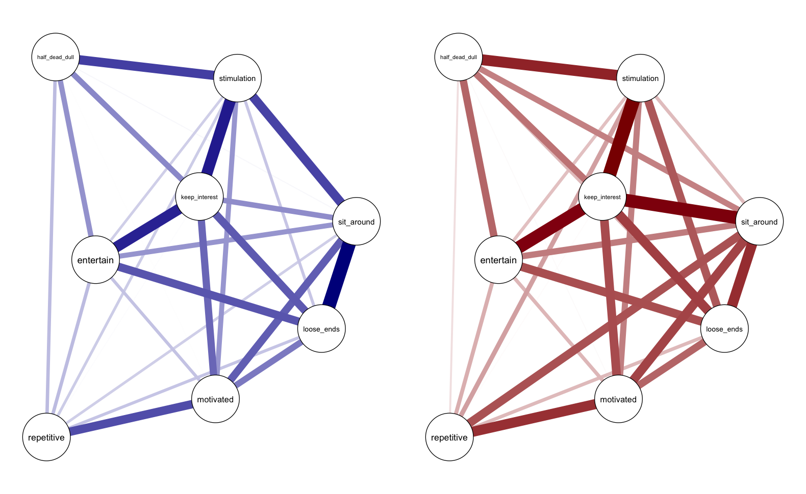{fig-align="center" width=90%}

---

#### Evidence for Differences

Visual inspection already raises the question: Are the two networks really different, or largely invariant?  

We can quantify this by computing **Bayes factors** for each edge difference:

```{r, eval = FALSE}
# Compute inclusion Bayes factors
p = coef(fit)$indicators
bf = p / (1 - p)
diag(bf) = 1

# Easybgm color scheme
colors = c("#36648b", "#990000", "#bfbfbf") 
evidence_thresh = 10

# Assign colors to edges
graph_color = ifelse(bf < evidence_thresh & bf > 1/evidence_thresh, colors[3], colors[1])
graph_color[bf < 1/evidence_thresh] = colors[2]

# Use dummy matrix with 1s for equal edge widths
graph_plot = matrix(1, nrow = nrow(bf), ncol = ncol(bf))
diag(graph_plot) = 1
colnames(graph_plot) = colnames(french)

# Evidence plot
par(mfrow=c(1,2))
qgraph(
  graph_plot,
  edge.color = graph_color[upper.tri(graph_color)],
  layout     = q1$layout,
  vsize      = 10,
  edge.width = 3,
  label.cex  = 1,
  legend     = FALSE,
  labels     = colnames(french),
  color      = "white",   # node fill color
  border.color = "black"  # node border color
)
```

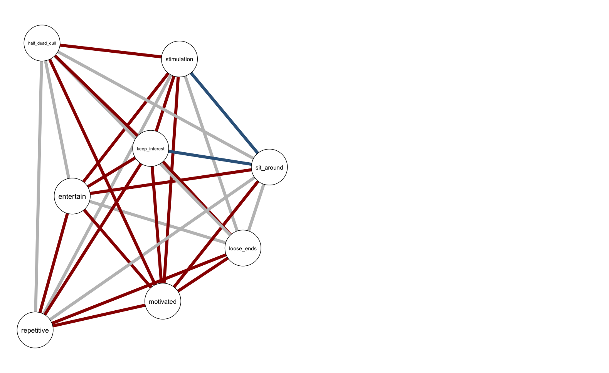{fig-align="center" width=90%}

  - Blue edges: strong evidence for group differences.  
  - Red edges: strong evidence for invariance.  
  - Grey edges: inconclusive.  

### Reproducibility

A central motivation for developing Bayesian approaches to group comparisons is the concern about **reproducibility** in network psychometrics.  

#### Forbes et al. (2017): Networks do not replicate

> Forbes, M, Wright. A, Markon, K, Krueger, R. (2017). Evidence that psychopathology symptom networks have limited replicability. *Journal of Abnormal Psychology*, *126*, 969-988. doi: 10.1037/abn0000276. 

Forbes, Wright, Markon, & Krueger (2017) argued that psychological networks often **failed to replicate across samples**:  
- Networks estimated in one sample looked different in another.  
- **Edges and centrality indices** varied widely across datasets.  
- They concluded that network models were **unstable and unreliable**, and that substantive conclusions about specific edges or “central symptoms” were therefore questionable.

#### Reply: Variability is not necessarily non-replication

Soon after, Jones, Williams, & McNally (2019) and others pointed out that the differences Forbes interpreted as “non-replication” were often just **sampling variability**:  
- Even if two samples come from the *same* population network, finite-sample estimates will differ.  
- Without quantifying uncertainty, apparent discrepancies can be mistaken for structural differences.

#### Bayesian group comparisons as a solution
Bayesian methods directly address these concerns:  
- **Evidence for invariance:** Bayes factors can provide *positive evidence* that two networks are the same. This reframes replication as testing for **network invariance**.  
- **Quantifying uncertainty:** Posterior distributions and Bayes factors offer a principled way to separate true differences from expected sampling variability.

This offers a **methodological perspective**: distinguishing signal from noise.

#### Example: Testing Network Invariance with BGGM

Williams & Mulder (2020) showcased how **Bayes factors** can be used to demonstrate **network invariance** across independent samples.  
This is crucial for reproducibility: if two subsamples drawn from the same population yield invariant networks, we gain evidence that the network model is stable.  

Below we illustrate this with the `BGGM` package. For simplicity, we use the `ptsd` dataset (ordinal items), here treated as continuous, and compare two random halves.

```{r, eval = FALSE}
library(BGGM)
library(qgraph)

# Data
data("ptsd")
set.seed(1234)
id = sample(1:nrow(ptsd), size = nrow(ptsd)/2)
group1 = ptsd[id, ]
group2 = ptsd[-id, ]

# Two-group comparison (Bayes factors for equality of edges)
fit = ggm_compare_explore(
  group1, group2,
  type = "continuous",
  iter = 1e4,
  progress = FALSE,
  seed = 1234
)

# Invert BF01 -> BF10 (difference vs. invariance)
bf = 1 / fit$BF_01
diag(bf) = 1

# Evidence colors (easybgm style)
colors = c("#36648b", "#990000", "#bfbfbf") 
evidence_thresh = 10
graph_color = ifelse(bf < evidence_thresh & bf > 1/evidence_thresh, colors[3], colors[1])
graph_color[bf < 1/evidence_thresh] = colors[2]

# Dummy matrix for equal edge widths
graph_plot = matrix(1, nrow = nrow(bf), ncol = ncol(bf))
diag(graph_plot) = 1
colnames(graph_plot) = colnames(ptsd)

#Evidence plot
qgraph(
  graph_plot,
  edge.color = graph_color[upper.tri(graph_color)],
  vsize      = 10,
  edge.width = 3,
  label.cex  = 1,
  legend     = FALSE,
  labels     = colnames(ptsd),
  color      = "white",   # node fill color
  border.color = "black"  # node border color
)
```

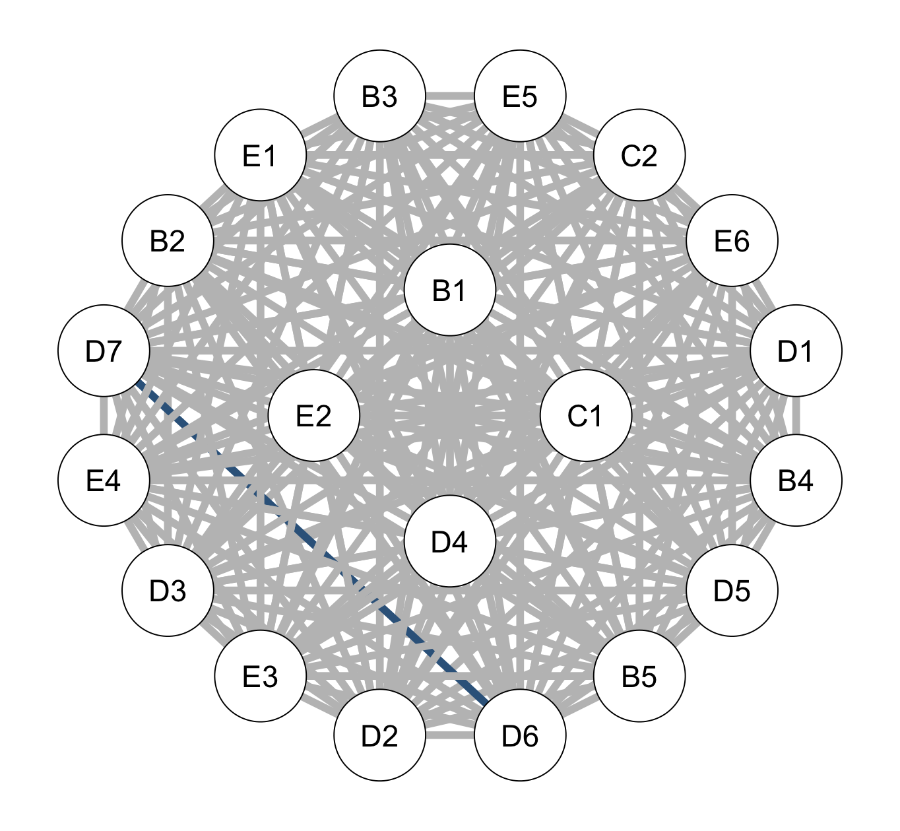{fig-align="center" width=90%}

  - Blue edges: strong evidence for group differences.  
  - Red edges: strong evidence for invariance.  
  - Grey edges: inconclusive.  

Later, we will discuss multiplicity correction. With correction (and an ordinal model), the evidence plot changes color:

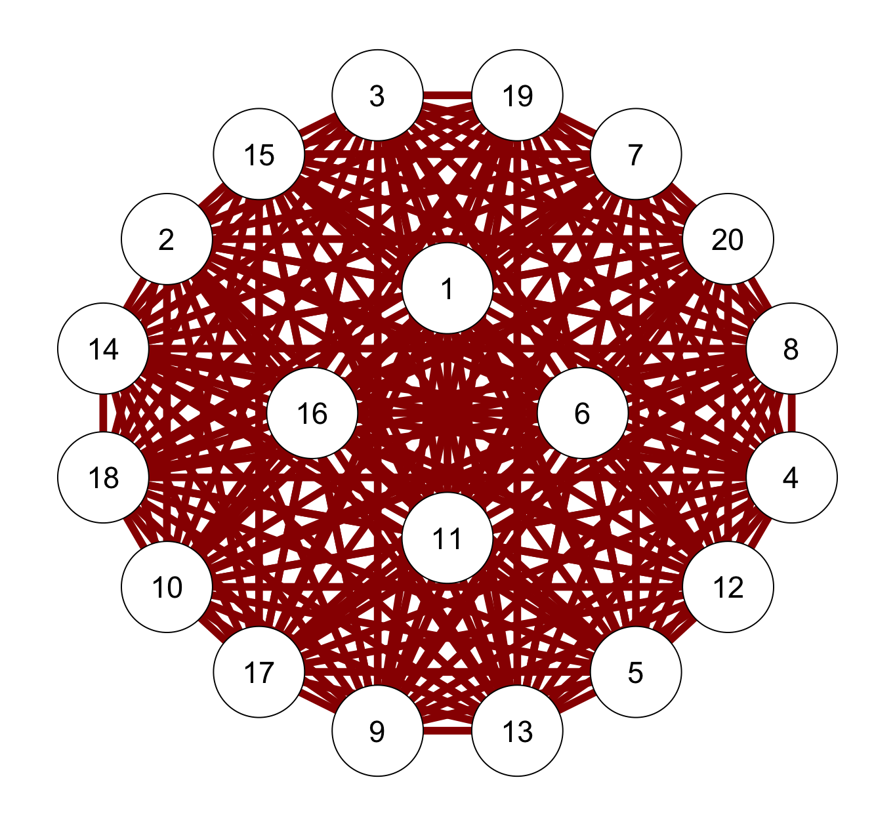{fig-align="center" width=90%}

---


### Assess Theoretical Predictions

A third motivation for comparing groups is to test **theoretical predictions**. Network models are not only descriptive; they can also be used to formalize and test theories. This offers a **substantive perspective** to network comparison.

> Dalege, J., Borsboom, D., van Harreveld, F., van den Berg, H., Conner, M., & van der Maas, H. (2016). Toward a formalized account of attitudes: The Causal Attitude Network (CAN) model. *Psychological Review*, *123*, 2–22. doi: 10.1037/a0039802  
> Dalege, J., Borsboom, D., van Harreveld, F., & van der Maas, H. (2018). The Attitudinal Entropy (AE) Framework as a General Theory of Individual Attitudes. *Psychological Inquiry*, *29*, 175–193. doi: 10.1080/1047840X.2018.1537246

For example, the **Network Theory of Attitudes** (Dalege et al., 2016, 2018) predicts that:  
- Attitudes that are *important* to individuals will be represented by **more densely connected networks**.  
- This implies that groups differing in *interest or involvement* with an attitude object (e.g., political engagement) should also differ in their network connectivity.  

#### Example 

In a working paper, Haslbeck, Blanken, Dalege, & Marsman, networks of attitudes toward Hillary Clinton were compared across voters **interested in politics** versus those **uninterested**.  
- The theoretical prediction (following the Network Theory of Attitudes) was that interested voters should have *more strongly connected attitude networks*.  
- The Bayesian group comparison allowed testing this prediction directly by estimating evidence for or against group differences in network connectivity.  
- In this case, the expected difference was not strongly supported in the 2016 data, possibly due to the polarized nature of that election.  


### Example Figure: Attitude Networks

![Top left: Attitude Network of the group interested in politics; top right: Attitude network of group uninterested in politics; bottom left: Difference between Interested and Uninterested groups; Blue edges indicate positive partial association parameters, red edges indicate negative partial association parameters; we show the ten largest parameters in absolute value. The bottom right panel shows the evidence network. In this network, blue edges indicate that the Bayes Factor for the group difference being present $BF_{10} > 10$, indicating strong evidence for inclusion; yellow edges indicate a Bayes Factor for the group difference *not* being present $BF_{10} < 0.10$. Grey edges indicate weak evidence for either hypothesis $10 > BF_{10} < 0.10$.](figures/Fig_Network2x2.png){fig-align="center" width=80%}

This illustrates how **theory → testable prediction → group comparison** becomes possible in the Bayesian network framework. Rather than asking only *“do the networks differ?”*, researchers can ask *“does the pattern of differences match what our theory predicts?”*

## 2. Classic versus Bayesian Approach to Group Comparisons

### How group comparisons are often done now
- The most widely used test is the **Network Comparison Test (NCT)**, which relies on permutation testing and returns a *p*-value for rejecting the null hypothesis that networks are equal.  
- Another approach is the **Fused Graphical Lasso (FGL)**, which jointly estimates networks across groups using penalization. FGL encourages similarity between groups but does not itself provide inferential evidence about invariance versus difference.

### Shortfalls
- **No evidence for invariance:**  
  *p*-values only allow us to reject equality; they cannot quantify evidence *for* networks being the same.  
- **Multiplicity:**  
  Edge-wise tests inflate the false positive rate unless very strict corrections are applied.  
- **Visual inspection pitfalls:**  
  Many early studies relied on comparing networks “by eye,” which can exaggerate differences due to sampling error.  
  Moreover, when local tests fail to reject the null, the corresponding edges are often simply omitted from plots.  
  This absence is then (incorrectly) interpreted as evidence for *no difference* between groups.

### The Bayesian alternative
- **Bayes factors** quantify evidence both *for differences* and *for invariance*.  
- **Posterior distributions** allow direct inspection of uncertainty in group differences.  
- **Model averaging** (bgms) naturally corrects for multiple comparisons by integrating over the model space.  

### Simulation Evidence

To evaluate performance, we conducted a large-scale simulation study comparing  
- **bgms** (Bayesian model selection with Bernoulli and beta–Bernoulli priors),  
- **BGGM** (single-model Bayes factors), and  
- **NCT** (Network Comparison Test).  

Performance was assessed using the **area under the ROC curve (AUC)**, which summarizes how well each method discriminates true from false group differences across a range of threshold values.  
- An AUC of 0.5 = chance performance.  
- Higher AUC = better accuracy.  

Results:  
- **Dense networks**: bgms methods achieved the best mean AUC (≈ 0.91), BGGM was moderate (≈ 0.85), and NCT lagged (≈ 0.74).  
- **Sparse networks**: bgms again led (≈ 0.87–0.88), with NCT (≈ 0.80) slightly outperforming BGGM (≈ 0.79).  
- Across conditions, **bgms consistently outperformed the alternatives**, especially with smaller samples or larger numbers of variables.  

{fig-align="center" width=80%}

::: callout-note
**Key takeaway:**  
All methods recover group differences above chance, but Bayesian bgms offers the most accurate detection.  
Unlike NCT, it can also provide **evidence for invariance**, which is crucial for reproducibility.
:::

---

## 3. A Bayesian Approach to Group Comparison

There are three main motivations for comparing groups in network models:  
1. **Psychometric** — testing model invariance in a network framework.  
2. **Methodological** — addressing reproducibility and sampling variability.  
3. **Substantive** — testing theoretical predictions across groups.  

We now turn to two Bayesian methods for testing group differences: the **Savage–Dickey density ratio** and **model-averaging**.

### Modeling group differences in `bgms`

Suppose we have two groups, for example **clinical** and **non-clinical** participants. For each pair of variables (nodes) $i,j$, `bgms` estimates a **group difference parameter**:

$$
\beta_{ij} ^{(g)} = \begin{cases}
\sigma_{ij} - \frac{1}{2}\delta_{ij} & \text{ if } g = 1\\
\sigma_{ij} + \frac{1}{2}\delta_{ij} & \text{ if } g = 2
\end{cases}
$$

Or equivalently,

$$
\delta_{ij} = \beta^{(2)}_{ij} - \beta^{(1)}_{ij},
$$

where $\beta^{(g)}_{ij}$ is the edge parameter in group $g$.  
- If $\delta_{ij}=0$, the edge is **invariant** across groups.  
- If $\delta_{ij}\neq 0$, there is a **difference**.

*Note:* Although not covered in the examples in this session, `bgms` can also compare **more than two groups** ($G \geq 2$). In that case, it uses a $G \times (G-1)$ projection matrix to model group differences in terms of $G-1$ contrasts. This is analogous to:  
- two groups → $t$-test,  
- $G$ groups → one-factor ANOVA.

#### Prior on differences

By default, `bgms` uses a Cauchy distribution for the group differences (contrasts):

$$
\delta_{ij} \sim \text{Cauchy}(0\text{, } \text{scale}),
$$
where $\text{scale}$ (`difference_scale`) is a scale parameter of the Cauchy density.  

This prior places most mass near invariance ($\delta_{ij}=0$), reflecting the expectation of small differences, but its heavy tails ensure that large differences remain plausible.


### The Savage–Dickey Density Ratio


The Savage–Dickey method provides an elegant shortcut for computing the Bayes factor **without** calculating marginal likelihoods.

*If:*

* $\mathcal{H}_0$ is nested within $\mathcal{H}_1$ (e.g., a point hypothesis $\mathcal{H}_0\text{:}~\delta = \delta_0$ is a special case of the alternatives $\mathcal{H}_1\text{:}~\delta \sim \text{Cauchy}$),
* The prior is continuous at $\delta_0$, and
* We can compute both the prior and posterior densities at $\delta_0$,

*Then:*
We can use the **Savage–Dickey density ratio** to compute the Bayes factor:

$$
\text{BF}_{01} = \frac{p(\delta_{ij}=0 \mid \text{data}\text{, } \mathcal{H}_1)}{p(\delta_{ij}=0 \mid \mathcal{H}_1)}.
$$

That is, the Bayes factor is the **posterior density at zero** divided by the **prior density at zero**.

- Posterior density at 0 > prior density at 0 → evidence for invariance.  
- Posterior density at 0 < prior density at 0 → evidence for a difference.  

---

Let's visualize what this really means with some toy examples.

```{r savage_dickey_plot_1, include=FALSE}
library(ggplot2)
library(tidyr)

# Example 1: Baseline
theta_vals <- seq(4.5, 8, length.out = 500)
prior_mean <- 6.5
prior_sd <- 0.7
post_mean <- 6.1
post_sd <- 0.4
theta0 <- 6

prior_dens <- dnorm(theta_vals, mean = prior_mean, sd = prior_sd)
post_dens <- dnorm(theta_vals, mean = post_mean, sd = post_sd)
prior_height <- dnorm(theta0, mean = prior_mean, sd = prior_sd)
post_height <- dnorm(theta0, mean = post_mean, sd = post_sd)
BF_value <- round(post_height / prior_height, 2)

plot_df <- data.frame(theta = theta_vals, Prior = prior_dens, Posterior = post_dens)
plot_long <- pivot_longer(plot_df, cols = c("Prior", "Posterior"), names_to = "Distribution", values_to = "Density")

p1 <- ggplot(plot_long, aes(x = theta, y = Density, fill = Distribution)) +
  geom_area(alpha = 0.5, position = "identity", color = NA) +
  geom_line(aes(color = Distribution), linewidth = 1.2) +
  geom_point(aes(x = theta0, y = prior_height), color = "#5D3FD3", size = 3, shape = 21, stroke = 1.2, fill = "white") +
  geom_point(aes(x = theta0, y = post_height), color = "#5D3FD3", size = 3, shape = 21, stroke = 1.2, fill = "white") +
  annotate("text", x = 7.8, y = max(c(prior_dens, post_dens)) * 1.02,
           label = paste0("BF[0*a] == ", BF_value), parse = TRUE, size = 5.5, hjust = 1) +
  scale_fill_manual(values = c("Prior" = "steelblue", "Posterior" = "darkorange")) +
  scale_color_manual(values = c("Prior" = "steelblue", "Posterior" = "darkorange")) +
  labs(x = expression(theta), y = "Density", title = "Savage–Dickey Density Ratio") +
  theme_minimal(base_size = 15) +
  theme(legend.position = "top", legend.title = element_blank(), legend.key.size = unit(0.6, "cm"))

ggsave("figures/savage_dickey_plot_1.png", p1, width = 7, height = 4.5, dpi = 300)


# Example 2: Jeffreys–Lindley Paradox (diffuse prior)
prior_sd <- 2  # more diffuse prior
prior_dens <- dnorm(theta_vals, mean = prior_mean, sd = prior_sd)
prior_height <- dnorm(theta0, mean = prior_mean, sd = prior_sd)
BF_value <- round(post_height / prior_height, 2)

plot_df$Prior <- prior_dens
plot_long <- pivot_longer(plot_df, cols = c("Prior", "Posterior"), names_to = "Distribution", values_to = "Density")

p2 <- ggplot(plot_long, aes(x = theta, y = Density, fill = Distribution)) +
  geom_area(alpha = 0.5, position = "identity", color = NA) +
  geom_line(aes(color = Distribution), linewidth = 1.2) +
  geom_point(aes(x = theta0, y = prior_height), color = "#5D3FD3", size = 3, shape = 21, stroke = 1.2, fill = "white") +
  geom_point(aes(x = theta0, y = post_height), color = "#5D3FD3", size = 3, shape = 21, stroke = 1.2, fill = "white") +
  annotate("text", x = 7.8, y = max(c(prior_dens, post_dens)) * 1.02,
           label = paste0("BF[0*a] == ", BF_value), parse = TRUE, size = 5.5, hjust = 1) +
  scale_fill_manual(values = c("Prior" = "steelblue", "Posterior" = "darkorange")) +
  scale_color_manual(values = c("Prior" = "steelblue", "Posterior" = "darkorange")) +
  labs(x = expression(theta), y = "Density", title = "A Diffuse Prior") +
  theme_minimal(base_size = 15) +
  theme(legend.position = "top", legend.title = element_blank(), legend.key.size = unit(0.6, "cm"))

ggsave("figures/savage_dickey_plot_2.png", p2, width = 7, height = 4.5, dpi = 300)


# Example 3: More certain posterior
prior_mean <- 6.5
prior_sd <- 0.7
post_mean <- 6.1
post_sd <- 0.2
prior_dens <- dnorm(theta_vals, mean = prior_mean, sd = prior_sd)
post_dens <- dnorm(theta_vals, mean = post_mean, sd = post_sd)
prior_height <- dnorm(theta0, mean = prior_mean, sd = prior_sd)
post_height <- dnorm(theta0, mean = post_mean, sd = post_sd)
BF_value <- round(post_height / prior_height, 2)

plot_df$Prior <- prior_dens
plot_df$Posterior <- post_dens
plot_long <- pivot_longer(plot_df, cols = c("Prior", "Posterior"), names_to = "Distribution", values_to = "Density")

p3 <- ggplot(plot_long, aes(x = theta, y = Density, fill = Distribution)) +
  geom_area(alpha = 0.5, position = "identity", color = NA) +
  geom_line(aes(color = Distribution), linewidth = 1.2) +
  geom_point(aes(x = theta0, y = prior_height), color = "#5D3FD3", size = 3, shape = 21, stroke = 1.2, fill = "white") +
  geom_point(aes(x = theta0, y = post_height), color = "#5D3FD3", size = 3, shape = 21, stroke = 1.2, fill = "white") +
  annotate("text", x = 7.8, y = max(c(prior_dens, post_dens)) * 1.02,
           label = paste0("BF[0*a] == ", BF_value), parse = TRUE, size = 5.5, hjust = 1) +
  scale_fill_manual(values = c("Prior" = "steelblue", "Posterior" = "darkorange")) +
  scale_color_manual(values = c("Prior" = "steelblue", "Posterior" = "darkorange")) +
  labs(x = expression(theta), y = "Density", title = "More Peaked Posterior") +
  theme_minimal(base_size = 15) +
  theme(legend.position = "top", legend.title = element_blank(), legend.key.size = unit(0.6, "cm"))

ggsave("figures/savage_dickey_plot_3.png", p3, width = 7, height = 4.5, dpi = 300)
```

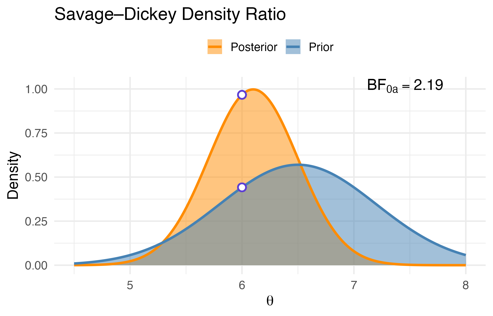

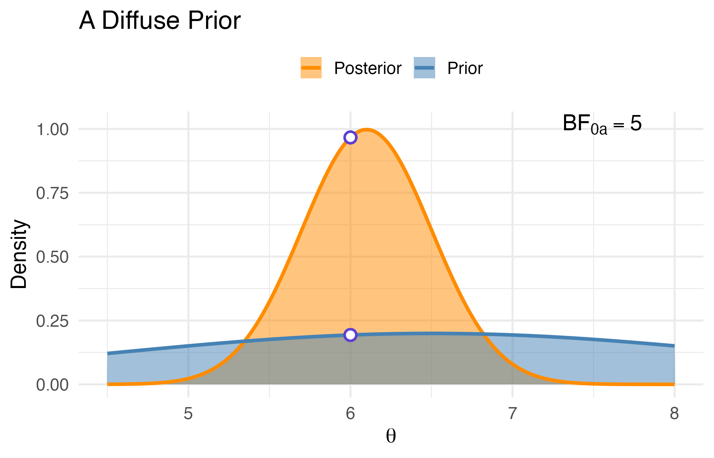

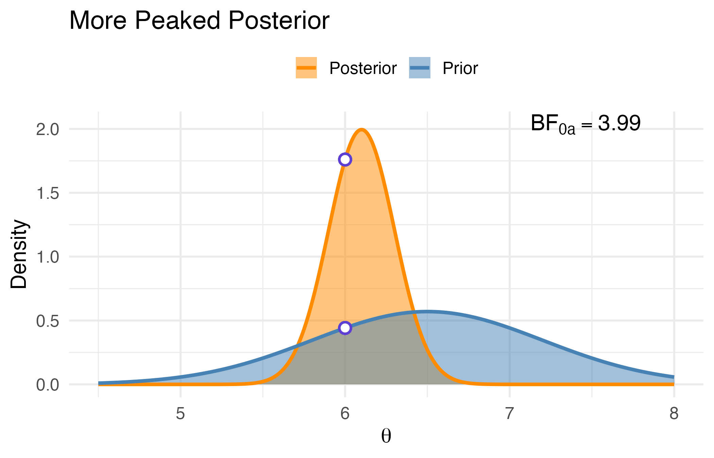

---

<div class="describe">
***Why it works***

We start with the posterior density under $H_1$:

$$
f(\delta \mid y) = \frac{f(y \mid \delta) f(\delta)}{f(y \mid H_1)}
$$

Solving for $f(y \mid H_1)$ and evaluating at $\delta = \delta_0$:

$$
f(y \mid H_1) = \frac{f(y \mid \delta_0) f(\delta_0)}{f(\delta_0 \mid y)}
$$

Under $H_0$, we assume $\delta = \delta_0$, so:

$$
f(y \mid H_0) = f(y \mid \delta_0)
$$

Taking the ratio:

$$
\text{BF}_{01} = \frac{f(y \mid H_0)}{f(y \mid H_1)} = \frac{f(y \mid \delta_0)}{\frac{f(y \mid \delta_0) f(\delta_0)}{f(\delta_0 \mid y)}} = \frac{f(\delta_0 \mid y)}{f(\delta_0)}
$$
</div>


### Exercise: Savage–Dickey Bayes Factor with `bgms`

The Savage–Dickey method requires evaluating the ratio of the **posterior** to the **prior** density at the point of interest, here $\delta_{ij} = 0$.  

- The **prior density** is straightforward, since `bgms` uses a Cauchy distribution (available as `dcauchy`).  
- The **posterior density** is not available in closed form. However, we can approximate it using the posterior samples of $\delta_{ij}$.  

In practice, this is done by fitting a smooth density estimate (e.g., with `logspline`) to the posterior samples and then evaluating that density at $\delta_{ij} = 0$.  

In the following exercise, we apply this approach to test whether there is an edge difference between **clinical** and **non-clinical** ADHD groups.

---

::: {.panel-tabset}

### Tasks

We now apply the **Savage–Dickey approach** for testing group differences with `bgms`.  
This exercise links directly to the session goals: learning how to construct single-model Bayes factors and analyze the role of priors.  

Using the **ADHD dataset** (clinical vs. non-clinical groups):
```r
library(bgms)
?ADHD
```

1. **Fit the group comparison model** with `bgmCompare`.  
   - Set `difference_selection = FALSE` to perform estimation only.  
   - Use `update_method = "nuts"` for efficient sampling.  

2. **Obtain posterior samples** of the edge differences $\delta_{ij}$.  
   - These will be used to estimate the posterioer distribution of group differences.  

3. **Approximate the posterior density at $\delta_{ij}=0$**.  
   - Fit a smooth density estimate (e.g., with `logspline`) to the posterior samples.  

4. **Compute the Savage–Dickey Bayes factor**.  
   - Divide the estimated posterior density at 0 by the prior density at 0 (Cauchy with `difference_scale`).  
   - Recall: $BF_{01} = \dfrac{p(\delta_{ij}=0 \mid \text{data})}{p(\delta_{ij}=0)}$.  

5. **Interpret the Bayes factor** at the edge level:  
   - $BF_{01}>10$ → strong evidence for invariance.  
   - $BF_{10}>10$ → strong evidence for a difference.  
   - Otherwise → inconclusive.  

*Goal*: To see concretely how **single-model Bayes factors** are constructed and interpreted, and to prepare for sensitivity analysis of prior specification.

---

### Try it

Run the code below to fit `bgmCompare` on the ADHD dataset (clinical vs. non-clinical).  
Extract posterior samples of edge differences and focus on one edge (e.g., nodes 1–2).  

```r
fit = bgmCompare(
  x = ADHD[ADHD$group == 0, -1], # not diagnosed
  y = ADHD[ADHD$group == 1, -1], # diagnosed
  iter = 1000, 
  seed = 1234,
  update_method = "nuts",
  difference_scale = 1,   # prior scale for Cauchy(0, scale)
  difference_selection = FALSE
)

# Extract posterior samples
num_variables = ncol(ADHD) - 1
num_pairwise  = num_variables * (num_variables - 1) / 2

samples = do.call(rbind, fit$raw_samples$pairwise)
samples = samples[, -c(1:num_pairwise)]   # keep only group differences
colnames(samples) = fit$raw_samples$parameter_names$pairwise_diff 

# Choose an edge difference (e.g., the one between nodes 1 and 2)
post_edge = samples[, 1]
```

Use the above code to:  
- Estimate the posterior density of post_edge at 0 (e.g., with logspline).  
- Compute the Savage–Dickey Bayes factor by dividing by the prior density at 0. 
- Determine if there is evidence for invariance or difference. Or is the result inconclusive?

---

### Solution

We now compute the Savage–Dickey Bayes factor for one edge difference.

```r
library(logspline)

# Posterior density at 0 (using logspline)
fit_density   = logspline(post_edge)
post_dens_0   = dlogspline(0, fit_density)

# Prior density at 0 (Cauchy with scale = 1)
prior_dens_0  = dcauchy(0, scale = 1)

# Bayes factors
BF01 = post_dens_0 / prior_dens_0
BF10 = 1 / BF01

BF01; BF10
```

**Interpretation**  
- If BF01 > 10 → strong evidence that this edge is invariant across groups.  
- If BF10 > 10 → strong evidence for a group difference.  
- Otherwise → evidence is inconclusive.  

**Connection to goals**  
This solution demonstrates how a single-model Bayes factor is constructed with the Savage–Dickey ratio. It also shows how the result depends on the prior density at 0 (here from the Cauchy prior). This links back to the session goal of understanding both the mechanics of Savage–Dickey and the role of priors in interpreting group differences.

:::


```{r, eval = FALSE}
library(bgms)
library(logspline)
library(qgraph)

x = ADHD[ADHD$group == 0,-1]
y = ADHD[ADHD$group == 1,-1]

difference_scale = 1

# run model
fit = bgmCompare(x, 
                 y,
                 iter = 1e3,
                 seed = 1234,
                 update_method = "nuts",
                 difference_scale = difference_scale,
                 difference_selection = FALSE)

num_variables = ncol(x)
num_pairwise = num_variables * (num_variables - 1) / 2

# select difference samples
samples = do.call(rbind, fit$raw_samples$pairwise)
samples = samples[, -c(1:num_pairwise)] # remove the baseline parameters
colnames(samples) = fit$raw_samples$parameter_names$pairwise_diff # only pairwise differences

# prior and posterior functions
prior = function(x, difference_scale) dcauchy(x, location = 0, scale = difference_scale)

posterior = function(x, p) {
  density = logspline(samples[, p])
  dlogspline (x, density)
}

# SD BF[01]
BF_01 = sapply(1:ncol(samples), function(p) {
  posterior(0, p) / prior(0, difference_scale)
})

# matrix BF[10]
BF = matrix(0, num_variables, num_variables)
BF[lower.tri(BF)] = 1 / BF_01
BF = BF + t(BF)

# Easybgm color scheme
colors = c("#36648b", "#990000", "#BFBFBF") 
evidence_thresh = 10

# Assign colors to edges
graph_color = ifelse(BF < evidence_thresh & BF > 1/evidence_thresh, colors[3], colors[1])
graph_color[BF < 1/evidence_thresh] = colors[2]

# Use dummy matrix with 1s for equal edge widths
graph_plot = matrix(1, nrow = nrow(BF), ncol = ncol(BF))
diag(graph_plot) = 1
colnames(graph_plot) = colnames(ADHD)[-1]

# Evidence plot
qgraph(
  graph_plot,
  edge.color = graph_color[lower.tri(graph_color)],
  vsize      = 10,
  edge.width = 3,
  label.cex  = 1,
  legend     = FALSE,
  labels     = colnames(ADHD)[-1],
  color      = "white",   # node fill color
  border.color = "black"  # node border color
)
```

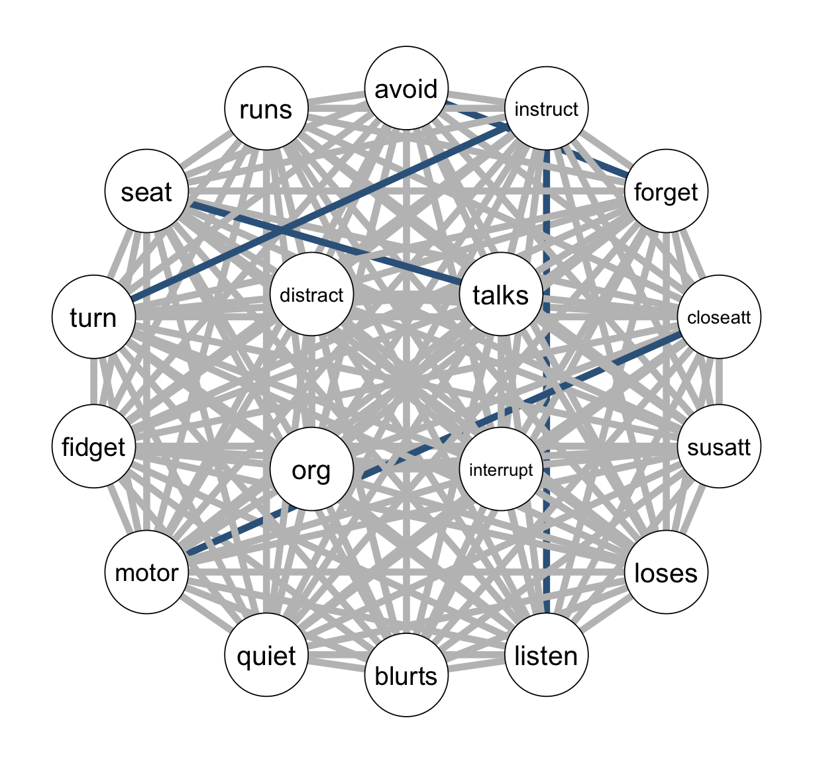{fig-align="center" width=90%}
---


Having computed a Savage–Dickey Bayes factor for one edge,  
we now focus on **visualizing the prior and posterior densities** of edge differences.  
This shows directly how the ratio is formed, and how changing the prior scale influences the result.

### Exercise: Visualizing Prior and Posterior Densities (Savage–Dickey)

In this exercise, you will build intuition for the Savage–Dickey ratio by plotting  
the **prior** and **posterior** densities of edge differences.  
By varying the prior scale, you can see how the Bayes factor changes.

The exercise builds on the function `sd_diff_plot()`.


```r
sd_diff_plot <- function(fit, edge) {
  num_variables = fit$arguments$num_variables
  num_pairwise = num_variables * (num_variables - 1) / 2
  
  samples = do.call(rbind, fit$raw_samples$pairwise)
  samples = samples[, -c(1:num_pairwise)] # remove the baseline parameters
  colnames(samples) = fit$raw_samples$parameter_names$pairwise_diff # only pairwise differences
  
  scale = fit$arguments$difference_scale
  edge_name = colnames(samples)[edge]
  
  dens_post <- logspline(samples[, edge])
  vals <- seq(min(samples[, edge]), max(samples[, edge]), length.out=500)
  
  post_vals  <- dlogspline(vals, dens_post)
  prior_vals <- dcauchy(vals, location=0, scale=scale)
  
  post_at0  <- dlogspline(0, dens_post)
  prior_at0 <- dcauchy(0, location=0, scale=scale)
  BF01 <- round(post_at0 / prior_at0, 2)
  
  df <- data.frame(theta=vals, Prior=prior_vals, Posterior=post_vals)
  df_long <- tidyr::pivot_longer(df, cols=c("Prior","Posterior"),
                                 names_to="Distribution", values_to="Density")
  
  ggplot(df_long, aes(x=theta, y=Density, color=Distribution, fill=Distribution)) +
    geom_line(linewidth=1.2) +
    geom_area(alpha=0.4, position="identity") +
    geom_point(aes(x=0, y=prior_at0), color="steelblue", size=3) +
    geom_point(aes(x=0, y=post_at0), color="darkorange", size=3) +
    annotate("text", x=max(vals)*0.8, y=max(c(prior_vals,post_vals))*0.9,
             label=paste0("BF[01] = ", BF01), parse=TRUE, hjust=1, size=5) +
    scale_color_manual(values=c("Prior"="steelblue","Posterior"="darkorange")) +
    scale_fill_manual(values=c("Prior"="steelblue","Posterior"="darkorange")) +
    labs(x=expression(delta), title=paste("Savage–Dickey for", edge_name, " (scale=", scale, ")")) +
    theme_minimal(base_size=14) +
    theme(legend.position="top", legend.title=element_blank())
}
```
---

::: {.panel-tabset}

### Tasks

1. Fit `bgmCompare()` on the ADHD dataset **twice**:  
   - once with `difference_scale = 0.5`,  
   - once with `difference_scale = 2`.  

2. Select a few edge differences from each model fit.  

3. Use `sd_diff_plot()` to visualize **prior vs. posterior densities**.  
   - Compare plots at scale = 0.5 and scale = 2.  
   - Place the two plots side by side.  

4. **Interpretation**  
   - How does increasing the prior scale change the density at 0?  
   - What is the impact on the Bayes factor evidence?  

*Goal*: Understand how **prior scale choices** influence Bayes factors.

---

### Try it

Run the comparison twice on the ADHD dataset with two different prior scales (e.g., 0.5 and 2). For each run:  
1. Extract posterior samples of several edge differences.  
2. Use the plotting function `sd_diff_plot()` to show prior and posterior densities.  
3. Place the plots side by side. Example code is shown below. 

Then use the plots to answer the following questions:
- How does the prior density at 0 change when the scale increases?  
- What is the impact on the Bayes factor evidence?  
- Are the conclusions about edge differences stable across scales?

```r
library(patchwork)

# Run bgmCompare with two different prior scales
fit1 <- bgmCompare(
  x = ADHD[ADHD$group== 0, -1],
  y = ADHD[ADHD$group== 1, -1],
  iter = 1000,
  update_method = "nuts",
  difference_scale = 0.5,
  difference_selection = FALSE
)

fit2 <- bgmCompare(
  x = ADHD[ADHD$group== 0, -1],
  y = ADHD[ADHD$group== 1, -1],
  iter = 1000,
  update_method = "nuts",
  difference_scale = 2,
  difference_selection = FALSE
)

# Compare the same edge, e.g. the first difference
p1 <- sd_diff_plot(fit1, edge = 2)
p2 <- sd_diff_plot(fit2, edge = 2)

# Show side by side
p1 + p2
```

---

### Solution

When you compare the two runs:

- With `difference_scale = 0.5`, the prior density is more concentrated around 0.  
  - The Savage–Dickey Bayes factor is based on a relatively high prior density at 0.  
  - Posterior evidence for invariance vs. difference is therefore more conservative.  

- With `difference_scale = 2`, the prior density is flatter near 0 and spreads more mass into the tails.  
  - The prior density at 0 is lower, so the Bayes factor will favor differences more easily.  

**Interpretation**  
- The Bayes factor outcome is sensitive to the prior scale.  
- Different prior scales can shift the balance of evidence between invariance and difference.  
- This illustrates the session goal of understanding how prior specification influences Bayes factors in group comparisons.


:::

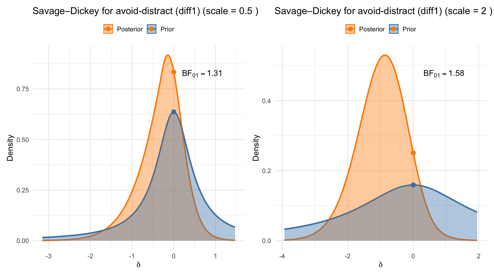{fig-align="center" width=90%}


## 4. Single-Model vs. Model-Averaged Bayes Factors

So far, we have focused on `bgms`. The same single-model Bayes factor approach is also implemented in `BGGM` for Gaussian data. In both cases, the method is based on the **Savage–Dickey ratio**:

- $BF_{01}$ compares $H_0: \delta_{ij}=0$ to $H_1: \delta_{ij}\sim \text{Cauchy}(0, s)$.  
- This is done **within one model**, assuming that all other edge differences are present (i.e., all $\delta_{kl}$ are “active” parameters).  

**Strengths**  
- Direct, interpretable, mathematically elegant.  
- Shows clearly how prior scale choices affect the result.  

**Limitations**  
- When testing one effect, it conditions on the assumption that all other differences are present, even if there is evidence for their absence.  
- Ignores model uncertainty and, as a result, cannot control for **multiplicity**.

### Model-averaged Bayes factors with `bgms`

When `difference_selection = TRUE`, `bgms` takes a different route.  

- For each edge difference $\delta_{ij}$, introduce a binary **indicator** $\gamma_{ij}$:  
  - $\gamma_{ij}=0$: enforce invariance ($\delta_{ij}=0$).  
  - $\gamma_{ij}=1$: allow difference, with prior $\delta_{ij}\sim \text{Cauchy}(0, s)$.  

- Place a prior on $\gamma_{ij}$ (Bernoulli or Beta–Bernoulli).  
  - With Beta–Bernoulli, the prior is on the **number of differences**, which provides automatic **multiplicity correction**.  

- The **inclusion Bayes factor** is  
$$
BF_{10} = \frac{\text{posterior odds}(\gamma_{ij}=1)}{\text{prior odds}(\gamma_{ij}=1)}.
$$  
  - Posterior odds: estimated from MCMC proportion of $\gamma_{ij}=1$.  
  - Prior odds: set by the Bernoulli/Beta–Bernoulli prior.  

This is a **Bayesian model averaging (BMA)** approach: evidence for differences comes from averaging over the entire model space of possible difference configurations.

**Strengths**  
- Provides multiplicity correction automatically.  
- Evidence reflects the *global context* of all edges.  

**Limitations**  
- Interpretation less straightforward than Savage–Dickey (especially for teaching).  
- Computationally more demanding.

---

### Exercise: Single-Model vs. Model-Averaged Bayes Factors

The next exercise demonstrates in practice how the two approaches differ, and why the distinction matters for interpretation and reporting.

::: {.panel-tabset}

### Tasks

1. Fit two models on the **ADHD** dataset:  
   - **Single-model (Savage–Dickey)**: `difference_selection = FALSE`  
   - **Model-averaged (inclusion BFs)**: `difference_selection = TRUE`  

2. Select at least three edge differences. For each edge:  
   - Compute the Savage–Dickey Bayes factor $BF_{10}^{SD}$.  
   - Extract the model-averaged inclusion Bayes factor $BF_{10}^{BMA}$.

3. **Compare and interpret**  
   - Do the two approaches give the same directional conclusion (difference / invariance / inconclusive)?  
   - Which tends to yield larger or smaller Bayes factors?  
   - Provide a principled explanation (consider model uncertainty and multiplicity).  

**Reflection**  

- If writing an applied paper, which Bayes factor would you report — and why?  
- For teaching and intuition, which approach do you find more transparent?  

*Goal*: Understand how **single-model** and **model-averaged Bayes factors** differ in their conclusions, and how this affects both applied and pedagogical reporting.


### Try it
  
The starter code below fits both models on the ADHD dataset:  

- a **single-model fit** (`difference_selection = FALSE`), where Savage–Dickey Bayes factors can be computed for each edge difference,  
- and a **model-averaged fit** (`difference_selection = TRUE`), which yields inclusion Bayes factors via posterior inclusion probabilities.  

The code also extracts posterior samples of edge differences and sets up functions to compute prior and posterior densities at 0.  

👉 Run the code to obtain Bayes factors for a set of edges.  

```r
library(bgms)
library(logspline)

# --- Fit two versions of the model on ADHD (clinical vs non-clinical) ---
# Single-model (estimation only; Savage–Dickey computed post hoc)
fit_est <- bgmCompare(
  x = ADHD[ADHD$group == 0, -1],
  y = ADHD[ADHD$group == 1, -1],
  iter = 1000,
  seed = 1234,
  update_method = "nuts",
  difference_scale = 1,
  difference_selection = FALSE
)

# Model-averaged (selection; inclusion Bayes factors via posterior inclusion probs)
fit_sel <- bgmCompare(
  x = ADHD[ADHD$group == 0, -1],
  y = ADHD[ADHD$group == 1, -1],
  iter = 1000,
  seed = 1234,
  update_method = "nuts",
  difference_scale = 1,
  difference_prior = "Beta-Bernoulli",
  beta_bernoulli_alpha = 1,
  beta_bernoulli_beta  = 1,
  difference_selection = TRUE
)

# --- Extract posterior samples of pairwise differences from the estimation fit ---
num_vars     <- fit_est$arguments$num_variables
num_pairwise <- num_vars * (num_vars - 1) / 2

post_mat <- do.call(rbind, fit_est$raw_samples$pairwise)
# keep only the difference columns (drop per-group pairwise effects)
post_diff <- post_mat[, -(1:num_pairwise), drop = FALSE]
colnames(post_diff) <- fit_est$raw_samples$parameter_names$pairwise_diff

# --- Helper: posterior density at 0 via logspline ---
posterior_d0 <- function(x) {
  ds <- tryCatch(dlogspline(0, logspline(x)), error = function(e) NA_real_)
  ds
}

# Prior density at 0 for the Cauchy(0, scale)
prior_scale <- fit_est$arguments$difference_scale
prior_d0    <- dcauchy(0, scale = prior_scale)

# --- Compute BF_01 (Savage–Dickey) per edge-difference, then BF_10 = 1/BF_01 ---
BF01_SD <- sapply(seq_len(ncol(post_diff)), function(j) posterior_d0(post_diff[, j]) / prior_d0)

# matrix bf_sm[10]
bf_sm = matrix(0, num_variables, num_variables)
bf_sm[lower.tri(bf_sm)] = 1 / BF01_SD
bf_sm = bf_sm + t(bf_sm)

# Inclusion BFs from posterior inclusion probabilities
pip = coef(fit_sel)$indicators
prior_odds <- 1
bf_bma <- (pip / (1 - pip)) / prior_odds
```

**Questions for reflection**  
- Do single-model and model-averaged Bayes factors give the same **directional conclusion** (difference / invariance / inconclusive)?  
- Which Bayes factor tends to be larger on average?  
- What explains the difference between the two approaches?  
- Which one would you prefer to report in an applied paper? Which one is more useful for teaching or building intuition?

---
  
### Solution

```r
edges <- list(c(1,2), c(2,3), c(3,4))

# Build a small comparison table
out <- data.frame(
  Edge     = sapply(edges, function(e) paste(e, collapse = "-")),
  BF10_SD  = sapply(edges, function(e) bf_sm[e[1], e[2]]),
  BF10_BMA = sapply(edges, function(e) bf_bma[e[1], e[2]])
)

print(out)
```

In the above comparison table, you will usually see that:  

- **Directional agreement:** For most edges, the single-model Bayes factor ($BF_{10}^{SD}$) and the model-averaged Bayes factor ($BF_{10}^{BMA}$) point to the same directional conclusion (difference vs invariance).  
- **Magnitude:** The single-model Bayes factors tend to be larger, while the model-averaged Bayes factors are often more conservative regarding differences.  
- **Reason:** This difference arises because the single-model approach conditions on all other edges being included, whereas the model-averaged approach integrates over model uncertainty and applies multiplicity correction through the prior on the number of differences.  

**Take-away**  
- Both methods answer the same question but from different perspectives.  
- For teaching and intuition, Savage–Dickey Bayes factors are more transparent.  
- For applied reporting, model-averaged Bayes factors are generally preferred because they properly account for model uncertainty and multiple testing.  

*Connection to goals:* This solution illustrates the contrast between **single-model** and **model-averaged** Bayes factors, showing how multiplicity correction changes the evidence and why reporting choices matter.
:::

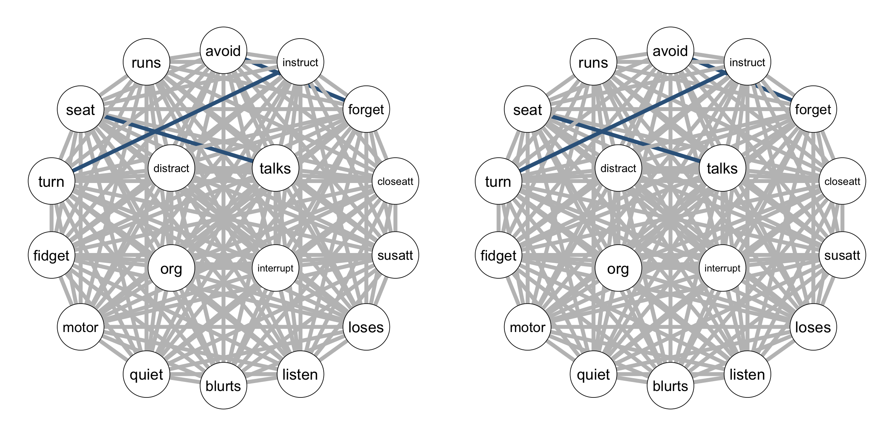{fig-align="center" width=90%}


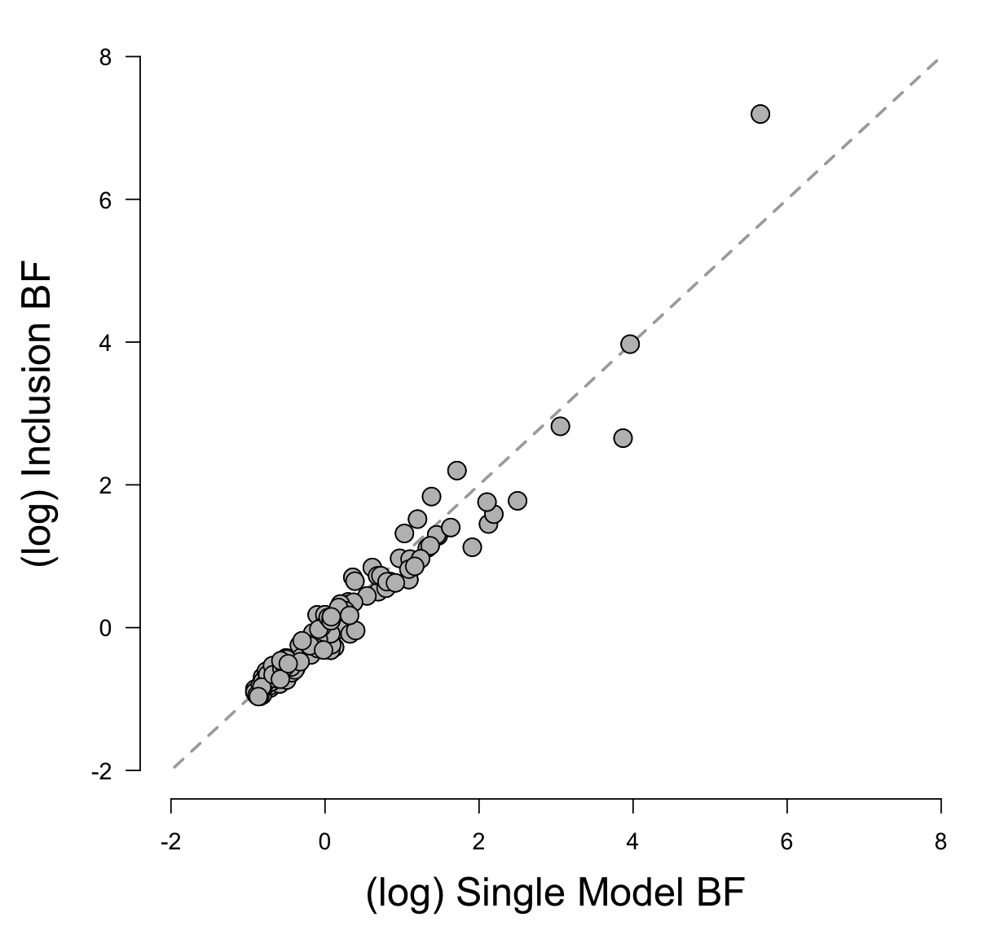{fig-align="center" width=90%}

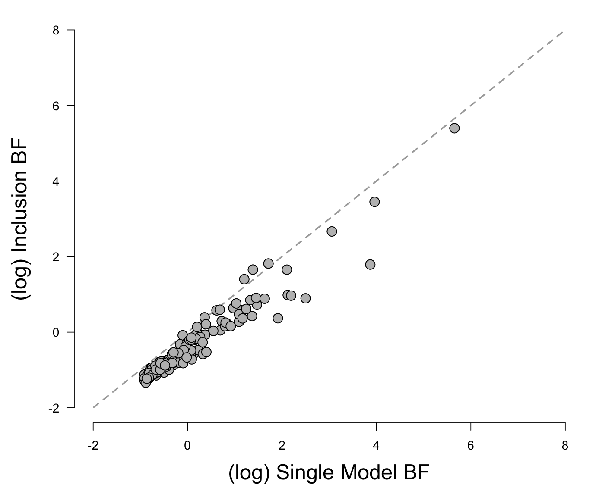{fig-align="center" width=90%}

# Omnibus Testing

So far, we have focused on **edge-specific Bayes factors**:  
- Savage–Dickey BFs (single-model)  
- Inclusion BFs (model-averaged)  

These are **local tests**: they assess evidence for individual edge differences.  
Sometimes, however, we may want to ask a **global question**:

> *Do the networks differ at all?*

Formally:  
- $H_0$: **global invariance**, $\delta_{ij}=0$ for all edges.  
- $H_1$: **at least one difference**, $\delta_{ij}\neq 0$ for some edge.  

---

## Current State

- **BGGM**  
  - Provides omnibus tests via **posterior predictive checks (PPCs)**.  
  - PPCs compare simulated data under the null to observed data.  
  - Limitation: cannot quantify *evidence for invariance*; only detect departures.  

- **bgms**  
  - Does not currently implement an omnibus Bayes factor.  
  - In principle: fit a fully restricted model ($\delta_{ij}=0$ for all) and an unrestricted model, then compare marginal likelihoods (e.g. with `bridgesampling`).  
  - Practically: constraints for $\delta_{ij}=0$ across all edges are not yet implemented, so a ready-to-use omnibus BF is not available.  

---

## Why Omnibus Tests Matter

- Address a **broad reproducibility question**: are two networks invariant as a whole?  
- Complement local Bayes factors:  
  - Local: *which edges differ?*  
  - Global: *is there any difference at all?*  

**Caution**  
- $H_1$ (“at least one difference”) spans a large model space.  
- It is possible for the omnibus test to favor invariance, even when local tests highlight clear edge differences.  
- For this reason, omnibus tests should not be used as “gatekeepers” that determine whether local analyses are reported.  

---

### Discussion Task

Reflect on the role of omnibus testing:  

1. Why might researchers be tempted to treat the omnibus test as a prerequisite for local tests?  
2. What problems could arise from that approach?  
3. If omnibus and local tests appear to conflict (e.g. omnibus favors invariance, but some edges show strong evidence for differences), how would you report this in a paper?  

---

# Closing

In this session you have:  
- Learned how to test group differences with **single-model Bayes factors** (Savage–Dickey) and **model-averaged Bayes factors** (inclusion BFs).  
- Seen how **prior specification** influences Bayes factors, and how **multiplicity correction** is built into model-averaged inference.  
- Compared the two approaches in practice, and reflected on their different uses for reporting and teaching.  
- Considered the role of **omnibus tests** and why they should be interpreted with caution.  

**Take-away:** Bayesian group comparisons provide a principled way to study invariance and differences in networks. Single-model and model-averaged Bayes factors each have strengths; together, they allow us to combine intuition, transparency, and multiplicity control in reporting group comparisons.


